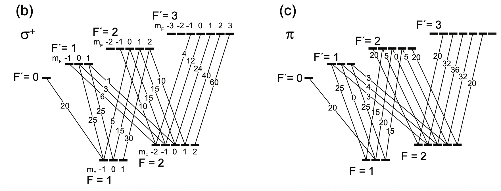
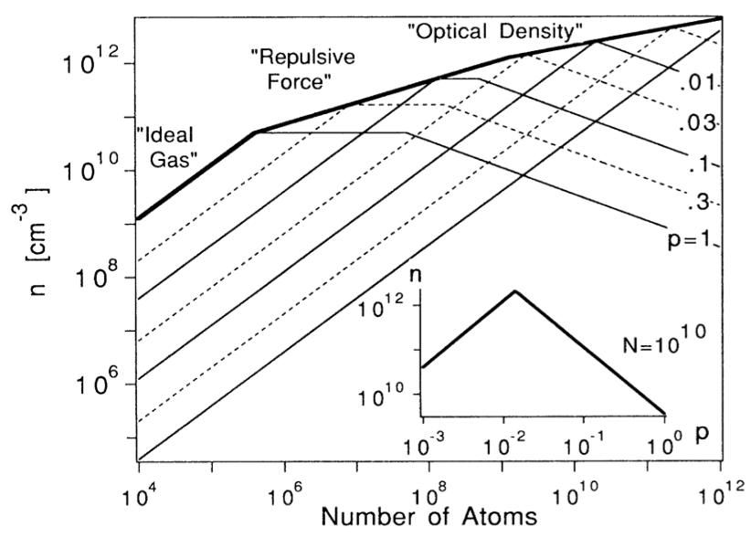

## Repumping in laser cooling

Na 원자의 경우, $S_{1/2}|F=2\rangle$ 에서 $P_{3/2}|F'=3\rangle$ 으로의 전이가 최적의 쿨링 transition line 이다 ($F$와 $F'$은 ground 상태와 excited 상태의 total angular momentum).

이때 $|F'=3\rangle$ 상태의 원자들 중 일부는 $|F'=2\rangle$ 상태로 전이할 수 있고, 최종적으로 relaxation channel 을 통해 $|F=1\rangle$ 상태에 도달한다. $|F=1\rangle$ 원자들은 쿨링레이저에 반응하지 않으니 repumping 레이저를 쏴서 다시 $|F'=2\rangle$ 상태로 올려준 뒤 $|F=2\rangle$ 상태로 전이되길 기대해야한다.

## Loss in MOT by repumping

repumping 에는 다음과 같은 문제점이 있다.

1. ground state 원자와 excited state 원자 사이의 충돌로 인해 excitation 에너지의 일부가 운동에너지로 전환되고, 결과적으로 트랩된 원자가 빠져나가는 로스가 발생한다.

2. scattered photon 을 다시 흡수한 원자들에 의해 생기는 repulsive force

## Dark MOT

해결법은 saturation 될때까지 repumping 하는게 아니라 약하게 하는 것. repumping 레이저의 세기를 1/100 정도로 하면 위와 같은 문제점이 해결되고, 그럼에도 원자를 붙잡기에는 충분히 강해서 MOT 트랩의 밀도를 높여준다.

원자들은 99%의 시간을 cooling laser 에 반응하지 않는 Dark fyperfine state 에 머무른다. Dark MOT.

P.S. Na의 D-line 에서 D 는 Fraunhofer lines 에서 따왔다고 한다. Fraunhofer 는 태양빛의 흡수선 스펙트럼을 분석하고, absorption line 을 빨간색부터 순서대로 A, B, C, D.. 라고 이름 붙였는데, Na 의 가시광선 영역대인 노란색 빛이 D 라서 D-line 이라고 한다. Na 뿐만 아니라 다른 알칼리 금속들도 D-line 이라고 부르고 data sheet 을 찾아볼 수 있다.