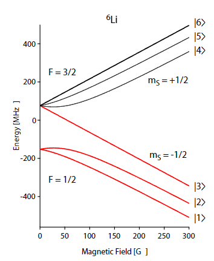

자기장 0일때 F=1/2 과 F=3/2 사이의 간격은 22MHz.

300G 가 넘어가면 기울기 1.4MHz/G, 각 상태별 간격은 80MHz.

low field 에서는 total spin F 가 good quantum number. high field 에서는 electron spin S 가 good quantum number. ultracold 상태라서 L quantum number 는 보통 고려 안한다.
