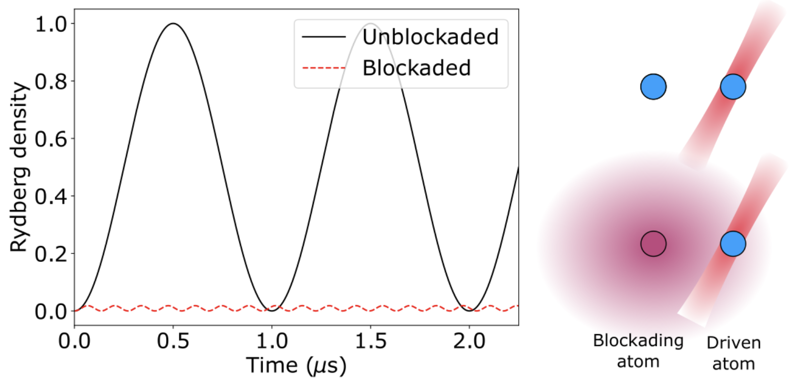
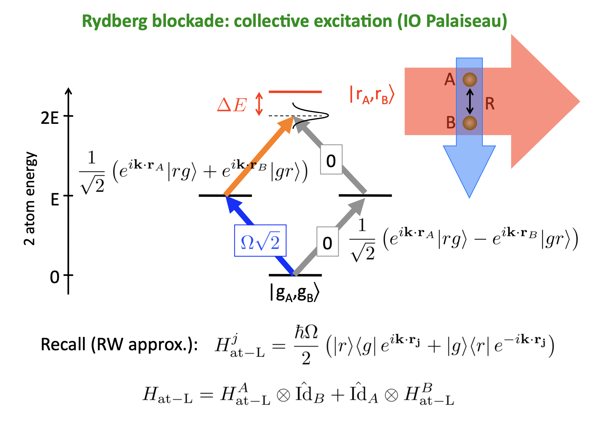
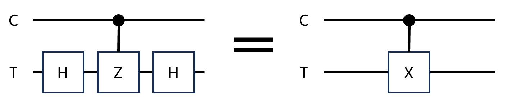

# Rydberg Blockade

만약 두개의 원자가 ground state 에 있을때 Rydberg 상태로 전이하는 Rabi frequency 빛을 오른쪽 원자에 쏘면 Rydberg 상태로 전이하면서 Rabi 진동을 보인다. (검은색 그래프)

하지만 왼쪽 원자가 Rydberg 상태에 있다면, 왼쪽 원자의 valence electron 의 wave function 이 아주 커져서 오른쪽 원자와 overlap 하게 되고, Rydberg 원자 다이폴과의 반데르발스 상호작용이 생기고, 오른쪽 원자의 Rydberg 상태는 상호작용으로 인해 detuning 이 생기면서 Drive frequency 에 반응하지 않게 된다 (빨간색 그래프). 이렇게 Rydberg 원자로 다른 원자를 막는 것을 Rydberg blockade 라고 한다.

Rydberg 상호작용 거리는 $\mu m$ 단위로 크기 때문에 조작이 용이하다.

# Rydberg Blockade and Entanglement

ground 상태의 두 원자를 붙잡아서 밀접하게 붙인 다음 Rydberg 상태로 전이시키는 레이저를 두 원자에 동시에 쏘면(두 원자를 구분 불가능하게 만든 상태에서), 둘 중 하나의 원자는 Rydberg 상태로 전이되고 나머지 하나는 blockade 때문에 에너지 레벨이 detuning 돼서 전이하지 못하고 바닥상태에 남게 된다. 

보통 atomic energy level 을 qubit 0, 1 로 사용하고 (보통 $|g\rangle$가 $|1\rangle$이다), Rydberg state $|r\rangle$ 는 얽힘을 위해 거쳐가는 용도로 사용한다.

# Rydberg atom and CNOT gate

Hadamard-CZ-Hadamard gate 와 CNOT gate 는 논리적으로 같다. Rydberg atom system 에서는 CNOT 을 구현하기 위해 H-CZ-H gate 를 구현한다.

H gate는 atomic level 0에서 1로 전이시키는 주파수를 Rabi 주기의 $\pi/2$ 만큼 쏴주면 0과 1의 중첩상태를 만드는게 가능하다.

CZ gate 는 Control bit 가 될 원자와 Target bit 이 될 원자를 붙여놓고, $|1\rangle \rightarrow |r\rangle$ 에 해당하는 레이저를 준비한 뒤

1. C 원자에 $\pi$ 레이저를 쏜다.
2. T 원자에 $2\pi$ 레이저를 쏜다.
3. C 원자에 $\pi$ 레이저를 쏜다.

이렇게 하면 CZ gate 를 구현할 수 있다 (정확히는 -CZ gate 가 구현된다). Rabi oscillation 에 대한 2 level 슈뢰딩거 방정식을 풀면 $2\pi$ 만큼 돌아갔을때 $e^{i\pi}$, -1 만큼의 phase shift 가 생긴다는 것을 알 수 있다.

(00 to 00) 00상태의 경우, C 원자와 T 원자 둘다 드라이빙 레이저에 반응 안하니 그대로 남는다. 

(01 to -01) 이 경우 T 원자만 $2\pi$ 만큼 Rabi 진동을 겪으므로 -1 phase shift.

(10 to -10) 이 경우 T 원자는 반응 안하므로 그대로 지만 C 원자는 올라갔다 내려가므로 -1 phase shift.

(11 to -11) 이 경우 C 원자는 올라가서 i 만큼 phase 를 먹고, Blockade 로 T 원자가 $2\pi$ 펄스에 반응 못하게 막고, 그다음 C 원자가 내려와서 다시 i 만큼 phase 를 먹으므로 -1 phase 가 붙는다.

결과적으로 -CZ gate 가 구현된다.

## Ref

Fast Quantum Gates for Neutral Atoms, 2000