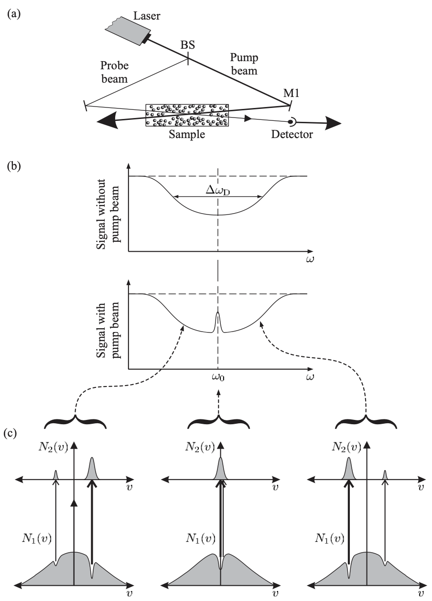

# Lamb dip

가스 샘플에 오른쪽에서 왼쪽으로 펌프빔을 집어넣은 상태에서, 왼쪽에서 오른쪽으로 프로브 빔을 집어넣어 Absorption 을 측정했을때 주파수 영역에 딥이 생기는 현상.

펌프 빔을 바꿔가며 프로브 빔을 스캔.

Lamb dip 의 width 는 kHz 정도로, 보통 원자들의 natural line width MHz 보다도 훨씬 좁다. 그래서 frequency lock 을 하는데 많이 사용한다. 펌핑이랑 프로브의 frequency 가 같게 하고 둘이 transition frequency 에 위치하게 된다면 absorption peak 정중앙에 딥이 생긴다.

3레벨 원자에서 crossover 딥이 생기는 이유: 펌핑빔이 올려놓은 kv 와 -kv 성분들에 대해 프로브빔이 스캔할때 두가지 성분에 대한 영향을 둘다 받아서, 가운데에 큰 딥이 생긴다. 

여기상태가 두개면 crossover 에 딥이 생기고, 바닥상태가 두개면 crossover 에 inverted dip 이 생긴다.

SAS 프로그램들은 대개 dip 신호를 반전시켜서 출력하기에 실제 모양과 반대로 보인다.

아래 내용은 다 코파일럿이 써준거임.. 나중에 수정.

## Introduction

The Lamb dip is a narrow dip in the absorption spectrum of a gas. It is named after Willis Lamb, who discovered it in 1947. The Lamb dip is a result of the interference between two absorption lines of the gas. The two lines are close in frequency, and the dip is formed when the two lines are in resonance with the laser frequency. The Lamb dip is a useful tool for high-resolution spectroscopy and is used in many applications, such as laser cooling and trapping, precision spectroscopy, and quantum information processing.

## Principle

The Lamb dip is formed when two closely spaced absorption lines of the gas interfere with each other. The interference causes a narrow dip in the absorption spectrum, which is known as the Lamb dip. The width of the dip is determined by the linewidth of the two absorption lines and the detuning of the laser frequency from the resonance frequency of the lines. The depth of the dip is determined by the strength of the absorption lines and the intensity of the laser beam. The Lamb dip is a result of the quantum interference between the two absorption lines and is a signature of the coherence of the gas.

# SAS

## Introduction

Saturated Absorption Spectroscopy (SAS) is a powerful technique for high-resolution spectroscopy. It is based on the principle of optical pumping, where a laser beam is used to excite atoms to a higher energy level. The atoms then relax back to the ground state by emitting light at a specific frequency. By measuring the absorption and emission spectra of the atoms, one can obtain detailed information about the energy levels and transitions of the atoms. SAS is widely used in many fields, such as atomic physics, quantum optics, and laser spectroscopy.

## Principle

The principle of SAS is based on the saturation of the absorption lines of the atoms. When a laser beam is tuned to the resonance frequency of an absorption line, the atoms absorb the light and are excited to a higher energy level. As more and more atoms are excited, the absorption of the laser beam saturates, and the absorption line becomes narrower. This saturation effect is due to the competition between the absorption and emission processes of the atoms. By measuring the absorption and emission spectra of the atoms, one can determine the energy levels and transitions of the atoms with high precision.

## Applications

SAS has many applications in various fields of science and technology. Some of the key applications of SAS are:

1. High-resolution spectroscopy: SAS is widely used for high-resolution spectroscopy of atoms and molecules. It allows researchers to study the energy levels and transitions of the atoms with high precision.

2. Laser cooling and trapping: SAS is used in laser cooling and trapping experiments to cool and trap atoms at very low temperatures. This technique is used in the field of quantum optics and quantum information processing.

3. Precision spectroscopy: SAS is used in precision spectroscopy experiments to measure the frequencies of atomic transitions with high accuracy. This technique is used in the development of atomic clocks and other precision measurement devices.

4. Quantum information processing: SAS is used in quantum information processing experiments to manipulate and control the quantum states of atoms. This technique is used in the development of quantum computers and other quantum technologies.

Overall, SAS is a versatile and powerful technique for high-resolution spectroscopy and has many applications in various fields of science and technology.

