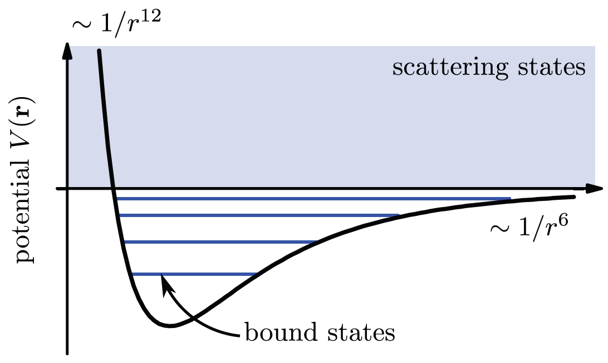

매우 낮은 온도에서는 kinetic energy 가 낮아지고 interaction 효과가 중요해진다. 특히 기체가 냉각된 뒤 온도가 균질해지려면(thermalization) 원자들끼리 상호작용하면 모멘텀과 에너지를 redistribution 해야한다.

증발 냉각 (Evaporation cooling). 에너지 분포에서 높은 에너지 영역대의 원자를 날려버린 뒤 온도가 낮아지기 위해선 원자들끼리의 상호작용이 핵심적인 역할을 한다.

중성 원자의 상호작용은 주로 van der Waals 상호작용 (dipole interaction) 으로 이뤄진다. 서로간의 거리가 $\bold{r}$인 두 중성원자 사이에 작용하는 포텐셜은 주로 Lennard-Jones potential 로 기술된다.

$$
V(\bold{r})=\frac{A}{r^{12}}-\frac{B}{r^6}
$$

여기서 $1/r^{12}$ 부분은 softly repulsive 한 원자핵 부분을, $1/r^6$은 attractive 한 상호작용을 의미한다.

하지만 metastable BEC에서 L-J potential 로 풀면 crystaline 같은 잘못된 결과를 주니, contact interaction: 

## Scattering theory

두 원자의 scattering 문제를 상대적인 위치 $\bold{r}=\bold{r_1}-\bold{r_2}$ 와 상대적인 wavevector $\bold{k}$ 로 바꿔 single particle schrodinger equation 으로 다룰 수 있다.

이때 우리가 알고 싶은 것은 asymtotically free, positive energy solution 이므로 풀고자하는 방정식은

$$
\hat{H}\psi_k=E_k\psi_k \quad \text{where}\quad E_k = \frac{\hbar^2k^2}{2m} 
$$

해당하는 Ansatz solution 은 다음과 같다.

$$
\psi_k=e^{ik\cdot r}+f(\bold{k},\bold{r})\frac{e^{ikr}}{r}
$$

첫번째 부분은 incoming plane wave, 두번째 부분은 scattering 으로 인한 outgoing spherical wave 이다. Low energy scattering 의 경우, potential 의 angular resolution 이 떨어지므로 asymtotic regime 에서 radial part 부분을 상수로 쓸 수 있다. 

$$
\psi_k=e^{ik\cdot r}+f(\bold{k},\bold{r})\frac{e^{ikr}}{r} \quad\xrightarrow[]{k\rightarrow 0}\quad 1-\frac{a}{r}
$$

이때의 a 값을 scattering length 로 정의한다.

More formally, 솔루션을 spherical harmonics 와 radial part 로 나눠 쓴다면

$$
\psi_k(\bold{r})= \sum_{l=0}^{\infty} \sum_{m=-l}^{l} Y_{lm}(\theta, \phi) \frac{u_{kl}(r)}{r} \rightarrow \left[\partial_r^2 +k^2 -\frac{l(l-1)}{r^2} -\frac{2m}{\hbar^2}V(r) \right]u_{kl}(r)=0
$$

이때 low energy regime 은 $l=0$ (s-wave scattering) 인 문제에 해당한다. 유일한 restriction 은 $\lim_{r\to 0} u_{kl}(r)=0$ 이다.  

## Square potential and sign of scattering length

$$
a>0 : \text{effectively repulsive potential} \\
a<0 : \text{effectively attractive potential}
$$
### Square barrier $V_0>0$

$$
V(r) = \begin{cases}
V_0>0 & r<b \\
0 & r>b
\end{cases}
$$

위와 같은 포텐셜이 있을때, low energy $k\rightarrow 0$ 인 영역에서 $l=0$ 인 s-wave 스캐터링 문제를 풀면 다음과 같다.

$$
\left[\partial_r^2 -\frac{2m}{\hbar^2}V(r)\right]u(r)=0
$$

$$
\partial_r^2 u(r) = \begin{cases}
\kappa^2 u(r) \quad\rightarrow\quad u(r)=\zeta \sinh(\kappa r) & r<b \\
0 \quad\rightarrow\quad u(r)=\chi (r-a)& r>b
\end{cases}
$$

where $\kappa = \sqrt{2mV_0/\hbar^2}$

이때 sinh 가 솔루션인 이유는 $\lim_{r \to 0} u(r)\to 0$ 조건 때문이다.

$r=b$ 인 지점에서 wavefunction 이 연속이고 미분값도 연속이라는 조건을 이용하면, 

$$
a= b-\frac{\tanh (\kappa b)}{\kappa}
$$

### Square well $-V_0<0$

$$
V(r) = \begin{cases}
-V_0 <0> & r<b \\
0 & r>b
\end{cases}
$$

$$
\partial_r^2 u(r) = \begin{cases}
-\kappa^2 u(r) \quad\rightarrow\quad u(r)=\zeta \sin(\kappa r) & r<b \\
0 \quad\rightarrow\quad u(r)=\chi (r-a)& r>b
\end{cases}
$$

$$
a= b-\frac{\tan(\kappa b)}{\kappa}
$$

### Resonance in scattering

$\kappa\sim \sqrt{V_0}$.

포텐셜이 $V_0>0$ 인 경우, $\kappa$ 가 작다면 scattering length 가 포텐셜의 유효거리에 비해 매우 작지만(포텐셜을 무시하듯 상호작용한다), $\kappa$ 가 크다면 스캐터링 length 가 포텐셜의 유효거리 b 와 거의 같아진다 (hard barrier).

(uncertain: 포텐셜이 $-V_0<0$ 인 경우에는, $\kappa b$ 가 특정값일 때마다 scattering length 가 발산하는 resonance 포인트가 생긴다. $a \to -\infty$ 라면 $\chi \to 0$ 라고 볼 수 있으므로, 모든 wavefunction 이 $r<b$ 에 존재하는 bound state 가 생긴다.)

## Feshbach resonance