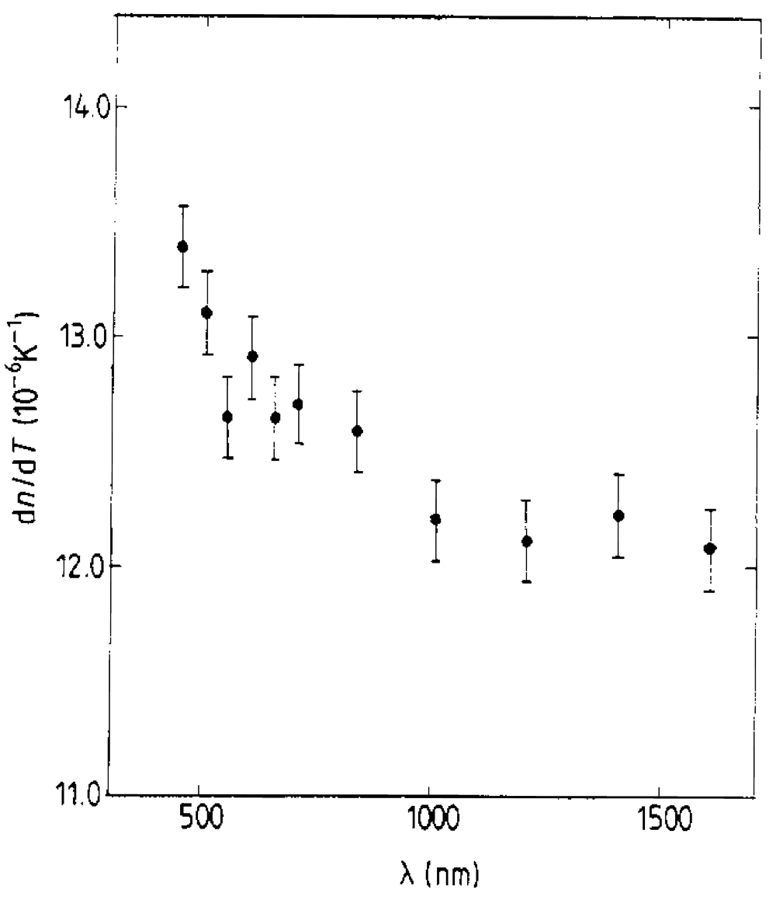
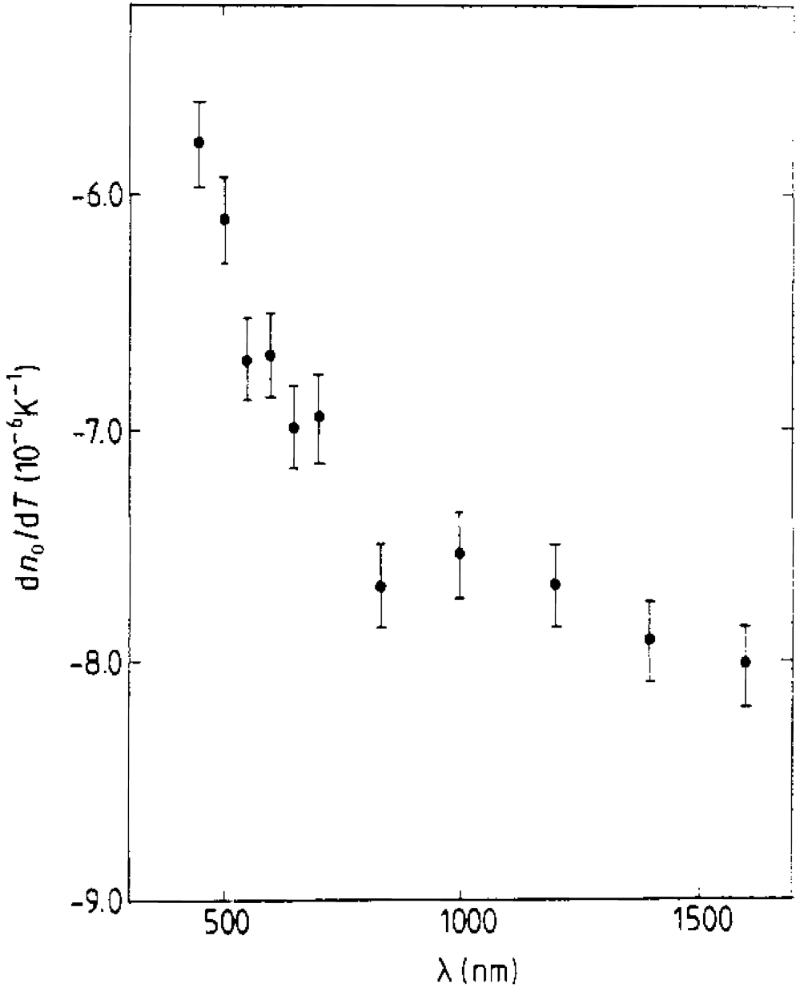
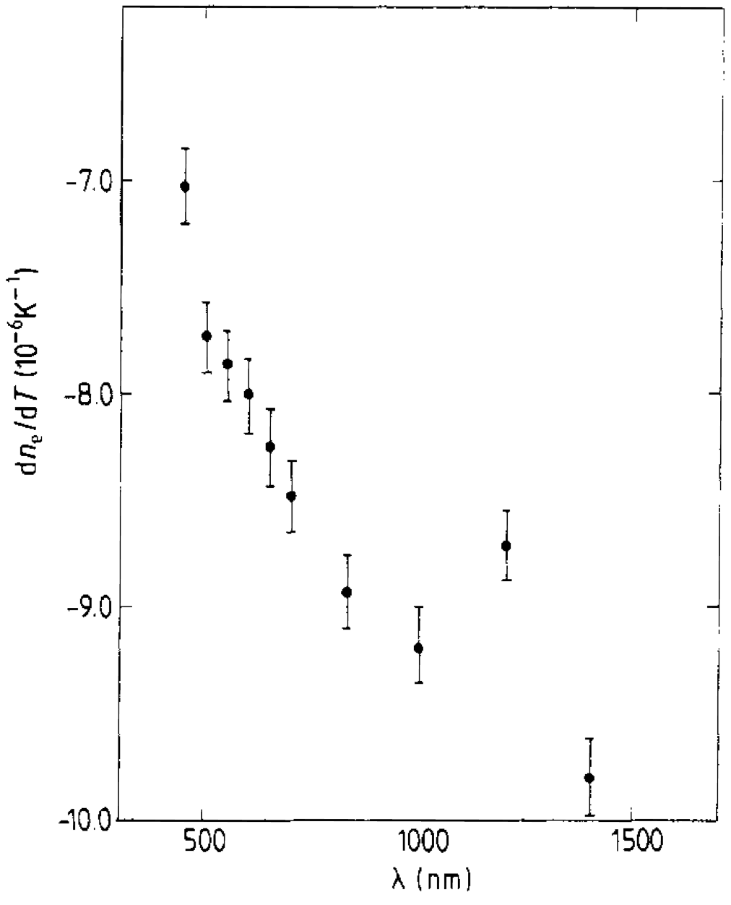

Fused silica 의 dn/dt. 대략 1도 정도 바뀔때 n 값이 $10^-5$ 정도 바뀐다.

o-ray 에 대한 Quartz의 dn/dt.

e-ray 에 대한 Quartz의 dn/dt.

## Ref

The temperature dependence of the refractive indices of fused silica and crystal quartz, T Toyoda and M Yabe 1983 J. Phys. D: Appl. Phys. 16 L97