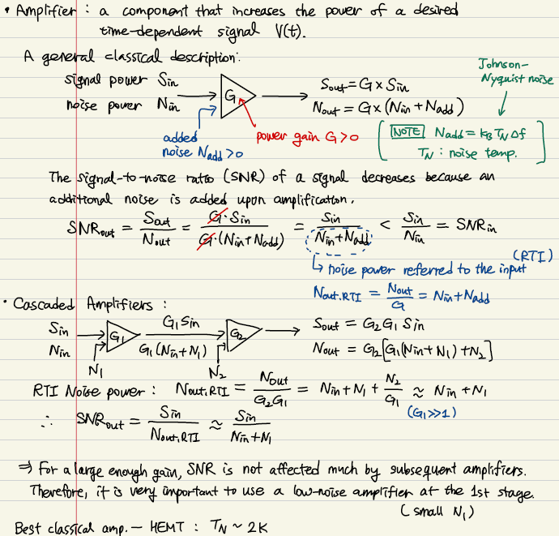
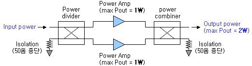

## Cascaded amplifier

앰프를 여러개 연결할수록 SNR은 나빠짐.

여러개의 앰프를 연결한다면, 게인이 충분히 크다면, 맨 첫번째 앰프가 SNR을 결정함. 그래서 맨 첫번째 앰프는 노이즈가 작고 게인이 커야한다.

## Gain $\neq$ Power

트랜지스터를 이용한 AC 신호의 증폭: 출력쪽에 더 큰 직류 전원을 걸어주면 AC 신호가 확대증폭 되는 것.

파워는 최종 출력단에서 얼마나 많은 전류를 끌어올 수 있느냐로 결정됨. 단위가 dB가 아닌 dBm.

Combiner 를 이용한 다음과 같은 구조의 앰프를 balanced amplifier 라고 한다.

### ref

http://www.rfdh.com/bas_rf/begin/amp.htm