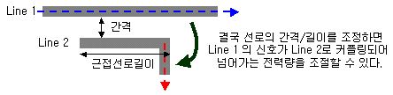
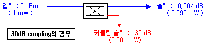
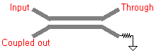
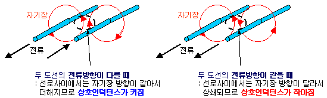
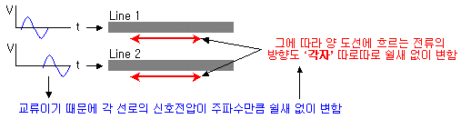
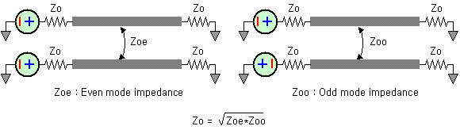

* Coupled line coupler

선로 간격과 길이로 커플링 양을 조절하는 커플러. 4개의 포트중 접지랑 연결된 포트는 격리포트(isolation)로서, 선로 임피던스에 맞춘 저항을 접지시켜서 누설 전력이 반사되지 않고 열로 소모시켜 버리는 역할을 한다.

* Quadrature hybrid coupler

Branch line 을 이용한 direct coupler. 두개의 출력이 균등한 반반 출력을 가진다. 두개의 출력신호는 90도 위상차를 가진다. 방향을 반대로 연결하면 divider 가 아니라 combiner 로 사용이 가능하다. 종단 포트가 없는 조금 변형된 구조를 Wilkinson divider 라고 부른다.

그외에  Rat hybrid coupler, Bethe-hole coupler, Lange coupler, Magic tee coupler 들이 많이 쓰인다. 

## Even mode, Odd mode

임피던스를 구할때 even mode (두 신호방향이 같을때)와 odd mode (두 신호방향이 다를때) 각각의 임피던스의 기하평균으로 임피던스를 정의하는 것.

> Question: 만약 두 신호의 phase 를 아주 정밀하게 맞출 수 있다면 한쪽 임피던스만 생각해도 될것같은데, 실제로 그런가?

### Ref

http://www.rfdh.com/bas_rf/begin/coupler.php3