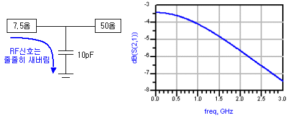
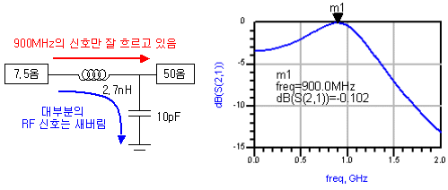
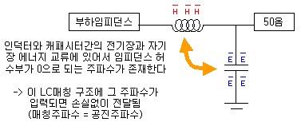
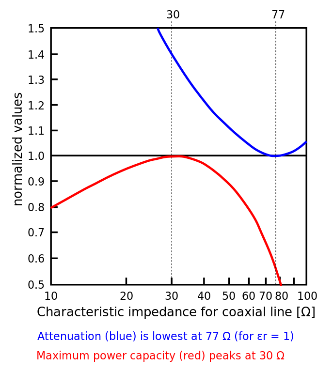

임피던스

$$
Z= R+jwL+\frac{1}{jwC}
$$

전송선로 특성 임피던스

$$
Z_0 = \sqrt{\frac{R+jwL}{G+jwC}}
$$

RF회로에서는 특성 임피던스가 주어짐. 하나의 회로 혹은 시스템이 기준으로 잡는 임피던스. 일반적인 회로는 50옴을, 안테나에서는 75옴을 많이 쓴다. 

## LC resonance 를 이용한 임피던스 매칭

## 번외: 왜 50옴이 임피던스 표준이 된걸까?

coaxial 케이블에서 로스가 작고, 전압이 높고, 보내는 전력이 높은 지점의 균형이 50옴이라서.

* low loss: air-filled coaxial 에서 로스는 동축 케이블 내부의 dielectric 에 의존하는데, 대략 77옴에서 최저가 된다.

* high voltage: 대략 60옴에서 최고.

* high power transfer: 대략 30옴에서 최고.

또한 신호파형의 왜곡이 가장 적은게 75옴 정도.

간혹 특성 임피던스를 75옴으로 쓰는 시스템이 있다.

### ref

https://resources.altium.com/p/mysterious-50-ohm-impedance-where-it-came-and-why-we-use-it

http://www.rfdh.com/bas_rf/begin/50ohm.htm