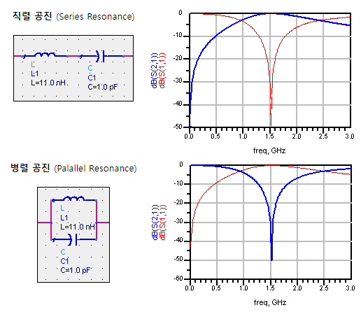
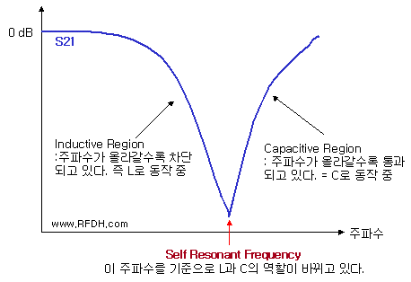
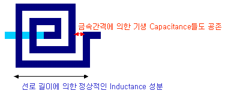

직렬공진: 특정주파수만 통과

병렬공진: 특정주파수만 블럭

## Self Resonating Frequency

L 또는 C 소자의 동작 주파수가 특정 주파수를 넘으면 다르게 작동하는 것.

가운데에 Resonance 같은 딥이 생긴다.

소자의 물리적 구조때문. 모든 인덕터에는 기생 캐패시턴스가, 모든 캐패시터에는 기생 인덕턴스가 있어서 그렇다.

일반적인 lumped 소자들은 SRF 가 few GHz 이기 때문에 그 이하 주파수에서 써야한다.

> Lumped circuit (집중 회로): 신호에 대한 응답을 동시에 생각해도 되는 경우. 물리적으로 신호의 전달속도는 빛의 속도에 제한되기 때문에, 선로 길이가 전송 신호 파장에 비해 무시할 수 없게 되면 동시적인 변화라고 생각할 수 없게 된다. 이런 경우는 Distributed circuit 이라 부른다.