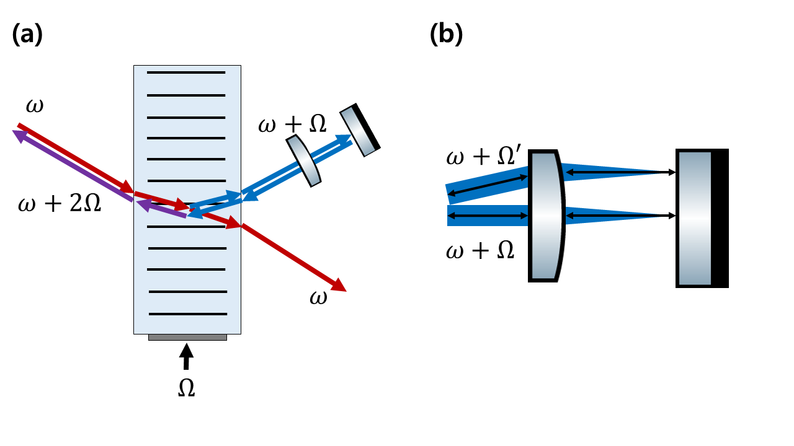
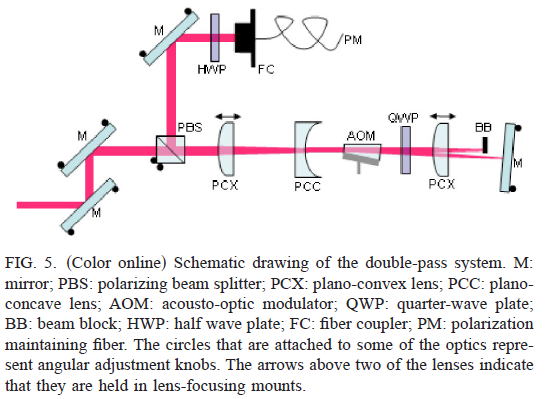
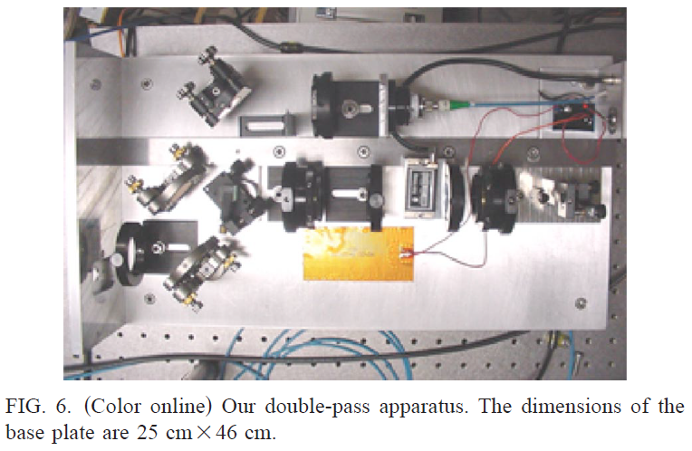

AOM 은 frequency modulation 정도에 따라 빛이 꺾이는 정도가 달라지는데, modulation 이 바뀌어도 빛의 경로가 같아지게끔 하는 테크닉.

modulation 이 바뀌어서 빛이 꺾여도, 렌즈로 인해 거울과 수직하게 빛이 튕겨서 되돌아오게 하여 원래 들어온 곳으로 빛이 되돌아가게 한다. Cat's eye retroreflector 라고 부른다. 

> Cat's eye 라고 부르는 이유는, 고양이 눈에도 retroreflector 구조가 있기 때문인 듯. Retroreflector 구조 때문에 고양이 눈은 밤에 밝게 보인다.

AOM과 렌즈 사이에 QWP 45도를 넣어서 PBS로 modulation 빛을 따올 수 있다. 위 셋업에서 Plano-convex 렌즈와 Plano-concave 렌즈는 빔사이즈 조절용이다.

## Ref

* Double-pass acousto-optic modulator system, 2005 (figures 2, 3 are from the above reference)