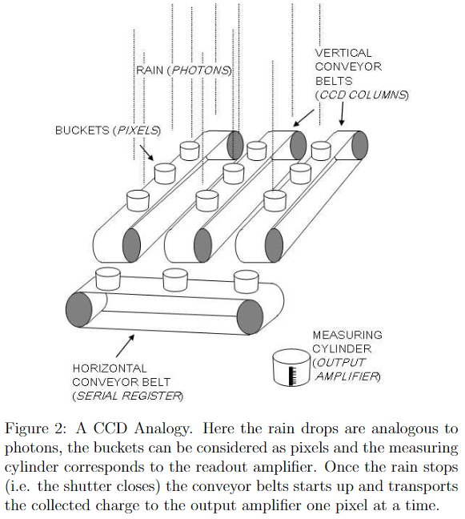
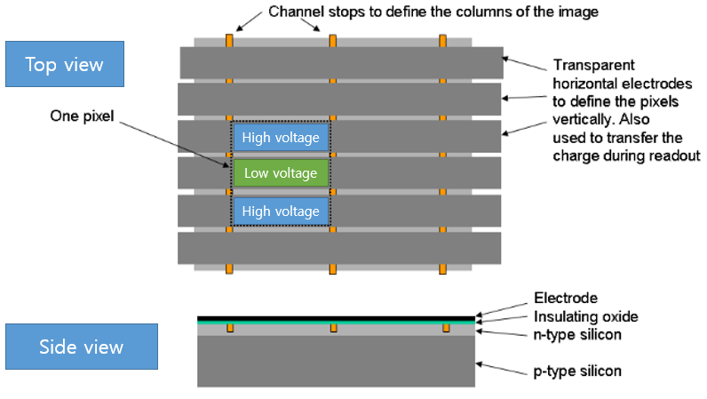
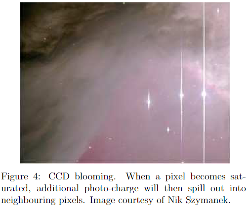
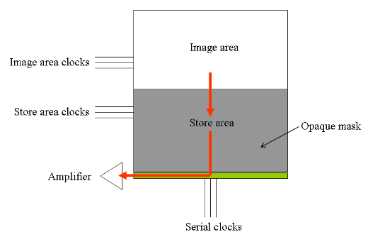
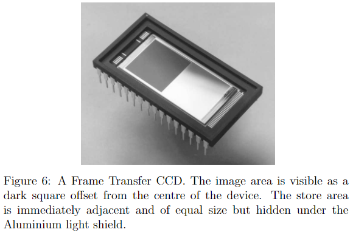
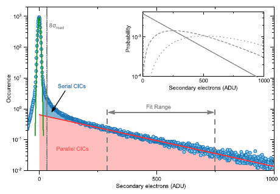

## Silicon sensor

Photoelectric effect. 실리콘의 밴드갭 1.26eV 인데, 대략 $1\mu m$ 의 광자의 에너지 정도이므로 visible 영역의 광자는 실리콘 CCD 로 측정할 수 있다. 

## Structure of CCD

비유: 비가 올때 컨베이어 벨트 위에 올라와 있는 양동이들.

셔터가 닫히면 컨베이어 벨트를 움직여서 물을 측정통에 부어서 픽셀바이 픽셀 담긴 물의 양을 측정한다.

Polysilicon 으로 이루어진 투명 전극 3개가 한 셋트로 CCD 픽셀을 구성한다. 두개의 전극은 high voltage, 하나는 low voltage 라서 potential well 을 구성해서 photo-electon 들을 가운데로 모은다. channel stop 은 수직방향으로 픽셀을 구분하는 역할을 해준다.

각 전극에 걸리는 전압을 바꿔주면, 전하는 전압이 만들어낸 포텐셜을 따라 움직이므로, 각 픽셀에 잡혀있는 전하들을 이동시킬 수 있다. charge transport 효율은 0.999999 정도다.

CCD 가 saturation 되면 전하가 column 방향으로 넘쳐 흘러서 위의 사진처럼 길다란 꼬리 노이즈를 만든다.

## Frame-transfer CCD (FTCCD)

CCD 의 아래쪽 절반을 불투명한 store 영역으로 쓰는 것. 25Hz 이상으로 빠르게 이미징을 하기 위해서 쓰인다. 기계적인 셔터는 빠른속도로 반복동작하면 신뢰성이 떨어진다.

FTCCD 의 실제 모습. 회색영역이 빛을 받는 영역이고, 은색이 저장영역으로써 알루미늄 light shield 처리된 부분이다. ms 속도로 이미징이 가능하다. 대부분의 EMCCD는 FTCCD 다.

# EMCCD

두개의 층의 센서. 이미지 센서랑 스토리지 센서. 이미지 센서는 빛에 노출되고, 스토리지 센서는 빛에 노출되지 않음.

이미지센서가 아래층 스토리지 영역으로 정보를 보낸뒤, 스토리지 센서에서 한층한층씩 리드아웃 레지스터로 전자를 보냄. 그 전자들을 gain register 에서 impact ionization 을 통한 em gain 함.

dark current 도 같이 증폭이 되므로 EMCCD 를 냉각시키는게 중요하다.

ROI 를 줄이는 크롭 모드를 사용하면 더 빠르게 찍을 수 있다. Ador iXon 의 경우 크롭모드 쓰면 최대 4대 빠르게 찍는다.

## Back-illuminated sensor

렌즈-포토다이오드-와이어링 순서로 만드는게 back-illuminated sensor. front-side illumination 은 렌즈-와이어링-포토다이오드 순서.

포토다이오드를 먼저 깔고 그 위에 와이어링 하고 마지막으로 렌즈를 까는게 공정은 쉬운데, 와이어링 층이 빛을 막아서 빛 흡수 효율이 떨어진다.

공정기술의 발달로 와이어링 층을 맨 밑에 깔 수 있어서 back-illumination 이 가능해졌다.

## Clock-Induced Charge (CIC) noise

photoelectron 들이 스토리지 영역이나 EM 레지스터로 움직일때 생기는 노이즈. 일반 CCD 에서도 생기는 노이즈이지만, 일반 CCD 에서는 readout noise 나 thermal noise 가 훨씬 더 크다. EMCCD 는 Electron Multiplying gain 으로 인해 readout noise 가 줄어들었고, 냉각하면 thermal noise 도 줄어들기 때문에 CIC 의 효과가 크다.

EMCCD 에서 전자를 이동시키기위해 센서에 clock signal을 보내는데, 이때 clock signal 의 위상이 반전된 inverted phase 가 생길경우 실리콘 센서칩에 hole 이 생기고, 이렇게 생긴 홀은 clock signal 이 끝날때 가속되고, 가속된 hole 은 실리콘 아톰에 부딪혀 칩에서 신호를 만들게 된다.

vertical clock 을 빠르게 하는게 CIC 를 낮게 한다는데, 왜지?? 쉬프트를 빠르게 하면 CIC가 줄어든다. 

포톤 스파이크는 근방에 모인 픽셀들의 그룹으로 나타나는데 CIC 는 그렇지 않으니까 신호와 노이즈를 구분할 수 있다는 거 같다 (In practical terms, ultra-weak signals of the single photon nature would be distinguishable from CIC spikes in that one could generally expect to see 'groupings' of photon spikes from adjacent pixels, even from diffraction limited single molecule emissions.)

### parallel CIC (pCIC), serial CIC (sCIC)

* pCIC: 이미지센서에서 신호가 평행하게 쉬프트 하는 과정에서 생기는 CIC 노이즈.

* sCIC: 증폭을 시키는 serial register 에서 전하를 이동시킬때 발생하는 CIC. 노이즈가 발생하는 지점에 따라 노이즈가 증폭되는 정도가 다를 것이라서 stochastic 하게 나타난다.

## Overal noise = Shot noise x 1.41

## Photon counting mode in Andor

Photon counting 모드는 싱글포톤 신호의 정확한 세기를 측정하는게 아니라, 어떤 문턱값 넘어가는 것만 측정하는 모드임.

## Ref

https://www.youtube.com/watch?v=2lHrdGxX5ew

https://en.wikipedia.org/wiki/Back-illuminated_sensor

http://www.qucam.com/assets/tn1.pdf

https://andor.oxinst.com/learning/view/article/sensitivity