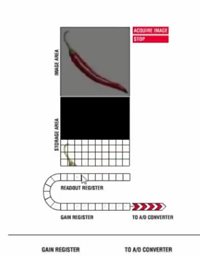
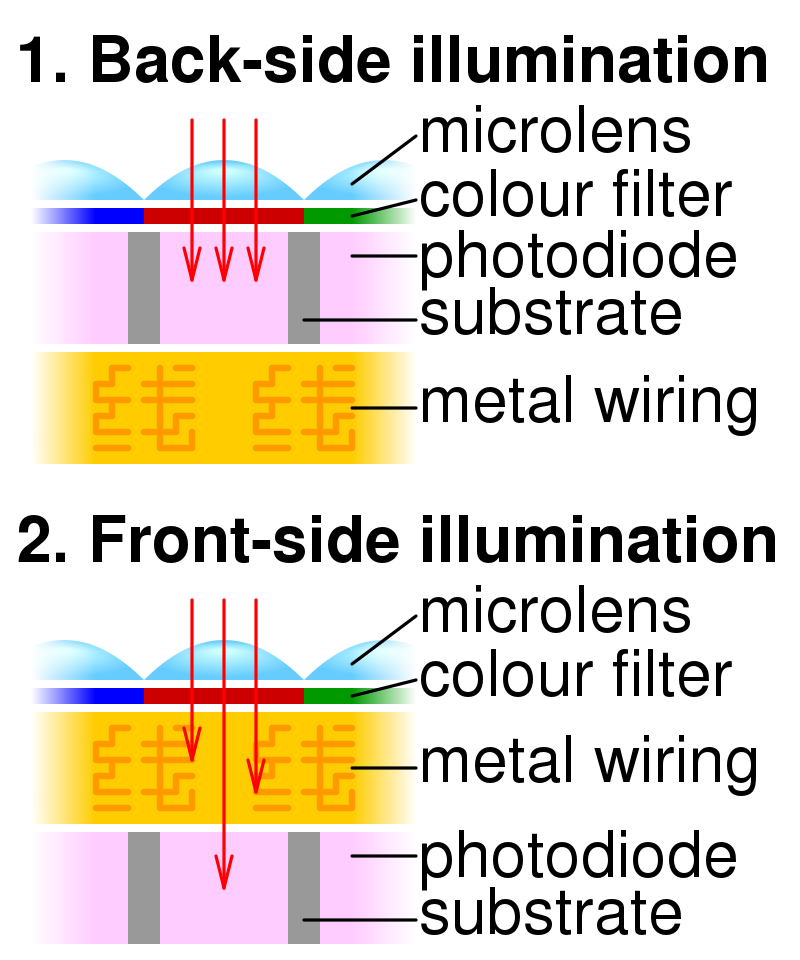

# EMCCD

두개의 층의 센서. 이미지 센서랑 스토리지 센서. 이미지 센서는 빛에 노출되고, 스토리지 센서는 빛에 노출되지 않음.

이미지센서가 아래층 스토리지 영역으로 정보를 보낸뒤, 스토리지 센서에서 한층한층씩 리드아웃 레지스터로 전자를 보냄. 그 전자들을 gain register 에서 impact ionization 을 통한 em gain 함.

dark current 도 같이 증폭이 되므로 EMCCD 를 냉각시키는게 중요하다.

ROI 를 줄이는 크롭 모드를 사용하면 더 빠르게 찍을 수 있다. Ador iXon 의 경우 크롭모드 쓰면 최대 4대 빠르게 찍는다.

## Back-illuminated sensor

렌즈-포토다이오드-와이어링 순서로 만드는게 back-illuminated sensor. front-side illumination 은 렌즈-와이어링-포토다이오드 순서.

포토다이오드를 먼저 깔고 그 위에 와이어링 하고 마지막으로 렌즈를 까는게 공정은 쉬운데, 와이어링 층이 빛을 막아서 빛 흡수 효율이 떨어진다.

공정기술의 발달로 와이어링 층을 맨 밑에 깔 수 있어서 back-illumination 이 가능해졌다.

## Clock-Induced Charge (CIC) noise

photoelectron 들이 스토리지 영역이나 EM 레지스터로 움직일때 생기는 노이즈. 일반 CCD 에서도 생기는 노이즈이지만, 일반 CCD 에서는 readout noise 나 thermal noise 가 훨씬 더 크다. EMCCD 는 Electron Multiplying gain 으로 인해 readout noise 가 줄어들었고, 냉각하면 thermal noise 도 줄어들기 때문에 CIC 의 효과가 크다.

EMCCD 에서 전자를 이동시키기위해 센서에 clock signal을 보내는데, 이때 clock signal 의 위상이 반전된 inverted phase 가 생길경우 실리콘 센서칩에 hole 이 생기고, 이렇게 생긴 홀은 clock signal 이 끝날때 가속되고, 가속된 hole 은 실리콘 아톰에 부딪혀 칩에서 신호를 만들게 된다.

vertical clock 을 빠르게 하는게 CIC 를 낮게 한다는데, 왜지??

## Photon counting mode in Andor

Photon counting 모드는 싱글포톤 신호의 정확한 세기를 측정하는게 아니라, 어떤 문턱값 넘어가는 것만 측정하는 모드임.

SNR 이 sqrt(2) 만큼 증가한다고 함.

## Ref

https://www.youtube.com/watch?v=2lHrdGxX5ew

https://en.wikipedia.org/wiki/Back-illuminated_sensor