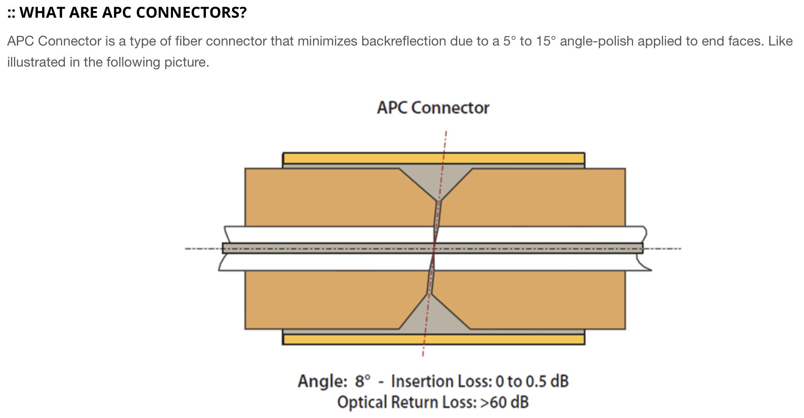
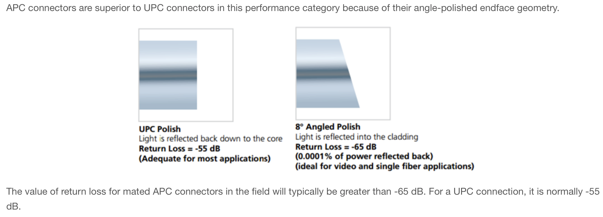

glass fiber 의 경우 일반적으로 refractive index core = 1.459, cladding = 1.442.

pure silica(SiO2) 는 n=1.458 at 587.6nm. GeO2 도핑을 해주면 refractive index 가 올라감.

clean condition 에서 loss 는 0.2db/km. 

cladding 바깥의 coating 은 클래딩보다 높은 refractive index. 왜냐면 클래딩 안에 있는 빛이 클래딩을 통해 가이딩 되면 안되니까.

클래딩은 125 micro meter. single mode fiber 는 코어 두께가 8마이크로 미터. 멀티모드는 50마이크로 미터.

Mode Field Diameter (MFD).

Bend Insensitive Fiber.

NA.

## reference

https://www.fiberoptics4sale.com/blogs/archive-posts/95041478-what-are-apc-angled-physical-contact-fiber-connectors

https://www.commscope.com/globalassets/digizuite/2518-fiber-optics-const-manual-co-107147.pdf?r=1