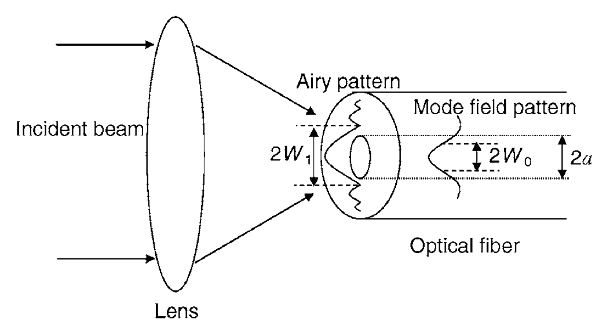
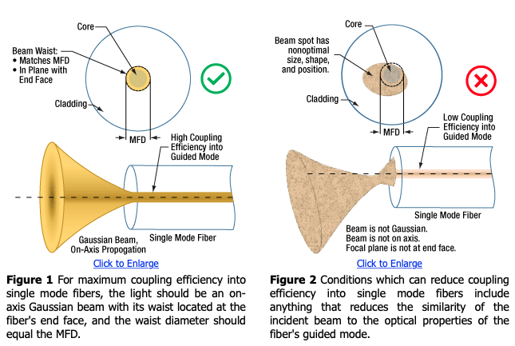

# Fiber Coupling

빔을 광섬유에 집어넣는 과정.

인풋 빔 사이즈 D, 포컬렝스 f, 빛의 파장 $\lambda$, 빔 웨이스트 $w_0$ 의 경우 렌즈로 인한 빔의 포커싱은 다음과 같다.

$2w_0 = \frac{4\lambda}{\pi}\frac{f}{D}$

커플러의 efficiency 를 높이기 위해선 fiber 코어에 들어가는 빔의 mode 가 일치해야 한다. 그래서 빔 사이즈를 키워야 할때가 있음. 

ray optics 관점에서 보면, 빔을 코어 수평선과 너무 큰 각도로 집어넣으면 전반사가 안되니 loss.

## ref

- [2006, Maximum fiber coupling efficiency and optimum beam size in the presence of random angular jitter for free-space laser systems and
their applications](https://opg.optica.org/DirectPDFAccess/9AC3A101-B329-4F52-A7DB6A33C5ADB2A4_97554/josaa-23-9-2246.pdf?da=1&id=97554&seq=0&mobile=no)

- [Improving the Coupling Efficiency of Light into Single Mode Fibers](https://www.thorlabs.com/newgrouppage9.cfm?objectgroup_id=14205)