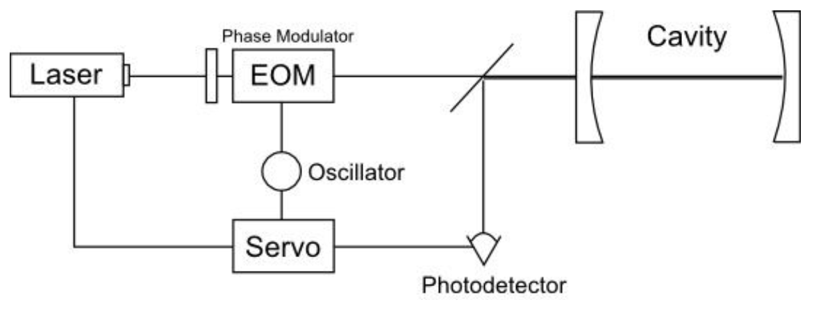

Fabry-Perot 간섭계를 이용해 레이저의 frequency 를 안정화 시키는 방법. 

단순히 frequency deviation $\delta f$ 를 통해 locking 을 하는 것은, $\delta f$가 원하는 주파수보다 큰지 작은지 알 수 없기 때문에 locking 이 제대로 되지 않는다. PDH 방법은 $\delta f$의 derivation 을 통한 feedback 으로 레이저의 frequency 를 locking 한다.

Assumption : Fabry-Perot 간섭계는 안정적이고 lossless 하다.

일단은 EOM 으로 인한 모듈레이션은 신경쓰지 말고, incident wave 와 reflected wave 의 비율인 reflection coefficient $F(w)$ 를 구해보자

spatial part $kr$ 은 신경쓰지 말고, 편의상 $-iwt$ 도 $iwt$ 로 생각한다.

$$
E_{inc} = E_0 e^{i(kx-wt)}\rightarrow E_0 e^{iwt}
$$

$$
E^{(0)}_{refl} = E_0 re^{i(-kx-wt+\pi)}\rightarrow E_0 re^{i(wt+\pi)}
$$
여기서 $r$ 은 캐비티 거울의 reflection coefficient 이고, $r^2+t^2=1$ 이다. 

$E^{(0)}$ 는 캐비티에 들어가기 전에 거울에서 반사된 빛을 의미한다. 투과거울에서 반사될때 phase 를 고려해 $\pi$ 만큼 shift 가 생겼다.

캐비티를 한번 왕복할때마다 $e^{i2Lw/c}$ 만큼의 phase retardance 가 생기고, 한번 왕복해서 캐비티를 나오는 필드는 $trt$, 두번 왕복하는 필드는 $trrrt$, 이런식의 factor 가 붙으므로 종합적인 reflected field 는

$$
E_{refl} = E_0 re^{iwt} \left(-1 +t^2 e^{i2Lw/c}+ t^2r^2 e^{i4Lw/c}+...\right)
$$

$t^2=1-r^2$ 을 이용해서 정리해주면

$$
F(w)\equiv \frac{E_{refl}}{E_{inc}} = \frac{r\left(e^{iw/\triangle \nu_{FSR}}-1 \right)}{1-r^2 e^{iw/\triangle \nu_{FSR}}}
$$
where $\triangle \nu_{FSR} \equiv c/2L$.

$\delta f$ 에 비례하는 에러 시그널 값을 얻기 위해, oscillator 와 EOM 으로 phase modulation 을 준다 (frequency modulation 을 주는 것보다 phase modulation 을 주는게 현실적으로 더 쉽다). 

$$
E_{inc} \rightarrow E_0 e^{i(wt+\beta\sin\Omega t)} \simeq E_0\left( J_0(\beta)+2i J_1(\beta)\sin\Omega t \right)e^{iwt}\\
=E_0 \left( J_0(\beta)e^{i\omega t} +J_1(\beta)e^{i(\omega+\Omega)t} -J_1 (\beta) e^{i(\omega -\Omega)t} \right)
$$

$\beta$ 는 모듈레이션의 세기, $J$는 Bessel function 이고, $\beta$가 작다면 위와 같은 approximation 이 성립한다. phase modulation 으로 인해 $\omega -\Omega$ 와 $\omega +\Omega$ 성분의 sideband 가 생긴다. 

$E_{refl}= F(\omega)E_{inc}$이므로, 모듈레이션이 있을때 $P_{refl}=|E_{refl}|^2$은

$$
P_{refl} = P_{c} |F(\omega)|^2 +P_s \left(|F(\omega+\Omega)|^2 +|F(\omega-\Omega)|^2  \right) \\
+ 2\sqrt{P_c P_s} Re\left[ F(\omega)F^*(\omega+\Omega) -F^*(\omega)F(\omega -\Omega) \right]\cos\Omega t\\
+ 2\sqrt{P_c P_s} Im\left[ F(\omega)F^*(\omega+\Omega) -F^*(\omega)F(\omega -\Omega) \right]\sin\Omega t\\
+O(2\Omega)
$$
$P_c=|J_0(\beta)E_0|^2$ 와 $P_s=|J_1(\beta)E_0|^2$ 는 carrier 와 sideband 의 intensity 를 뜻하고, $O(2\Omega)$는 sideband 끼리의 interaction term 들이다.

여기서 관심 있는 것은 $ F(\omega)F^*(\omega+\Omega) -F^*(\omega)F(\omega -\Omega)$ 에 대한 정보가 담긴 $\cos$ 와 $\sin$ term 이다.

각속도 $\Omega'$ 의 어떤 sinusoidal input 과  oscillator 가 만들어낸 modulation 신호 $\sin\Omega t$ 를 mixer 로 곱해주면, 

$$
\sin\Omega \cos\Omega't = \frac{1}{2}\left[ \sin(\Omega-\Omega')t -\sin(\Omega+\Omega')t \right]
$$

$$
\sin\Omega \sin\Omega't = \frac{1}{2}\left[ \cos(\Omega-\Omega')t -\cos(\Omega+\Omega')t \right]
$$

가 된다. 이때 $\Omega = \Omega'$ 가 되게 끔 조정하고, low pass filter 를 걸면 dc component 만 남게 되는데 이 경우 결과적으로 $\cos$ input 은 사라지고 $\sin$ input 은 살아남는다. 

$\cos$ input 을 활용하고자 한다면 phase delay 조정이 필요하다 (실제 상황에서는, 두 신호의 경로차이가 존재하기 때문에 $\sin$ input 을 쓸때도 phase 조정을 해줘야 한다). 

모듈레이션 주파수 $\Omega$ 가 작냐 크냐에 따라 $ F(\omega)F^*(\omega+\Omega) -F^*(\omega)F(\omega -\Omega)$ 값이 purely real 이냐 purely imaginary 이냐 가 바뀐다. 

캐비티의 공명 주파수를 $F$ 라고 할때, $\Omega \ll \triangle \nu_{FSR}/F$ 면 purely real 이라 $\cos$ 성분이 살아남고, $\Omega \gg \triangle \nu_{FSR}/F$ 면 purely imaginary 라 $\sin$ 성분이 살아남는다. 

실제 상황에선 모듈레이션 속도를 빠르게 해서 $\sin$ 성분을 사용한다.