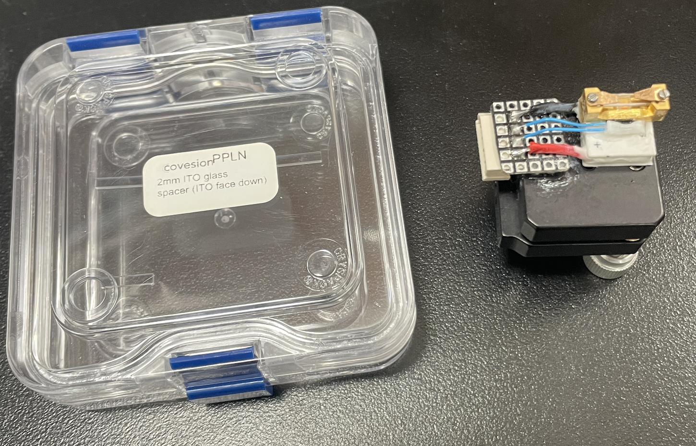
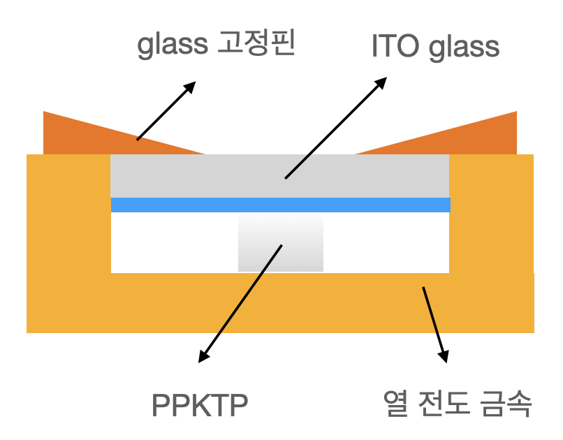
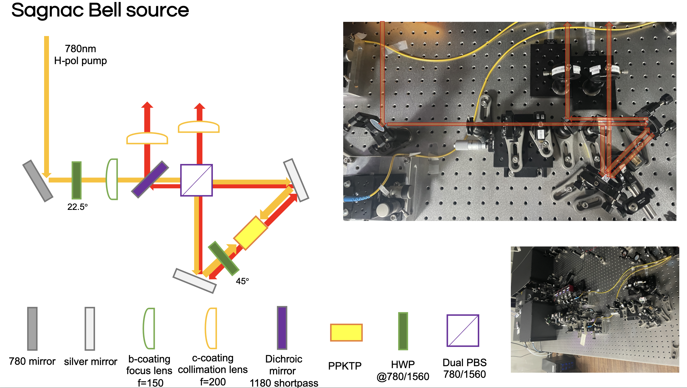

# PPTKP 마운트

- 고정핀 나사를 적당히 풀어준다. 나사 잃어버리면 온도조절기(TEC) 새로 사야되니까 완전 다 풀지는 말것
- 크리스탈 장착 전에 tec 의 열전도 금속 밑표면을 클리닝 할 것.
- 크리스탈은 투명한 면이 정면을, 불투명한 면이 측면으로 향하도록 할것 (위아래 구분 x)
- ITO 글래스는 열전도를 위해서 유리에다가 ITO 코팅을 입힌것. ITO 코팅이 아래를 향해 크리스탈과 맞닿아야 한다. 코팅면이 육안으로 구분 안되니까, 글래스 케이스에 ITO face down 이라 적혀있는 것 체크해서 진행할 것.

# Bell state generation using ppktp

PBS 에서 반사되는 V pol 편광의 phase 를 고려하면, 결과적으로 $\ket{\Psi^-}=\ket{HV}-\ket{VH}$ 상태가 만들어진다.

두개의 spdc 광자의 output 채널에서 한 채널은 펌프빔의 방향을 통해서 예측하고, 다른 한 채널은 Dichroic mirror 의 뒷쪽으로 반사되는 빛의 방향을 통해서 spdc 빛의 경로를 예측할 수 있다.