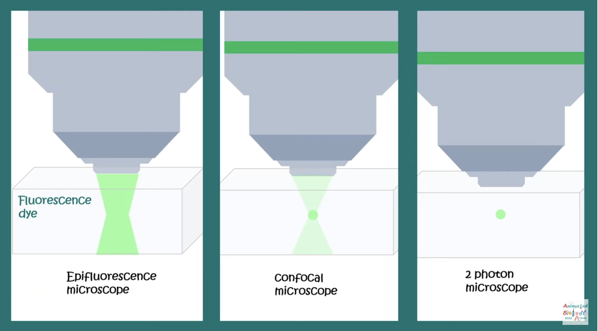

형광 이미징 방법들. Photobleaching 이라고, 빛의 파장이 짧을수록 광자 에너지가 높아서 타겟을 화학적으로 변화시키거나 파괴할 확률이 높다. 그리고 샘플을 뚫고 들어가는 깊이는 스캐터링 되는 확률과 연관돼 있는데, 스캐터링 확률은 대략 1/파장^4 이라서, 파장이 짧을수록 스캐터링이 많이 돼서 투과를 잘 못한다.

형광을 보기위한 펌프 빔의 파장은 형광 빛의 파장보다 짧다. 왜냐면 dye 나 분자같은것들은 upper level 에 자잘한 internal channel 들(서로간의 충돌로 인한 decay 라던지)이 있어서 나오는 형광 빛이 넣어준 것보다 에너지가 작다.

## Epifluorescence Microscopy

원하는 위치에 초점맞추는거 안하고 그냥 빛 때려넣어서 형광을 보는 것. 빛이 지나가는 길 전부 다 형광을 내기 때문에 수직방향 구분이 잘 안된다. 가장 원시적인 방법.

## Confocal Microscopy

원하는 위치에 초점을 맞춰서 빛을 집어넣는 것. 초점에서 intensity 가 가장 강하기때문에 분해능이 올라가지만, 여전히 빛이 지나가는 길 전부 다 어느정도 형광을 내기때문에 분해능이 완벽하지는 않다. 그나마 발전한 버전.

## Two-photon Microscopy

타겟이 광자 두개를 흡수해서 upper level 로 올라간 뒤 형광을 내뱉는 걸 이용하는 것. 긴 파장의 빛을 사용하니 샘플을 파괴할 확률도 줄고, 빛이 투과하는 길이도 길다. 두개의 광자 펄스의 시간 차이가 50fs 미만이어야 서로 펄스간의 구분이 안되니 two-photon 과정이 일어날 것. 가우시안 빔이면 초점에선 두 지점의 거리가 약간 있어도 wave vector sum 이 absorption 에 해당하는 phase matching 조건을 맞추겠지만, 초점이 아닌 지점에선 약간 떨어진 두 지점의 wave vector 가 phase 가 다르거나 co-linear 해서 phase matching 조건이 안맞아서 excitation 이 안 생기는 것(이라고 추측함). 딱 초점에서만 excitation 이 일어나기 때문에 분해능이 좋아지지만, two-photon process 라서 신호의 세기는 줄어든다. 