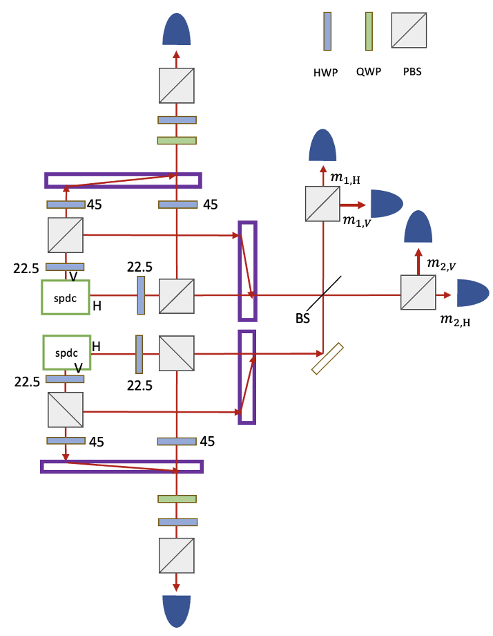

initial state (dagger is omitted for convenience)

$$
a_Ha_Vb_Hb_V\ket{vac}
$$

After first BS,

$$
\frac{1}{4}(a_H+c_H)(a_V+c_V)(b_H+d_H)(b_V+d_V)
$$

in second BS, there is no distinguish for mode a and b. Theses become mode m

$$
\frac{1}{4}(m_H+c_H)(m_V+c_V)(m_H+d_H)(m_V+d_V)
$$

After second BS, 

$$
\frac{1}{4}[\frac{1}{\sqrt{2}}(m_{1,H}+m_{2,H})+c_H]
\newline
\times [\frac{1}{\sqrt{2}}(m_{1,V}+m_{2,V})+c_V]
\newline
\times [\frac{1}{\sqrt{2}}(m_{1,H}+m_{2,H})+d_H]
\newline
\times [\frac{1}{\sqrt{2}}(m_{1,V}+m_{2,V})+d_V]
$$

Post-selection : one photon per each path. we see 4-fold coincidence.

m 패스에 포톤이 세개들어오는 경우랑 네개 들어오는 경우는 엄밀히는 노이즈지만, 4fold 에는 찍히지 않는다.

포스트셀렉션을 거치면

$$
\frac{1}{8}[2m_{1,V}m_{2,V}c_H d_H + 2m_{1,H}m_{2,H}c_V d_V
\newline
+(m_{1,V}m_{2,H}+m_{1,H}m_{2,V})c_H d_V 
\newline
+ (m_{1,V}m_{2,H}+m_{1,H}m_{2,V})c_V d_H]
$$
$$
=\frac{1}{8}[(m_{1,H}m_{2,H}+m_{1,V}m_{2,V})(c_{H}d_{H}+c_{V}d_{V})
\newline
+ (m_{1,H}m_{2,H}-m_{1,V}m_{2,V})(c_{H}d_{H}-c_{V}d_{V}) 
\newline + m_{1,V}m_{2,H}(c_H d_V+c_V d_H)
\newline + m_{1,H}m_{2,V}(c_H d_V+c_V d_H)]
$$

마지막 디텍터로 들어가기전 waveplate와 pbs로 HV 또는 VH 프로젝터를 구성하면 $\ket{\Psi^+}$ 상태를 얻을 수 있다. (맨 처음 BS 로 포톤을 빼낼때 BS 의 입사면을 바꿔서 페이즈를 먹이면 $\ket{\Psi^-}$) 를 얻을 수 있다.

또는 RL 이나 LR, DA 나 AD 프로젝터를 구성하면 $\ket{\Phi^+}$ 또는 $\ket{\Phi^-}$ 상태를 얻을 수 있다.

만약 마지막 프로젝터에서 QWP, HWP 대신에, PRA 2014 처럼 HWP22.5 를 놓고 PBS 다른 한쪽포트에 디텍터를 둔다면?

$$
m_{1,H}\rightarrow \frac{1}{\sqrt{2}}(m_{1,H} +m_{1,V})\newline
m_{1,V}\rightarrow \frac{1}{\sqrt{2}}(m_{1,H} - m_{1,V})\newline
m_{2,H}\rightarrow \frac{1}{\sqrt{2}}(m_{2,H} +m_{2,V})\newline
m_{2,V}\rightarrow \frac{1}{\sqrt{2}}(m_{2,H} -m_{2,V})
$$
이 되므로,

$$
=\frac{1}{8}[(m_{1,H}m_{2,H}+m_{1,V}m_{2,V})(c_{H}d_{H}+c_{V}d_{V})
\newline
+ (m_{1,H}m_{2,H}-m_{1,V}m_{2,V})(c_{H}d_{H}-c_{V}d_{V}) 
\newline + m_{1,V}m_{2,H}(c_H d_V+c_V d_H)
\newline + m_{1,H}m_{2,V}(c_H d_V+c_V d_H)]
$$

$$
\rightarrow \frac{1}{8}[(m_{1,H}m_{2,H}+m_{1,V}m_{2,V})(c_Hd_H+c_Vd_V)\newline
+(m_{1,V}m_{2,H}+m_{1,H}m_{2,V})(c_Hd_H-c_Vd_V)\newline
(m_{1,H}m_{2,H}-m_{1,V}m_{2,V})(c_Hd_V+c_Vd_H)]
$$
가 돼서, 디텍터 클릭만을 통해서는 각 상태를 구분할 수 없게 된다.

### 만약 dump 포트까지 활용한다면?

$$
\frac{1}{4}(m_H+c_H)(m_V+c_V)(m_H+d_H)(m_V+d_V)
$$

After second BS, 

$$
\frac{1}{4}[\frac{1}{\sqrt{2}}(m_{1,H}+m_{2,H})+c_H]
\newline
\times [\frac{1}{\sqrt{2}}(m_{1,V}+m_{2,V})+c_V]
\newline
\times [\frac{1}{\sqrt{2}}(m_{1,H}-m_{2,H})+d_H]
\newline
\times [\frac{1}{\sqrt{2}}(m_{1,V}-m_{2,V})+d_V]
$$

we see 4-fold coincidence. let's do postselection.

$$
\frac{1}{8}[(m_{1,H}+m_{2,H})(m_{1,H}-m_{2,H})c_V d_V 
\newline
+ (m_{1,V}+m_{2,V})(m_{1,V}-m_{2,V})c_H d_H]
\newline
+ (m_{1,H}+m_{2,H})(m_{1,V}-m_{2,V})c_V d_H \newline
+ (m_{1,V}+m_{2,V})(m_{1,H}-m_{2,H})c_H d_V $$

$$
\rightarrow\frac{1}{8}[m_{1,H}m_{1,V}(c_V d_H+c_H d_V)
\newline
-m_{2,H}m_{2,V}(c_V d_H+c_H d_V)\newline
+m_{1,V}m_{2,H}(c_V d_H-c_H d_V)\newline
-m_{1,H}m_{2,V}(c_V d_H-c_H d_V)]
$$
