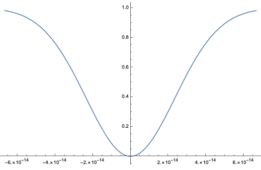

Let $\hat{a}_1$ and $\hat{a}_2$ are bosonic operators at the two input ports to the beam splitter and $\hat{b}_1$ and $\hat{b}_2$ are bosonic operators at the two output ports.

By the condition $|E_{a1}|^{2}+|E_{a2}|^{2}=|E_{b1}|^{2}+|E_{b2}|^{2}$, input-output operators relations are given by

$$
\hat{b}_1 = e^{i\phi_1}(e^{i\alpha}\sqrt{R}\hat{a}_1 + \sqrt{T}\hat{a}_2) \\
\hat{b}_2 = e^{i\phi_2}(e^{i(\pi-\alpha)}\sqrt{T}\hat{a}_1 + \sqrt{R}\hat{a}_2)
$$

where $R+T=1$, $\phi_1$ and $\phi_2$, $\alpha$ are arbitrary phase. For convenience, we shall put $\phi_1=\phi_2=0$ and $\alpha=\pi/2$, Thus

$$
\hat{b}_1 = \sqrt{R}\hat{a}_1 + i\sqrt{T}\hat{a}_2 \\
\hat{b}_2 = i\sqrt{T}\hat{a}_1 + \sqrt{R}\hat{a}_2 \\
\hat{b}^{\dagger}_1 = \sqrt{R}\hat{a}^{\dagger}_1 - i\sqrt{T}\hat{a}^{\dagger}_2 \\
\hat{b}^{\dagger}_2 = -i\sqrt{T}\hat{a}^{\dagger}_1 + \sqrt{R}\hat{a}^{\dagger}_2
$$

input Fock state is $\ket{1}\ket{1}=\hat{a}^{\dagger}_1\hat{a}^{\dagger}_2\ket{0}\ket{0}$. Using $ \hat{a}^{\dagger}_1 = \sqrt{R}\hat{b}^{\dagger}_1 + i\sqrt{T}\hat{b}^{\dagger}_2 $ and $ \hat{a}^{\dagger}_2 = i\sqrt{T}\hat{b}^{\dagger}_1 + \sqrt{R}\hat{b}^{\dagger}_2 $, output state after the beam splitter is

$$
\ket{out} = (R-T)\ket{1}\ket{1}+i\sqrt{2RT}\ket{2}\ket{0}+i\sqrt{2RT}\ket{0}\ket{2}
$$

Two-photon state produced by SPDC crystal is 

$$
\ket{\psi}=\int{dw_1 dw_2 \phi(w_1,w_2)\ket{w_1,w_2}}
$$

where $\phi$ is some weight function and $w_0=w_1+w_2$.

Joint probability of the detection of photons at both dectectors D1 and D2 at times $t$ and $t+\tau$ is given by

$$
P_{12}(\tau)= K\sum_{f} |\bra{f} \hat{E}^{(+)}_2 (t+\tau) \hat{E}^{(+)}_1 (t) \ket{i}|^2\\
=K\sum_{f} \bra{i} \hat{E}^{(-)}_1 (t) \hat{E}^{(-)}_2 (t+\tau) \ket{f}\bra{f} \hat{E}^{(+)}_2 (t+\tau) \hat{E}^{(+)}_1 (t) \ket{i}\\
=K\bra{i} \hat{E}^{(-)}_1 (t) \hat{E}^{(-)}_2 (t+\tau)  \hat{E}^{(+)}_2 (t+\tau) \hat{E}^{(+)}_1 (t) \ket{i}\\
=K\braket{\hat{E}^{(-)}_1 (t) \hat{E}^{(-)}_2 (t+\tau)  \hat{E}^{(+)}_2 (t+\tau) \hat{E}^{(+)}_1 (t)} 
$$

by completeness $\sum_{f}\ket{f}\bra{f}=I$, where $\ket{i}$ and $\ket{f}$ are initial photon state and final photon state and K is detector efficiency coefficient.

output fields of beam splitter $\hat{E}^{(+)}_1 (t)$ and $\hat{E}^{(+)}_2 (t)$ are related to the input fields $\hat{E}^{(+)}_{01} (t)$ and $\hat{E}^{(+)}_{02} (t)$.

$$
\hat{E}^{(+)}_1 (t) =\sqrt{T}\hat{E}^{(+)}_{01} (t-\tau_1) +i\sqrt{R}\hat{E}^{(+)}_{02} (t-\tau_1+\delta\tau) \\
\hat{E}^{(+)}_2 (t)=\sqrt{T}\hat{E}^{(+)}_{02} (t-\tau_1) +i\sqrt{R}\hat{E}^{(+)}_{01} (t-\tau_1 - \delta\tau)
$$

Here $\tau_1$ is the propagation time from mirror to detector and $\delta\tau$ is the time delay created by the small displacement of the beam splitter.

For simplicity, we put $\tau_1 = 0$. Then we can write as follows

$$
\hat{E}^{(+)}_1 (t) =\sqrt{T}\hat{E}^{(+)}_{01} (t) +i\sqrt{R}\hat{E}^{(+)}_{02} (t+\delta\tau) \\
\hat{E}^{(+)}_2 (t+\tau)=\sqrt{T}\hat{E}^{(+)}_{02} (t+\tau) +i\sqrt{R}\hat{E}^{(+)}_{01} (t+\tau - \delta\tau)\\
\hat{E}^{(-)}_2 (t+\tau)=\sqrt{T}\hat{E}^{(-)}_{02} (t+\tau) -i\sqrt{R}\hat{E}^{(-)}_{01} (t+\tau - \delta\tau)\\
\hat{E}^{(-)}_1 (t) =\sqrt{T}\hat{E}^{(-)}_{01} (t) -i\sqrt{R}\hat{E}^{(-)}_{02} (t+\delta\tau) 
$$

Coincidence count probability represented by input fields $E_{01}$ and $E_{02}$ has 16 terms ($2\times 2\times 2\times 2=16$). Terms that have same number of $E_{01}$ and $E_{02}$ are non-vanishing and otherwise goes to zero(by orthogonality of Fock state basis), thus only 6 terms remain. Terms that have $E_{01}$ ($E_{02}$) only are not related to coincidence count. Only 4 terms are physically meaningful in terms of coincidence count. Remainings are given by

$$
P_{12}(\tau)=K\langle T^{2}E^{(-)}_{01}(t)E^{(-)}_{02}(t+\tau)E^{(+)}_{02}(t+\tau)E^{(+)}_{01}(t)\\
+R^2 E^{(-)}_{01}(t+\tau-\delta \tau)E^{(-)}_{02}(t+\delta\tau)E^{(+)}_{02}(t+\tau)E^{(+)}_{01}(t+\tau-\delta\tau)\\
-RT[E^{(-)}_{01}(t)E^{(-)}_{02}(t+\tau)E^{(+)}_{02}(t+\delta\tau)E^{(+)}_{01}(t+\tau-\delta\tau)\\
+E^{(-)}_{01}(t+\tau-\delta\tau)E^{(-)}_{02}(t+\delta\tau)E^{(+)}_{02}(t+\tau)E^{(+)}_{01}(t)]\rangle
$$

It can be written as second order coherence function(fourth order interference) $g(\tau)$. 

$$
P_{12}(\tau)=K|G(0)|^2 [T^{2} |g(\tau)|^{2}+R^{2} |g(2\delta\tau-\tau)|^{2}-RT[g^*(\tau)g(2\delta\tau - \tau)+g(\tau)g^*(2\delta\tau - \tau)]]
$$

where $g(\tau) = G(\tau)/G(0)$.

By integrating $P_{12}(\tau)$ over all $\tau$, we can get observed coincidence count number $N_c$.

$$
N_c = C[R^2 + T^2 -2RT\frac{\int_{-\infty}^{\infty}g(\tau)g(t-2\delta\tau)d\tau}{\int_{-\infty}^{\infty}g^2(\tau)d\tau}]
$$

where $C$ is some constant. If $g(\tau)$ has the gaussian form $g(\tau)=e^{-(\triangle w\tau)^2 /2}$, coincidence count is

$$
N_c = C[R^2 + T^2 -2RT\frac{e^{-\Delta w^2\delta w}\int_{-\infty}^{\infty}e^{-\Delta w^2 (\tau -\delta\tau)^2}d\tau}{\int_{-\infty}^{\infty}e^{-\Delta w^2 \tau^2}d\tau}]
$$

$\int_{-\infty}^{\infty}e^{-\Delta w^2 (\tau -\delta\tau)^2}=\int_{-\infty}^{\infty}e^{-\Delta w^2 \tau^2}$, Thus the equation becomes

$$
N_c = C(T^2+R^2)[1-\frac{2RT}{R^2+T^2}e^{(\Delta w \delta \tau)^2}]
$$

Coincidence count probability has a dip near $\delta \tau=0$. (Here $T=1/2$, $R=1/2$, $\Delta w=3\times10^{13}$)

