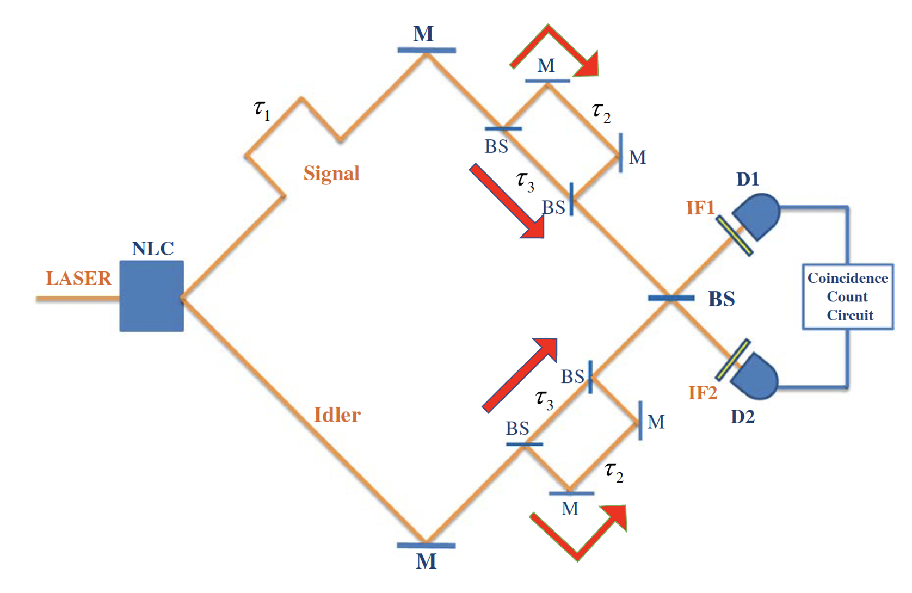
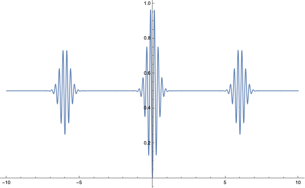

The biphoton state that is generated from the SPDC process can be given by

$$
\ket{\psi} = \int dw_s dw_i \phi(w_s, w_i)\hat{a}^{\dagger}_s(w_s) \hat{a}^{\dagger}_i (w_i)\ket{0}
$$

where $\phi(w_s, w_i)$ is the biphoton spectral function, which is determined by the phase-matching condition.

In this experimental setup, there are four paths that generate time delay.

Phase shifts by time delay can be written as:

$$
(e^{-iw_s(\tau_1+\tau_3)}+e^{-iw_s(\tau_1+\tau_2)})(e^{-iw_i\tau_3}+e^{-iw_i\tau_2})
$$

where $\tau_1$ is signal photon path time delay, $\tau_3$ is short path time delay and $\tau_2$ is long path time delay (note that beam splitter is a 50:50 beam splitter). 

For a convenience, we put a $\tau_3$ is a zero. Then phase shifts are given by

$$
(e^{-iw_s\tau_1})(1+e^{-iw_s\tau_2})(1+e^{-iw_i\tau_2})
$$

The biphoton state that interferes the last beam splitter should be written as:

$$
\ket{\psi} = \int dw_s dw_i (e^{-iw_s\tau_1})(1+e^{-iw_s\tau_2})(1+e^{-iw_i\tau_2})\newline
\times\phi(w_s, w_i)\hat{a}^{\dagger}_s(w_s) \hat{a}^{\dagger}_i (w_i)\ket{0}
$$

Electric field operators that are related to photon detection at detector D1 and D2 are defined as:

$$
\hat{E}^{(+)}_{1}(t_1)\sim \int dw_1 \hat{a}_1(w_1)g_1(w_1)e^{-iw_1 t_1}\newline
\hat{E}^{(+)}_{2}(t_2)\sim \int dw_2 \hat{a}_2(w_2)g_2(w_2)e^{-iw_2 t_2}
$$

where $g_1(w_1)=e^{-(w_1-w_a)^2/2\sigma_1^2}$ and $g_2(w_2)=e^{-(w_2-w_b)^2/2\sigma_2^2}$ represent optical spectral functions of filters in front of detectors D1 and D2

