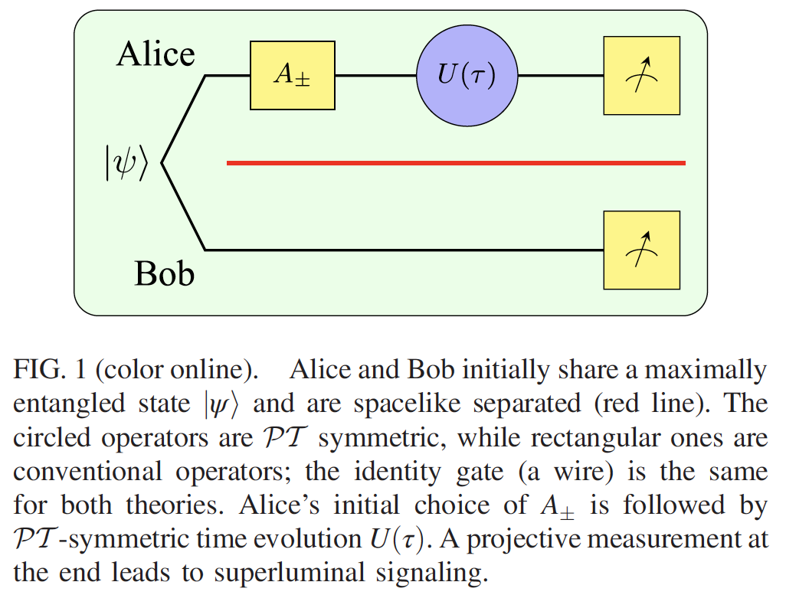

# Local PT Symmetry Violates the No-Signaling Principle

## What is Local PT ?

Local PT symmetry means that certain subsystems are PT symmetric while others are not and the Hamiltonian completely describes the subsystem without any conditional dependence on the other conventional subsystems.

## Two assumption

1. There exists a quantum system described locally by a PT-symmetric Hamlitonian and it can coexist with a conventional quantum system.

2. Post-measurement probability distribution are computed using conventionally normalized quantum states.

## PT symmetry Hamiltonian and Time evolution

For 2x2 system, P operator is pauli x matrix and T is defined by complex conjugation. 

A nontrivial example of a PT-symmetry Hamiltonian is 

$$
H=s\begin{bmatrix}
i\sin{\alpha} &1\\
1& -i\sin{\alpha}
\end{bmatrix}
$$
s and $\alpha$ is real number. s is a scaling constant and $\alpha$ is Hermiticity of $H$. When $\alpha=0$, Hamiltonian is a Hermitian. 

Eigenvalues are $E_{\pm}=\pm s\cos{\alpha}$, are real when $|\alpha|<\pi/2$.

Corresponding eigenstates are

$$
\ket{E_{+}(\alpha)}=\frac{e^{i\alpha/2}}{\sqrt{2\cos{\alpha}}}
\begin{bmatrix}1\\e^{-i\alpha}\end{bmatrix}
$$

$$
\ket{E_{-}(\alpha)}=\frac{ie^{-i\alpha/2}}{\sqrt{2\cos{\alpha}}}
\begin{bmatrix}1\\-e^{i\alpha}\end{bmatrix}
$$

These are not orthogonal each other in conventional quantum theory. 

Some useful formula as following:

$$
e^{i\phi\bold{\sigma\cdot \hat{n}}}=\cos{\phi}+i\sin{\phi}\bold{\sigma\cdot \hat{n}}
$$
where $\bold{\sigma}=(\sigma_0,\sigma_1,\sigma_2,\sigma_3)$ and $\bold{\hat{n}}$ is a normalized vector.

Our Hamiltonian is expressed as following:

$$
H=s\cos{\alpha}(\frac{\sigma_1+i\sin{\alpha}\sigma_3}{\cos{\alpha}}) = s\cos{\alpha}\bold{\sigma \cdot\hat{n}}
$$

Then time evolution is given by

$$
U(t)=e^{-itH}=e^{-its\cos{\alpha}\bold{\sigma \cdot\hat{n}}}=e^{-it'{\sigma \cdot\hat{n}}}
\\
=\cos{t'}-i\sin{t'}{\sigma \cdot\hat{n}}
\\
=\frac{1}{\cos{\alpha}}
\begin{bmatrix}
\cos{(t'-\alpha)}&-i\sin{t'}\\
-i\sin{t'}&\cos{(t'+\alpha)}
\end{bmatrix} 
$$
where $\hbar=1$ and $t'=ts\cos{\alpha}$ for convinience.

## PT symmetry violates the no-signaling principle

Let $A_{+}=I$, $A_- = \sigma_x$, $\tau=\pi/(2s\cos{\alpha})$ are. Alice and Bob share maximally entangled state $\psi = \frac{1}{\sqrt{2}}[\ket{+_x+_x}+\ket{-_x-_x}]$, where $\ket{\pm_k}$ are eigenstate of pauli matrices $\sigma_k$.

$$
\ket{\psi^\pm_{f}}=[U(\tau)A_{\pm}\otimes I]\ket{\psi}\propto\frac{1}{\sqrt{2}}[e^{i\phi_+}\begin{bmatrix}1\\ie^{-i\epsilon}\end{bmatrix}\ket{+}\pm[e^{i\phi_-}\begin{bmatrix}1\\ie^{i\epsilon}\end{bmatrix}]
$$
where $e^{i\phi_{\pm}}=\frac{\sin{\alpha}\mp i}{\sqrt{1+\sin{\alpha}^2}}$ and $e^{i\epsilon}=\frac{-2\sin{\alpha}+i\cos{\alpha}^2}{1+\sin{\alpha}^2}$.

The normalization constants have been renormalized in the way of conventional quantum mechanics, $1/\cos{\alpha}\rightarrow 1/\sqrt{1+\sin{\alpha}^2}$, since in the end Bob will measure his system using conventional quantum mechanics.

The joint probability is

$$
P(a,b|A_{\pm},B)=\bra{\psi^{\pm}_{f}}(\ket{a}\bra{a}\otimes\ket{b}\bra{b})\ket{\psi^{\pm}_{f}}
$$

then 

$$
\sum_{a=\pm_y}P(a,+_y|A_{\pm},B)=\frac{1}{2}[1\pm\cos{\epsilon}\sin{(2\phi_+ -\epsilon)}]
$$

So, to adjust $\alpha$ and local operation from Alice change Bob's probability distribution. 

