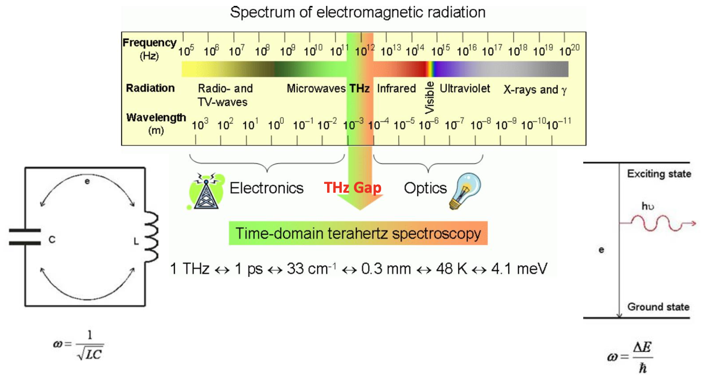
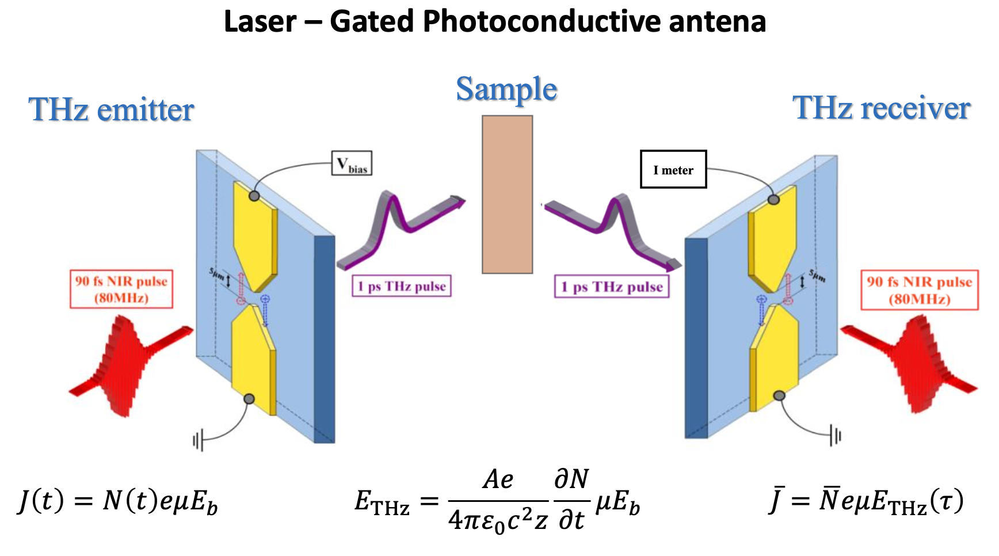
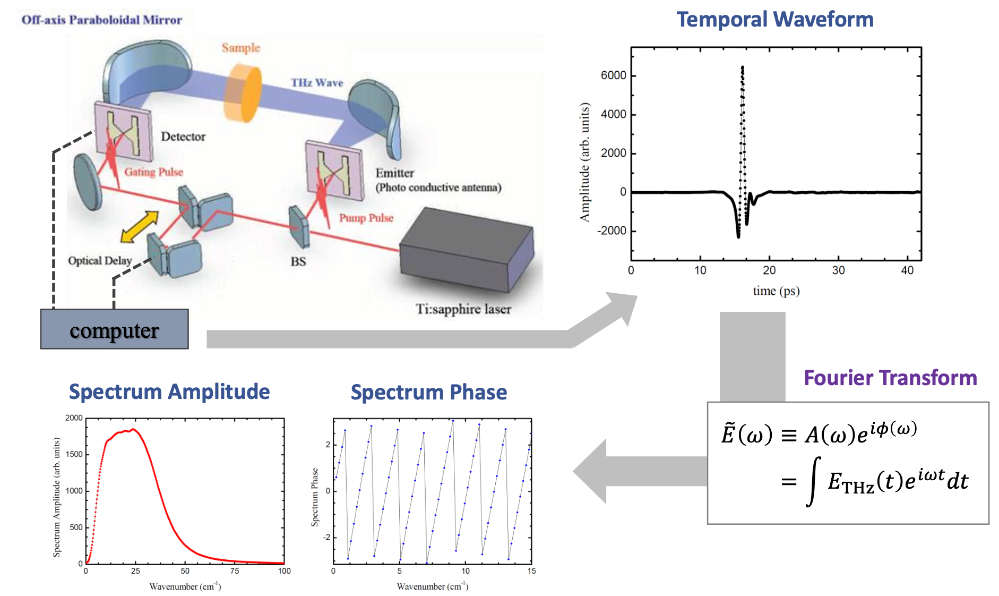

## Why generating THz source is so difficult ?

낮은 주파수 대역은 LC 회로로 만듦. 전자의 mobility 때문에 LC 회로 속도에는 limit 이 걸림. 약 0.1THz 정도가 한계.

높은 주파수 대역은 excited atom 으로 만듦. 하지만 주파수가 낮을 수록 energy gap 차이가 줄어들어 제어하기 힘듬. 약 10THz 정도가 한계.

pulse laser 의 개발로 THz spectroscopy 가 가능해짐.

### pulse laser

dye laser : 염료를 푼 액체 여러 색깔을 섞은 물은 다양한 밴드갭을 가져서, 넓은 frequency mode 의 레이저(시간 영역에선 짧은 pulse)를 만들 수 있다.

Ti-Sapphire laser : 사파이어에 티타늄 원자를 도핑. 티타늄 원자 위치에 따라 제각각 밴드 갭을 가져서 broad 한 밴드갭.

## How to generate & detect THz ?

### THz 생성

defect 가 아주 많은 GaAs에 전극을 달아 전압을 가한다. NIR pulse laser 가 GaAs 에 맞으면 hole-electron dipole 이 생기고, dipole 이 전압에 의해 회전하면서 dipole radiation 이 THz pulse 를 만들어 낸다. dipole 의 전하들은 defect 들에 흡수된다.

### THz 측정

THz 펄스와 NIR 펄스가 GaAs 에서 만나게 되면 receiver 에 dipole 이 생겨나며 전류가 발생한다. 그 전류를 측정하면 THz 펄스를 측정할 수 있다.

NIR 펄스의 시간폭은 THz 펄스보다 훨씬 짧다. 수신되는 신호는 NIR 펄스와 THz 펄스의 컨볼루션 형태이기 때문에, NIR 펄스의 시간 딜레이를 바꿔가면서 THz 펄스를 스캔하며 temporal waveform 을 측정할 수 있다.