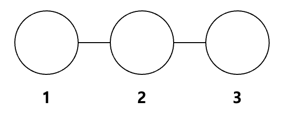
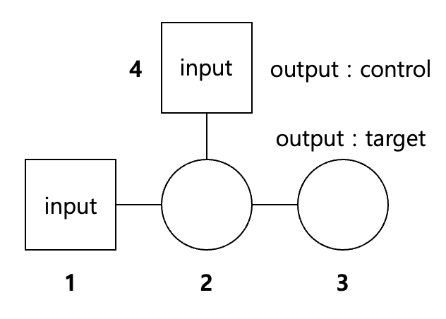

Measurement Based Quantum Computing (MBQC) 라고 불리는 방법. 

Cluster state 를 준비한 다음 single qubit measurement 를 수행한 뒤, measurement outcome 에 따라서 다음 큐빗의 측정을 결정하는 feed-forward 방식으로 measurement 를 순차적으로 수행하면 결과적으로 Circuit based quantum computing 과 같은 결과를 얻을 수 있다.

Single qubit rotation gate 와 CNOT gate 를 통해 임의의 quantum gate 를 구성할 수 있으므로, cluster state 와 MBQC 를 통해 두 gate 를 구현할 수 있음을 보이도록 하겠다.

## Single qubit rotation $R_{z}(\theta)$

임의의 초기상태 $\ket{\psi_i}=\alpha\ket{0}+\beta\ket{1}$ 에 대해 $R_z(\theta)\ket{\psi_i}=e^{-i\theta/2}(\alpha\ket{0}+\beta e^{i\theta}\ket{1})$ 이다. 

먼저 3큐빗을 준비한다. 첫번째 큐빗은 초기상태인 $\ket{\psi_i}=\alpha\ket{0}+\beta\ket{1}$ 이고, 2번과 3번 큐빗은 $\ket{+}$ 상태로 준비한다. 

1번 큐빗과 2번 큐빗을 control 과 target 으로 하여 CPhase gate(Controlled-$\sigma_z$ gate)를 걸고, 그 다음 2번큐빗과 3번큐빗을 control 과 target 으로 하여 CPhase gate 를 적용해 cluster state 를 준비한다.

클러스터 상태를 준비한 다음, 첫번째 큐빗은 다음과 같은  $-\theta$ basis 로 측정한다.

$$
\ket{\tilde{0}}= \frac{1}{\sqrt{2}}(\ket{0}+e^{i\theta}\ket{1}) \newline
\ket{\tilde{1}}= \frac{1}{\sqrt{2}}(\ket{0}-e^{i\theta}\ket{1})
$$

두번째 큐빗에서는 X basis 로 측정하고 나면, 세번째 큐빗의 상태는 $R_z(\theta)\ket{\psi_i}$ 가 되거나, 또는 파울리 게이트를 걸어줌으로써 $R_z(\theta)\ket{\psi_i}$ 가 되는 상태가 된다 (파울리 게이트를 걸어줌으로써 원래 상태로 돌아올 수 있는 상태를 Pauli error 내의 상태라고 한다). 각 싱글 큐빗의 측정 결과에 따라서 적절히 single qubit operation 을 해주면 원하는 gate 를 만들 수 있다.

자세한 과정은 다음과 같다. 처음 3 큐빗 상태는 

$$
(\alpha\ket{0}+\beta\ket{1})\ket{++}
$$

이고, 1,2번 큐빗과 2,3번 큐빗에 C-Phase gate 를 걸어주면 

$$
\frac{1}{\sqrt{2}}[(\alpha\ket{0}+\beta\ket{1})\ket{0+}+(\alpha\ket{0}-\beta\ket{1})\ket{1-}]
$$

가 된다. 여기서 첫번째 큐빗을 $-\theta$ basis 로 쓰면, 상태는 다음과 같이 쓸 수 있다.

$$
\frac{1}{\sqrt{2}}(\ket{\tilde{0}}_1\ket{\psi_{\tilde{0}}}_{23}+ \ket{\tilde{1}}_1\ket{\psi_{\tilde{1}}}_{23}) 
$$

이때

$$

$$

## CNOT gate

$\ket{\psi_1}=\alpha\ket{0}+\beta\ket{1}$ 와 $\ket{\psi_4}=\gamma\ket{0}+\delta\ket{1}$ 에 대해서 4번 큐빗이 control qubit 이고 1번 큐빗이 target qubit 이라 하면 CNOT 의 결과는 다음과 같다.

$$
\alpha\gamma\ket{00}\alpha\delta\ket{11}+\beta\gamma\ket{10}+ \beta\delta\ket{01}
$$

다음과 같은 4큐빗 클러스터 상태를 준비한 후, 싱글 큐빗 gate 와 measurement feed-forward 를 수행하면 4, 3번 큐빗을 control, target qubit 으로 삼았을때 CNOT gate 를 걸어준 결과가 나온다.

결과적으로 단일 큐빗 연산과 측정만으로도 CNOT 같은 2 qubit 게이트를 구현할 수 있다. 광학 기반의 시스템은 CNOT 게이트의 구현이 쉽지 않은데(빛은 다른 빛과 잘 상요작용 하지 않기때문), 이런 cluster state 기반의 MBQC 는 single qubit operation 만으로도 CNOT 과 같은 결과를 만들 수 있으니 DV 기반 양자컴퓨팅은 MBQC 를 목표로 하고 있다. 

맨 처음 C-Phase 게이트를 통해 cluster 상태를 만드는게 가장 큰 overhead다.