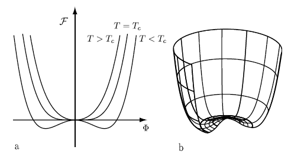

## Order parameter

Example: Magentization on temperature $T$.

When $T$ is high, no maganetization. Symmetric.

When $T<T_c$, system shows magnetization to specific direction. Symmetry breaking. To describe system, we need additional parameter: Order parameter. In this case, magnetization $M$ is the order parameter.

Reduction in symmetry requires an parameters for description!

## Critical exponent

Higher order phase transition (continuous phase transition) systems show singular behavior near the critical temperature $T_c$, as the form of

$$
\left|\frac{T-T_c}{T_c}\right|^{-c} \equiv |t|^{-c}
$$

critical exponents $c$ are typically labeled by Greek letters ($\alpha$ for heat capacity, $\beta$ for order parameter, $\gamma$ for compressibility, $\delta$ for equation of state, etc...)

### Universality of critical exponents

The critical exponents are universal. Physical systems can be grouped in universality classes. The critical exponents are dependent from each other, There exists a number of scaling relations between them, arising from statistical and thermodynamic considerations.

## Landau theory

- Describe a system around the critical point, where the order parameter $\psi$ is small.

- Phenomenological approach. dealing only with macroscopic quantities. Ignore microscopic structure.

- Mean-field approach. 

- Valid when fluctuation is much smaller than the mean value of the order parameter.

Free energy $\mathcal{F}$ is expanded in powers of the order parameter $\psi$. 

$$
\mathcal{F}(T,\psi,h) = \mathcal{F}_0 -h\psi +\frac{1}{2}a(T)\psi^2 + \frac{1}{4}b(T)\psi^4+...
$$

$\mathcal{F}_0$ is normal phase free energy. $h$ is external field. Except for $h$ term, free energy contains only even powers of $\psi$, which corresponds to the second order phase transition. 보통은 4th order 까지 고려하고, $b(T)$ 는 positive numbr 다. highest order 가 음수면 Free energy 가 아래로 가므로 unphysical.

Equilibrium points:

$$
\frac{\partial \mathcal{F}}{\partial \psi}=0, \frac{\partial^2 \mathcal{F}}{\partial \psi^2}>0
$$

If $a(T),b(T)>0$ and $h=0$, the only minimum is at $\psi=0$.

Let $a(T)\simeq \alpha_0 t$ and $b(T)$ is constant near the $T_c$, where $\alpha_0$ is phenomenological positive constant.

When $T<T_c$ ($t<0$), two mimimum points:

$$
\psi_0 = \pm \left(-\frac{\alpha_0 t}{b} \right)^{1/2} \text{, for $t<0$}
$$

For order parameter dimension $n=1$ (not the system dimension $d$!) and $n=2$. For example, $\psi = |\psi|e^{i\theta}$. Two order parameters.

In this case, critical exponent of order parameter $\beta$ is $1/2$.

$T>T_c$ 인 normal phase 에서는 stable point 에서 order parameter $\psi=0$인데, $T<T_c$ 인 phase 에서는 stable point 에서의 order parameter $\psi\neq 0$. 

Landau theory gives good intuition to symmetry breaking, but wrong prediction since it does not consider fluctuation of order parameter. 

## Ginzburg-Landau theory

- Landau theory + fluctuation of order parameter.

- Order parameter depends on position; $\psi\rightarrow \psi(\bold{r})$

- Free energy becomes functional of $\mathcal{F}(\psi(\bold{r}))$

$$
\mathcal{F} = \int \left( \mathcal{F}_0 -h\psi(\bold{r}) +\frac{1}{2}a(T)|\psi(\bold{r})|^2+\frac{1}{4}b(T)|\psi(\bold{r})|^4 +c|\nabla\psi(\bold{r})|^2 \right)d\bold{r}^3 
$$

To find minimun, we have to find $\delta \mathcal{F}=0$ for $\psi(\bold{r})\rightarrow \psi(\bold{r})+\delta \psi(\bold{r})$

$\mathcal{F}_0$ 과 external field $h$ 를 무시한다면, 

$$
\delta \mathcal{F} = \mathcal{F}(\psi+\delta\psi)-\mathcal{F}(\psi)\\
= \int \left(\frac{1}{2}a\psi +\frac{1}{4}\psi|\psi|^2-c\nabla^2\psi\right)\delta\psi^*d\bold{r}^3\\
+\int \left(\frac{1}{2}a\psi^* +\frac{1}{4}\psi^*|\psi|^2-c\nabla^2\psi^*\right)\delta\psi d\bold{r}^3
$$

since $\nabla\psi \cdot\nabla\delta\psi = -\nabla^2 \psi\delta\psi$ by the itegration by part.

For $\delta\mathcal{F}=0$, (...)=0.

Thus, the stable points $\psi(\bold{r})$ satisfy

$$
\left(-c\nabla^2 +\frac{1}{2}a+\frac{1}{4}b|\psi(\bold{r})|^2\right)\psi(\bold{r})=0
$$

it is similar with Gross-Pitaevskii equation when chemical potential $\mu=0$

$$
\left(-\frac{\hbar^2}{2m}\nabla^2  +V(\bold{r}) +U_0 |\psi(\bold{r})|^2 \right)\psi(\bold{r})=\mu \psi(\bold{r})
$$

Actually, in the BEC phase, $\mu=0$.