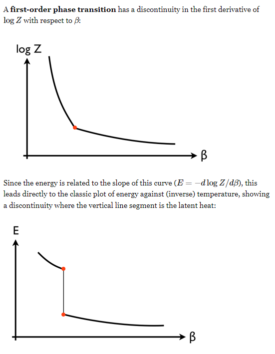
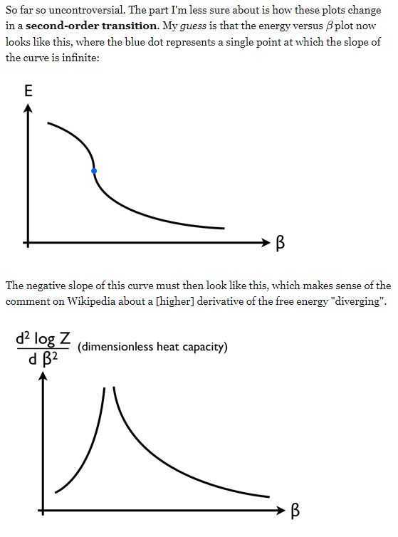

## 1st order phase transition

First-order phase transitions aren't very interesting. You can model them by Landau-Ginzburg theory in the mean field approach by adding appropriate terms in the effective action (like $m^3$, $m^4$,$m^5$,$m^6$, $m$ being the order parameter [yes, note that odd terms are allowed - they explicitly break the symmetry. Although for reasons of positive-definiteness the largest power must be even.]).

## 2nd order phase transition

Continuous phase transitions have a diverging correlation length (first order ones typically do not).

Microscopic details are washed out because of the diverging correlation length. So we expect continuous phase transitions to be classified into universality classes. By that I mean that near such a critical point, thermodynamic properties diverge with some critical exponents with the order parameter, and these set of critical exponents fall into classes that can be used to classify different PTs. Refer to Peskin and Schroeder pg 450 - we see that the critical point in a binary liquid system has the same set of exponents as that of the β
-brass critical point! And the critical point in the EuO system is the same as the critical point in the Ni system. 

## Thermal 1st order vs 2nd (or higher) order transition

The classification 'first-order phase transition vs. second-order phase transition' is an old one, now replaced by the classification 'first-order phase transition vs. continuous phase transition'. The difference is that the latter includes divergences in 2nd derivatives of F and above - so to answer your question, yes there are other orders of phase transitions, in general.

Quantum fluctuation 이나 topological phase transition (BKT, XY model) 들은 얘기가 또 다르다. 

The framework to understanding the thermal phase transitions is statistical field theory. A very important starting point is Ginzburg theory, and then you upgrade it to Landau-Ginzburg theory. In a nutshell, phases are distinguished by the symmetries they possess. For example, the liquid phase of water is rotationally symmetric and translationally symmetric, but the solid phase (ice) breaks that rotational symmetry because now it only has discrete translational symmetry. So there must be some phase transition between these two phases. Liquid and gas possess the same symmetry and so actually can be identified as the same phase, as evidenced by being able to go from liquid to gas by going around the critical point instead of through the liquid-gas boundary in the phase diagram. LG theory involves writing a statistical field theory of the system respecting symmetries of the system, and then studying how the solution to the field equations respects the symmetry or not against the temperature.

## Ref

https://physics.stackexchange.com/questions/80245/first-and-second-order-phase-transitions