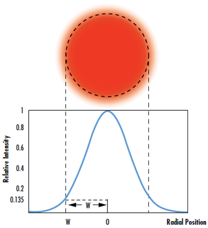
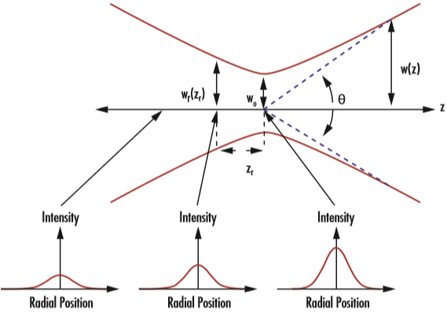

중심축으로부터 가우시안 빔의 분포는 다음과 같다.

$$
I(r)=I_{0}e^{-2r^2/w(z)^2}=\frac{2P}{\pi w(z)^2}e^{-2r^2/w(z)^2}
$$

이때 $I_0$ 는 빔 중심에서 최대 Irradiance ($W/m^2$), r은 광축에서 부터의 반경, w(z)는 irradiance 가 $I_0$의 $1/e^2$ 일때의 레이저 빔 반경, P는 빔의 총 출력이다.

w(z)는 z에 대한 함수인데, 회절로 인하여 가우시안 빔은 빔의 직경이 최소가 되는 beam waist ($w_0$)라고 불리는 곳에서 수렴하고 분산한다.

$$
w_0 = \frac{\lambda}{\pi\theta}
$$

$\lambda$는 레이저의 파장이고 $\theta$ 는 원거리장(far field)의 발산각 근사치를 나타낸다. 빔 웨이스트로부터 거리가 멀어질수록 $\theta$의 정확성은 높아진다.

빔 웨이스트 영역에서 빔의 직경 w(z)는 다음과 같이 정의된다.

$$
w(z)^2 = w_{0}^2 + \theta^2z^2 = w_{0}^2 + (\frac{\lambda}{\pi w_0^2})^2 z^2
$$

가우시안 빔의 레일리 거리 $z_R$ 은 빔의 단면이 두배가 될때의 z 값으로 정의된다. 따라서 레일리 거리는 다음과 같다.

$$
z_{R} = \frac{\pi w_0^2}{\lambda}
$$

또한 w(z)는 $z_R$ 과도 연관이 있다.
$$
w(z) = w_0\sqrt{1 + (\frac{\lambda z}{\pi w_0^2})^2}=w_0\sqrt{1 + \frac{z^2}{z_{R}^2}}
$$

### Reference

https://www.edmundoptics.co.kr/knowledge-center/application-notes/lasers/gaussian-beam-propagation/