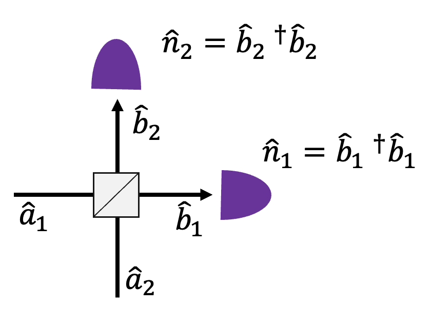
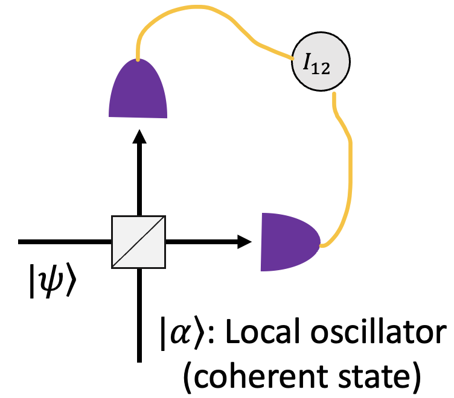

# Balanced Homodyne Detection

$$
U_{BS} = \begin{bmatrix}
t && r\\
r&& t\\
\end{bmatrix},
U^†_{BS} = \begin{bmatrix}
t^* && r^*\\
r^*&& t^*\\
\end{bmatrix}
$$

$$
b_1 = ta_1 + ra_2\\
b_2=ra_1+ta_2\\
b^†_1 = t^*a^†_1 + r^*a^†_2\\
b^†_2=r^*a^†_1+t^*a^†_2\\
$$

$$
n_1-n_2 = b^†_1 b_1-b^†_2 b_2\\
= (|t|^2-|r|^2)a^†_1 a_1+(t^*r-tr^*)a^†_1 a_2 \\
+(r^*t-rt^*)a_1 a^†_2+ (|r|^2-|t|^2)a^†_2 a_2
$$

when $t=1/\sqrt{2},r=i/\sqrt{2}$, then

$$
n_1-n_2 = i(a^†_1 a_2-a_1 a^†_2)
$$

$\ket{\alpha} = e^{-|\alpha|^2/2}\sum_{n}^{\infty} \frac{\alpha^n}{\sqrt{n!}}\ket{n}$ is coherent state and $\hat{a}\ket{\alpha}=\alpha \ket{\alpha}$
$$
I_{12} = I_1 - I_2 = \bra{\psi}\bra{\alpha} i(a^†_1 a_2 - a_1 a^†_2)\ket{\psi}\ket{\alpha}\\
= \bra{\psi}\bra{\alpha} i(\alpha a^†_1  - \alpha^* a_1 )\ket{\psi}\ket{\alpha}\\
= \bra{\psi}i(\alpha a^†_1  - \alpha^* a_1 )\ket{\psi}\\
$$

Let $\alpha = |\alpha|e^{i\phi}$, then

$$
\rightarrow 2|\alpha|\bra{\psi}\frac{1}{2i}(a_1 e^{-i\phi}-a^†_1 e^{i\phi})\ket{\psi}
$$

Two quadrature operators are

$$
X_1 = \frac{1}{2}(a+a^†),X_2 = \frac{1}{2i}(a-a^†)
$$

Rotated quadrature operators are

$$
Y_1 = \frac{1}{2}(a e^{-i\theta/2}+a^†e^{i\theta/2}),Y_2 = \frac{1}{2i}(a e^{-i\theta/2}-a^† e^{i\theta/2})
$$
Thus,
$$
I_{12} = 2|\alpha|\bra{\psi}Y_2\ket{\psi}
$$

We can measure expectation value of quandrature operator. ($\alpha$ is intensity of laser)
$$
I_{12} \propto \braket{\hat{n}_{12}} = 2|\alpha|\bra{\psi}Y_2\ket{\psi}
$$

$$
(\triangle \hat{n}_{12})^{2} = \braket{\hat{n}_{12}^2}-\braket{\hat{n}_{12}}^2 = 4|\alpha|^2(\triangle Y_2)^2
$$
