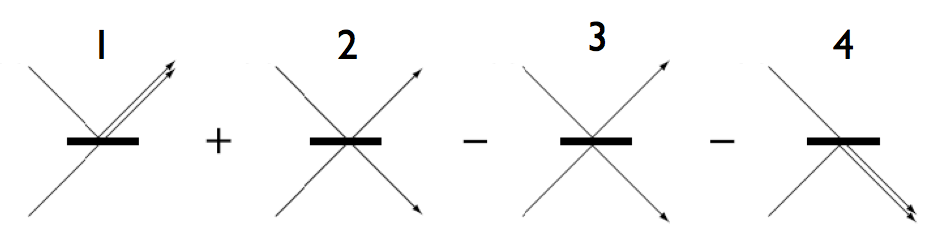

# Hong-Ou-Mandel Effect

50:50 Beam Splitter 각 방향으로 물리적 성질(polarization, spatio-temporal mode, frequency)이 같은 photon 이 한개씩 동시에 들어올 경우, 둘이 한쪽 방향으로만 함께 나오는 현상

두개의 포톤이 BS 로 들어가면 나오는 경우의 수는 다음의 4가지다.

1. 위에서 온 포톤은 반사되고 아래에서 온 포톤은 투과한다.

2. 두 포톤 다 투과한다.

3. 두 포톤 다 반사된다.

4. 위에서 온 것은 투과하고 아래에서 온 것은 반사된다.

이때 네가지 경우가 선형결합 되는데, 이때 BS 아래쪽 면에서 반사되는 경우 phase 가 pi 만큼 shift 되므로 해당 term 에 -1 이 붙게된다. 이때 output state 2와 3을 구분할 수 없으므로(input photon 의 물리적 성질이 똑같으므로) 2번과 3번 term 이 cancel out 되고, 결과적으로 1번과 4번 결과만 남는다.

