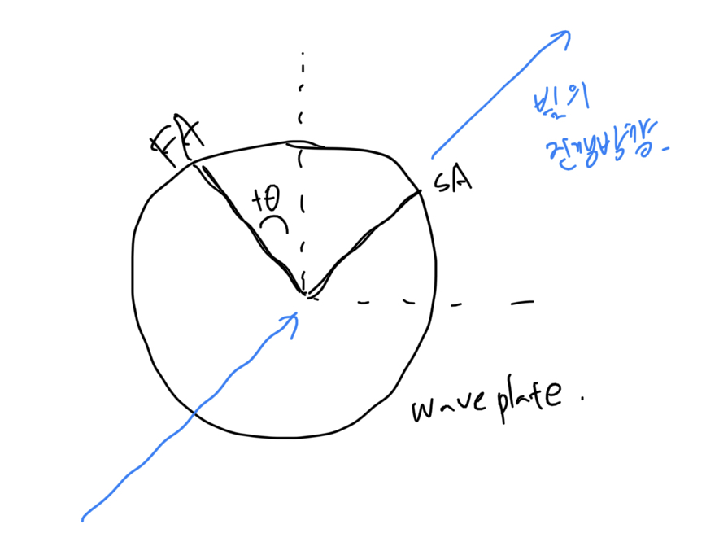
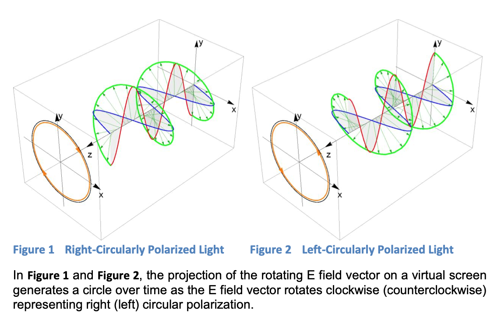

# Waveplate

slow axis vertical, fast axis horizontal 의 경우

horizontal axis 기준으로 $\theta$ 만큼 돌렸을때의 편광 상태 구하기

$$
HWP(0) =\begin{pmatrix}
e^{-i\pi/2} & 0 \\
 0 & e^{i\pi/2}
\end{pmatrix} =e^{-i\pi/2}\begin{pmatrix}
1 & 0 \\
 0 & -1
\end{pmatrix} 
$$

$$
QWP(0) =\begin{pmatrix}
e^{-i\pi/4} & 0 \\
 0 & e^{i\pi/4}
\end{pmatrix} =e^{-i\pi/4}\begin{pmatrix}
1 & 0 \\
 0 & i
\end{pmatrix} 
$$

이고, $\theta$만큼 좌표변환을 하는 변환행렬은

$$
R(\theta)=\begin{pmatrix}
cos{\theta} & sin{\theta} \\
-sin{\theta} & cos{\theta}
\end{pmatrix}
$$

이므로, 

## fast axis horizontal

$$
HWP(\theta) = R(\theta)HWP(0)R(-\theta) = e^{-i\pi/2}\begin{pmatrix}
cos{2\theta} & sin{2\theta} \\
sin{2\theta} & -cos{2\theta}
\end{pmatrix}
$$

$$
QWP(\theta) = R(\theta)QWP(0)R(-\theta) = e^{-i\pi/4}\begin{pmatrix}
\cos^2{\theta}+i\sin^2{\theta} & (1-i)\cos{\theta}\sin{\theta} \\
(1-i)\cos{\theta}\sin{\theta} & \sin^2{\theta}+i\cos^2{\theta}
\end{pmatrix}
$$

## fast axis vertical

$\cos{\pi/2+\theta} = -\sin{\theta}$, $\sin{\pi/2+\theta} = \cos{\theta}$ 이므로 Fast axis 가 vertical 을 기준으로 각도 a, b 만큼 배치돼 있을때 존스 매트릭스는 다음과 같다.
$$
U^v_{HWP}(a) = 
\begin{bmatrix}
\cos{2a} && -\sin{2a}\\
-\sin{2a} && -\cos{2a}
\end{bmatrix}
$$

$$
U^v_{QWP}(\theta) =e^{-i\pi/4} \begin{bmatrix}
\sin^2{\theta}+i\cos^2{\theta} && (i-1)\cos{\theta}\sin{\theta}\\
(i-1)\cos{\theta}\sin{\theta} &&
\cos^2{\theta}+i\sin^2{\theta}
\end{bmatrix}
$$

Kwiat 논문에서 (measurement of qubits)
$$
U^v_{HWP}(a) = 
\begin{bmatrix}
\cos{2a} && -\sin{2a}\\
-\sin{2a} && -\cos{2a}
\end{bmatrix}
$$

$$
U^v_{QWP}(\theta) =\frac{1}{\sqrt{2}} \begin{bmatrix}
i-\cos^2{2\theta} && \sin{2\theta}\\
\sin{2\theta} &&
i+\cos^2{2\theta}
\end{bmatrix}
$$

이때 a, b는 빛의 소스쪽에서 웨이브 플레이트를 바라보았을때 반시계방향이 +다.

## Joens vectors
$$
\ket{H}=
\begin{bmatrix}
1\\
0
\end{bmatrix},

\ket{V}=\begin{bmatrix}
0\\
1
\end{bmatrix},

\ket{D}=
\frac{1}{\sqrt{2}}\begin{bmatrix}
1\\
1
\end{bmatrix},

\ket{A}=
\frac{1}{\sqrt{2}}\begin{bmatrix}
1\\
-1
\end{bmatrix},

\ket{R}=
\frac{1}{\sqrt{2}}\begin{bmatrix}
1\\
-i
\end{bmatrix},

\ket{L}=
\frac{1}{\sqrt{2}}\begin{bmatrix}
1\\
i
\end{bmatrix}
$$

이때 빛이 관찰자쪽으로 다가오는 상황에서 편광을 관찰했을때, 편광이 시계방향으로 돌아가면 R 편광, 반시계로 돌아가면 L 편광이다.

단, 분야에 따라 컨벤션이 다르다. 광학에서는 위와 같이 정의하지만, 입자물리에서는 LCP 를 positive helicity 로 정의하고, IEEE 에서는 Right handed 로 정의한다.