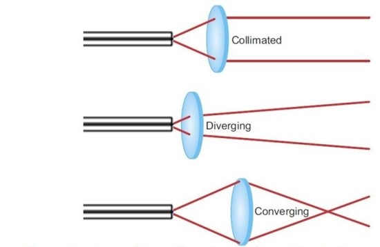
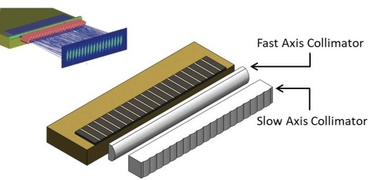
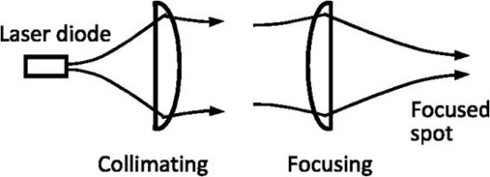
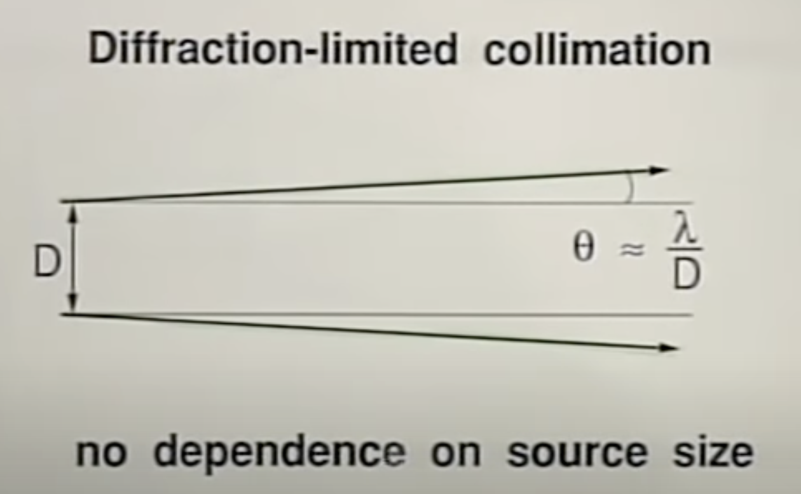
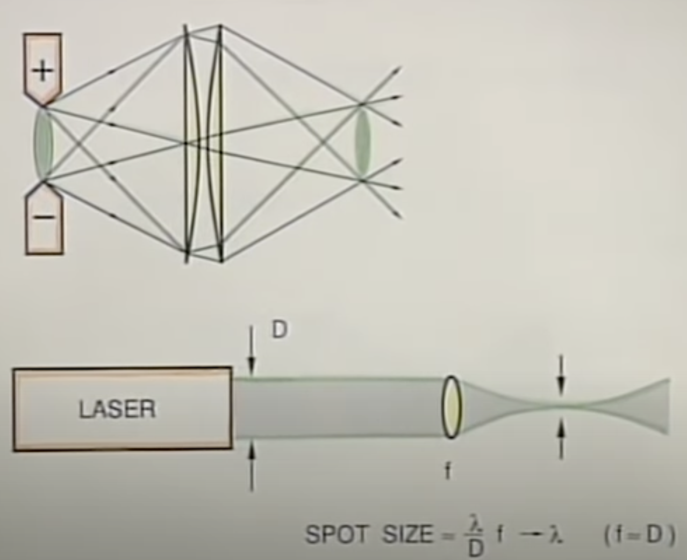

# Laser

1. narrow spectral width (high temporal coherent)

2. highly collimated beam

일반적으로 semi classical light 을 laser 라고 하는데, coherent state 라고도 부른다.

## Beam Collimation

광선을 평행하게 교정하는 것. 

Laser 도 어느정도 퍼진다.

빛이 빠르게 퍼지는 축과 느리게 퍼지는 축이 생기는데, Fast Axis 와 Slow Axis 로 지칭. 이로 인해 빛은 완벽한 원형이 아닌 타원형으로 형성된다.

각 축마다 굴절률이 다른 렌즈를 대응시킴으로써 평행한 광선을 얻을 수 있다. 

빠르게 퍼지는 축에는 Fast Axis Collimator (FAC)를, 느리게 퍼지는 축에는 Slow Axis Collimator (SAC)를 사용한다. 보통 레이저 다이오드 앞단에 FAC 를 먼저, SAC 를 뒷단에 배치한다.

빛을 포커싱하는 경우 collimator 를 통해 빛을 고르게 정렬한 후 focusing lens 로 집광하는 방법이 사용된다.

## 빛에 파장에 따른 diffraction

빛의 파장에 비례한 diffraction. electromagnetic physics 에 의한 성질.

보통 빛은 시작점보다 더 높은 intensity 를 만들수 없다(더 focusing 할 수 없다)

하지만 laser 는 빛의 파장 크기만큼 focussing 이 가능. 

## 레이저 빔의 품질 M2

이상적인 레이저는 가우스빔(TEM00) 의 빔 프로파일을 가지고, 다음과 같이 3가지 상태를 만족해야 한다.

1. 강도가 광축에서 최대이다

2. 발산이 낮다

3. 회절 제한적이다. 즉, 초점을 맞출 때 빔 웨이스트는 특정 파장에 대해 얻을 수 있는 가장 작은 것이다.

M2 파라미터는 레이저빔의 품질을 정량화 하는 무차원 값이다.

이상적인 레이저는 퍼지는 정도 $\theta = \lambda /\pi w$ 를 만족하므로, M2 값을 다음과 같이 정의한다.

$$
M^2 =\frac{\theta}{\lambda/\pi w} = \frac{\pi w \theta}{\lambda} 
$$

이상적인 레이저는 M2 값이 1이며, 값이 클수록 레이저 품질이 낮다. 

또한 M2 값은 무차원 값이기에 서로 다른 레이저를 단순히 비교할때 사용하기 좋다.

## M2 값을 이용한 계산

focal length 를 $f$라 할때, 일반적인 빔 웨이스트는 다음과 같이 쓸 수 있다.

$$
w_{f,real} = f\theta_{real} = \frac{fM^2 \lambda}{\pi w_{0,real}}
$$

또한 빔의 반경은 다음과 같이 쓸 수있다.

$$
w_{real}(z) = w_{0,ideal}\sqrt{M^2 + M^2(\frac{\lambda z}{\pi w^2_{0,ideal}})^2}
$$

그리고 레이저의 far field 발산은 다음과 같이 쓸 수 있다.

$$
\theta_{real} = \frac{\lambda M^2}{\pi w_{0,real}}
$$

M2 값을 알고 있다면 빔의 진행방향에서의 빔 크기를 예측할 수 있다.

## M2 값의 측정

## high spatial coherence

- wave is well behaved in space : can predict amplitude and phase at any position at given time.