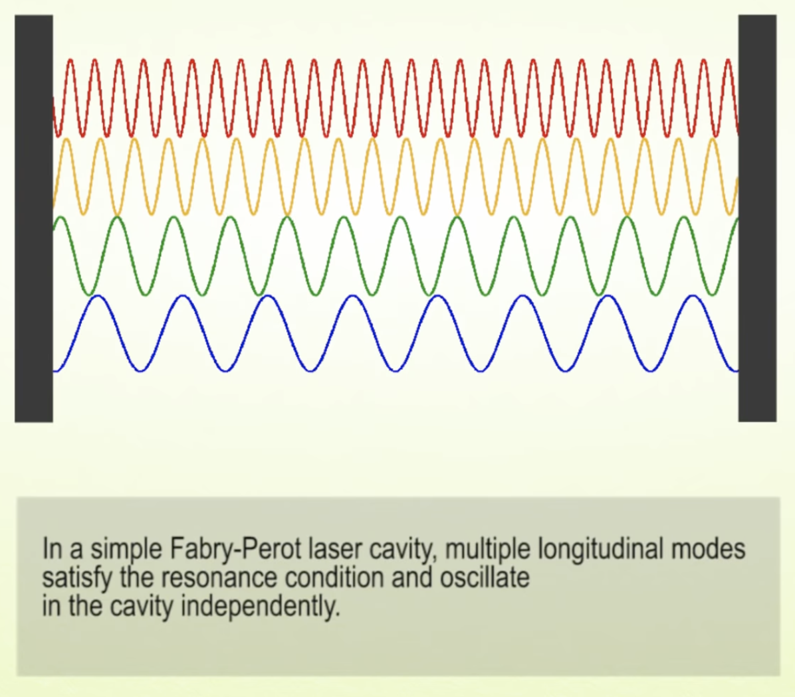
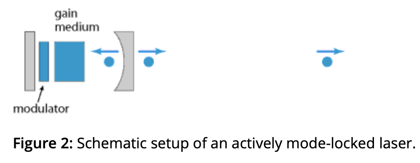
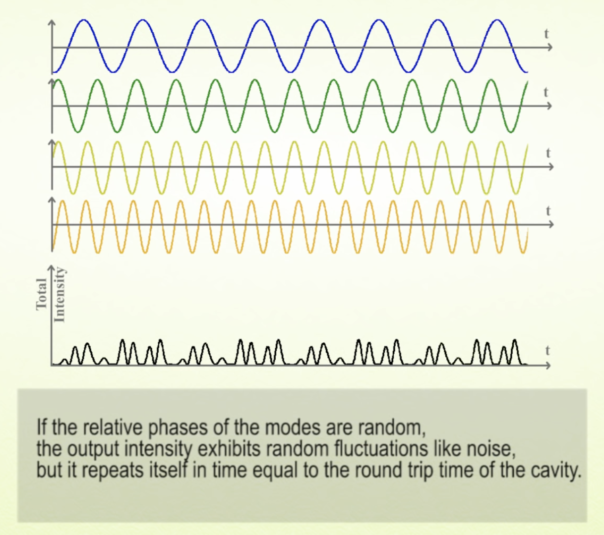
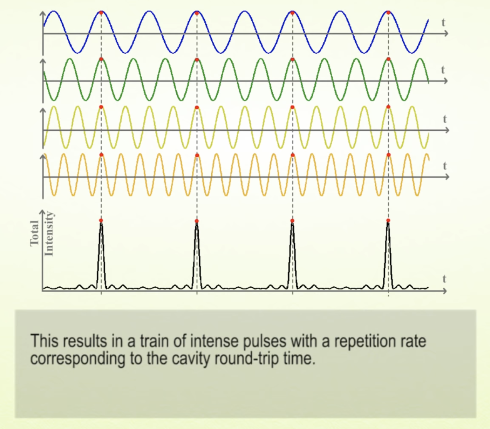
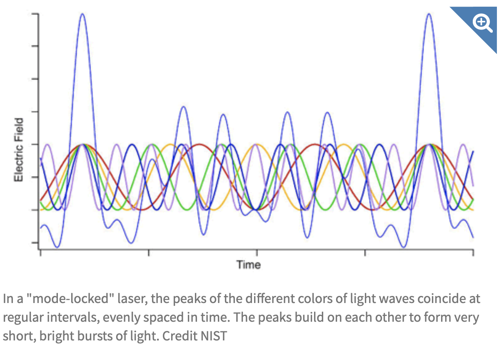
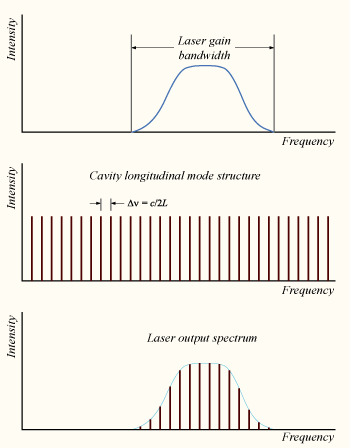

에너지-시간 불확정성으로 인해 시간 영역에서 짧은 펄스를 만들기 위해선 에너지 영역(진동수 또는 파장)영역의 여러 빛을 합쳐야 한다. 즉, 시간상으로 짧은 펄스를 만들기 위해선 여러 가지 색깔의 빛을 in phase 로 합쳐야 한다.

optical cavity 안에는 정상파를 이루는 파장의 빛만 존재하게 된다.

캐비티내의 빛은 왕복운동을 하면서 투과거울을 만날때마다 캐비티 밖으로 펄스를 방출한다.

처음에는 각 모드의 페이즈가 제각각이라서 노이즈처럼 나온다. 빛의 cavity 왕복 시간과 맞춰 동작하는 Amplitude modulator 를 사용, $cos(A)cos(B) = \frac{1}{2}cos(A-B)+\frac{1}{2}cos(A+B)$임을 이용해서, 기존 빛의 주파수 $f$에 대해 $\nu$ 만큼의 AM 을 주면 $f-\nu$, $f+\nu$ 진동수가 sideband 로 생겨나게 된다. 이때 $f-\nu$, $f+\nu$ 가 cavity 공진 주파수랑 맞게끔 조절하면, AM 의 동작 주기에 따라서 캐비티 내부의 빛의 phase 도 통일돼서 시간이 지나면 빛의 왕복운동 주기에 맞춰 일정한 펄스가 나오게 된다.

pulse repetition rate 는 레이저 공진기에서 빛이 왕복운동하는데 걸리는 시간의 역수이다.

옵티컬 캐비티 안에 얼마나 많은 수의 모드가 존재할 수 있는지를 결정하는 것은 레이저 캐비티 내의 gain medium 의 gain bandwidth 다.

gain medium 에서 optical amplification 이 일어나는 진동수 영역대를 gain bandwidth 라고 한다.

헬륨 네온 레이저의 경우 gain bandwidth 가 1.5GHz (파장으로 치면 0.002nm 정도)이고, 티타늄 도핑 사파이어 레이저의 경우 bandwidth 가 128THz (파장으로 치면 300nm 정도) 이다. 

만약 캐비티 길이가 30cm 정도라면 각 모드별 진동수 차이는 c/2L 로 0.5 GHz 가 되는데, 즉 헬륨 네온 레이저는 캐비티 내에 존재할 수 있는 모드가 3개 정도이지만 티타늄 사파이어 레이저는 25만개 정도가 된다. 그래서 헬륨 네온 레이저는 3개의 파장의 빛밖에 섞지 못하니 펄스 레이저로 쓸 수 없고, 티타늄 사파이어 레이저는 25만개의 색깔의 빛을 섞으니 시간영역에서 아주 짧은 펄스를 만들어 낼 수 있는 것이다.

gain bandwidth 는 여러가지 의미로 쓰이는 용어이니 맥락에 따라 헷갈리지 않도록 주의.

# ref

[Mode Locking](https://www.rp-photonics.com/mode_locking.html)

[Mode Locking video](https://www.youtube.com/watch?v=efxFduO2Yl8)

[Gain Bandwidth](https://www.rp-photonics.com/gain_bandwidth.html)