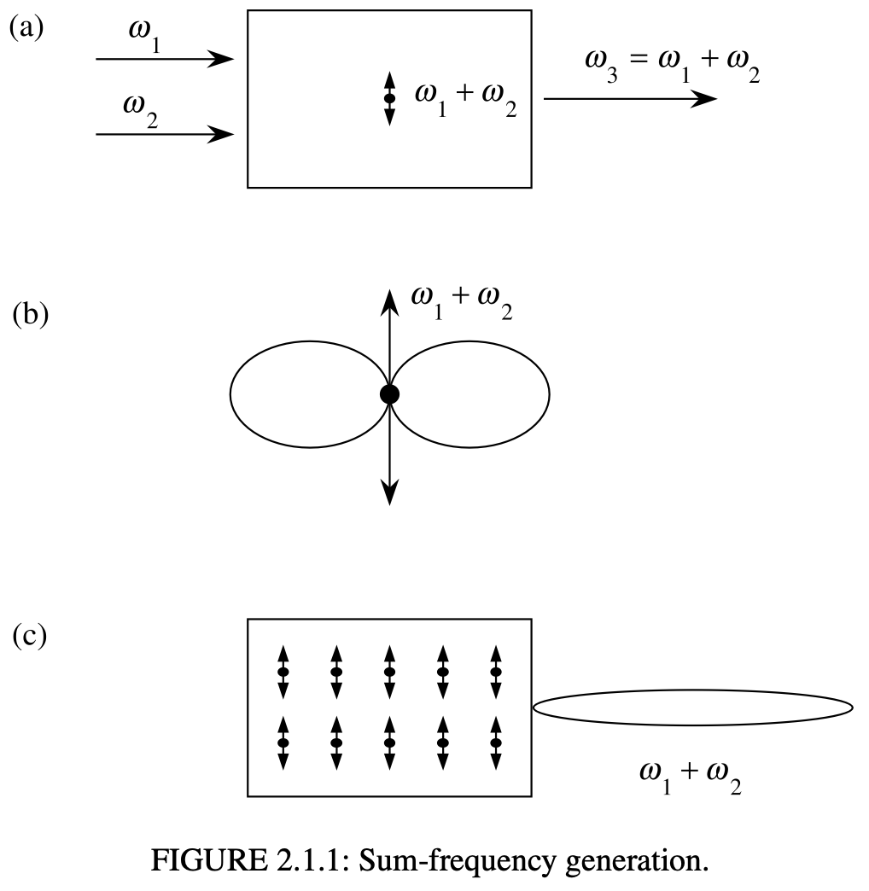
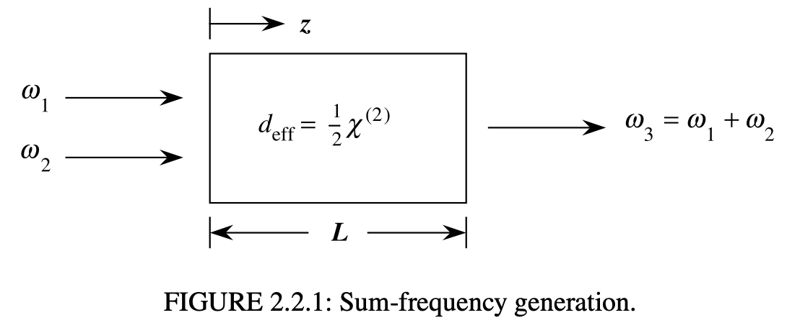
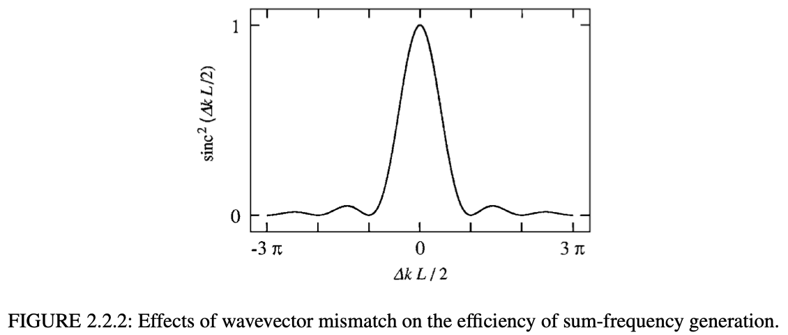
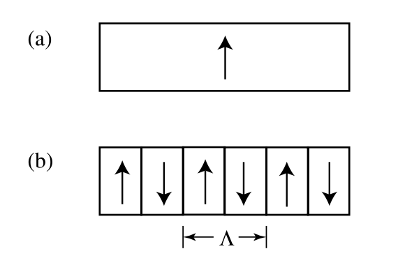
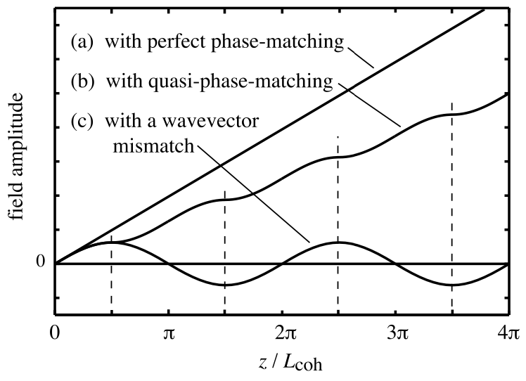

# Phase Matching in Sum-Frequency Generation

Intuitive picture :

Induced dipole by external electric field in the medium : atomic dipole is new source that are not pre-existed frequency components.

To obtain high reaction efficiency, each dipole's phases should be well matched and amplitudes should be constructively added up.

#### What is the condition of Phase matching in nonlinear optical process?

For single frequency CW laser pump,

$$
\nabla^2 \vec{E}(\vec{r},t)-\frac{\overleftrightarrow{\epsilon}^{(1)}(w_n)}{ c^2}\cdot\frac{∂\vec{E}(\vec{r},t)}{∂t^2} = \frac{1}{\epsilon_0 c^2}\frac{∂^2\vec{P}^{NL}(\vec{r},t)}{∂t^2}
$$

Let trial solutions for generated field (index 3):

$$
E_3(z,t) = A_3 e^{i(k_3 z - w_3 t)}+c.c.
$$

where $k_3=n_3w_3/c$, $n_3^2=\epsilon^{(1)}(w_3)$, and

$$
P_3(z,t) = P_3 e^{-i w_3 t}+c.c.
$$

From equation 1.5.28 and 1.5.29 (crystal symmetry and effective $\xi_2$ tensor) in Boyd's book,

$$
P_3 = 4\epsilon_0 d_{eff}E_1 E_2
$$

Let applied fields are

$$
E_1(z,t) = E_1 e^{-iw_1 t}+c.c.\\
E_2(z,t) = E_2 e^{-iw_2 t}+c.c.\\
$$

where 

$$
E_i = A_i e^{ik_i z}
$$

Thus,

$$
P_3 = 4\epsilon_0 d_{eff} A_1 A_2 e^{i(k_1+k_2)z} \equiv p_3 e^{i(k_1+k_2)z}
$$

Gather all trial solutions into nonlinear wave equation. (here, $\nabla^2 = d^2/dz^2$)

$$
\left[ \frac{d^2 A_3}{dz^2} +2ik_3 \frac{dA_3}{dz} -k_3^2 A_3 +\frac{\epsilon^{(1)}(w_3)w_3^2 A_3 }{c^2} \right]e^{i(k_3 z - w_3 t)} +c.c. \\
= \frac{-4d_{eff} w_3^2}{c^2}A_1A_2 e^{i[(k_1+k_2)z-w_3 t]}+c.c.
$$

Third and fourth terms are canceled out each other. 

Slowly varying amplitude approximation:

$$
\left|\frac{d^2A_3}{dz^2}\right| \ll \left|k_3 \frac{dA_3}{dz}\right|
$$

Then nonlinear wave equation becomes coupled equation:

$$
\frac{dA_3}{dz} = \frac{2id_{eff}w_3}{n_3 c} A_1 A_2 e^{i\triangle k z}
$$

where $\triangle k \equiv k_1+k_2-k_3$.

We can do same things to $w_1$ and $w_2$ fields.

$$
\frac{dA_1}{dz} = \frac{2id_{eff}w_1}{n_1 c} A_3 A_2^* e^{i\triangle k z} \\
\frac{dA_2}{dz} = \frac{2id_{eff}w_2}{n_2 c} A_3 A_1^* e^{i\triangle k z}
$$

Let $A_1$ and $A_2$ are constants if conversion of the input fields into the sum-frequency field is not too large.

$$
A_3(L) = \frac{2id_{eff}w_3 A_1 A_2}{n_3c}\int_{0}^{L} e^{i\triangle k z}dz \\
= \frac{2id_{eff}w_3 A_1 A_2}{n_3c} \left(\frac{e^{i\triangle k L} -1}{i\triangle k}\right)
$$

The intensity of $w_3$ field is time-averaged poynting vector.

$$
I_i = 2n_i \epsilon_0 c |A_i|^2
$$

with the fact that

$$
\left| \frac{e^{i\triangle k L} -1}{i\triangle k} \right|^2 = L^2\frac{\sin^2{(\triangle k L/2)}}{(\triangle k L/2)^2}=L^2sinc^2(\triangle k L/2)
$$

$$
I_3 = \frac{2d_{eff}^2 w_3^2 I_1I_2 L^2}{n_1 n_2 n_3 \epsilon_0 c^3}sinc^2(L/L_{coh})
$$

where $L_{coh} \equiv 2/\triangle k$.

If $\triangle k=0$, then sinc function is just 1, then intensity of generated wave increase proportional to $L^2$.

## Quasi-phase matching

Let effective optical susceptibility $d(z)$ has spatial dependency and is described in terms of Fourier series as:

$$
d(z) = d_{eff} \sum_{m=-\infty}^{\infty} G_m e^{ik_m z}
$$

where $k_m \equiv 2\pi m /\Lambda$ and $G_m \equiv (2/m\pi) \sin (m\pi/2)$.

put it to coupled equation.

$$
\frac{dA_3}{dz}=\frac{2iw_3d_m}{n_3 c}A_1A_2 e^{i\triangle k_m z}
$$

where $d_m\equiv d_{eff}G_m$ and $\triangle k_m \equiv k_1 + k_2 -k_3 -2\pi m/\Lambda$

By engeering quasi-phase matching period $\Lambda$, we can achieve $\triangle k_m =0$.

$$
\Lambda = 2\pi/\triangle k = \pi L_{coh}
$$

For example, $L_{coh}$ of lithium niobate at wavelength $1.06\mu m$ is $3.4\mu m$.

## Reference

Boyd nonlinear optics 4th Ch 2.2 ~ 2.4