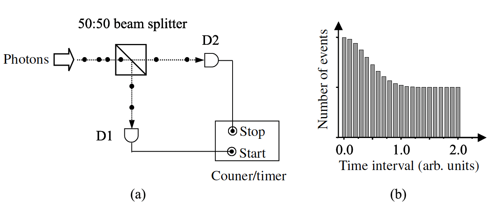
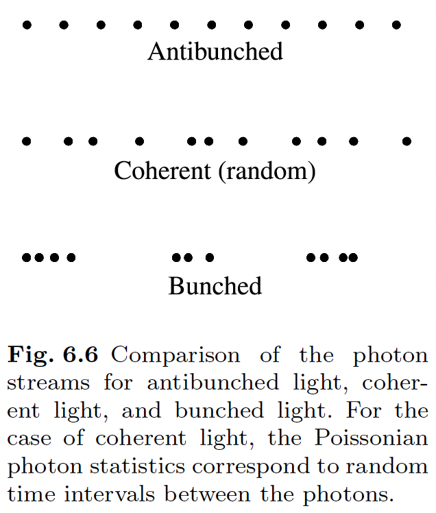
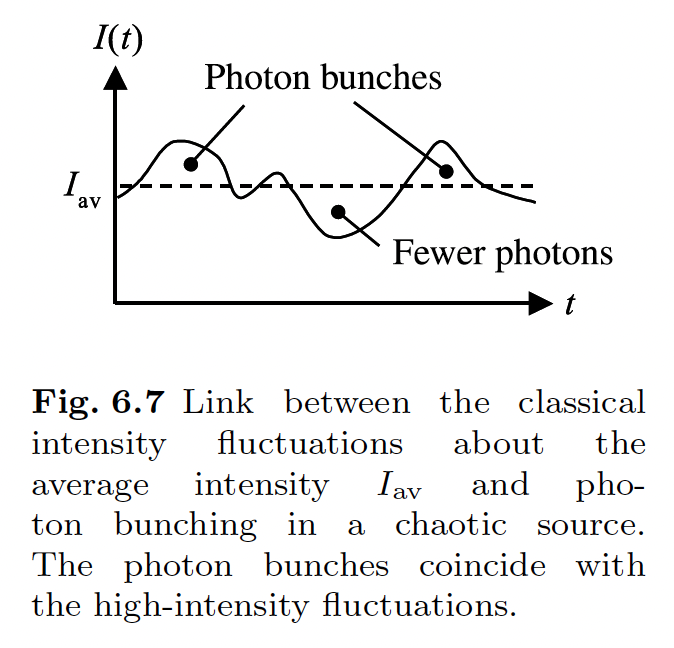

## Photon statistics

constant intensity, perfect coherent light : 광자가 n 개면, 불연속 분포 Poissonian statistics.

일반적으로 빛의 statistics 는 세가지. 

$\triangle n<\sqrt{\bar{n}}$ : Sub Poissonian statistics.

$\triangle n= \sqrt{\bar{n}}$ : Poissonian statistics.

$\triangle n>\sqrt{\bar{n}}$ : Super Poissonian statistics.

이때 $\bar{n} = \Phi L/c$ 로, 길이 L beam segment 의 평균 광자이고 $\Phi$ 는 photon flux 로써 $\Phi = P/\hbar w$ (photons / second) 이다.

photon number 가 더욱 fluctuation 한 경우는 super poissonian. 흑체복사에서 나오는 partially coherent 한 빛이 이런 경우. larger variations in the intensity.

## Photodetection statistics

photocount number 의 variance $(\triangle N)^2$과 디텍터로 들어오는 광자의 variance $(\triangle n)^2$의 관계는 다음과 같다. (이유는 out of scope)
$$
(\triangle N)^2 = \eta^2 (\triangle n)^2 + \eta (1 - \eta)\bar{n}
$$

$\eta =\bar{N}/\bar{n}$ 는 디텍터의 quantum efficiency. 

## Sub Poissonian statistics

$\triangle n =0$ 이면 photon number state (Fock state)

Sub Poissonian 분포 : Quantum optics 관점의 설명을 필요로 함.

Hg 가스로 채워진 Franck-Hertz 튜브 : space charge 의 효과로 sub poissonian 광자가 나옴.

Sub Poissonian light 는 second correlation function 으로 quantify 하고, 그 값에 따라 *antibunching*, *coherent*, *bunching* 으로 나뉜다.

## HBT experiment

Intensity fluctuation of a beam of light is related to its coherence.

## Second correlation function

For spatially coherent light from a small area of the source, second correlation function $g^(2)(t)$ is

$$
g^{(2)}(\tau) = \frac{<\varepsilon^*(t)\varepsilon^*(t+\tau)\varepsilon(t)\varepsilon(t+\tau)>}{<\varepsilon^*(t)\varepsilon^*(t+\tau)><\varepsilon(t)\varepsilon(t+\tau)>}
\newline
=\frac{<I(t)I(t+\tau)>}{<I(t)><I(t+\tau)>}
$$

$\varepsilon$ 은 electric field, $I$는 intensity.

In terms of photon number view, there are two photon count detectors D1, D2, and then 

$$
g^{(2)}(\tau) =\frac{<n_1(t)n_2(t+\tau)>}{<n_1(t)><n_2(t+\tau)>}
$$

bunched light: $g^{(2)}(0) > 1$

coherent light: $g^{(2)}(0) = 1$

anti-bunched light: $g^{(2)}(0) < 1$

실험상황에서 $g^{(2)}$ 에 대한 제대로 된 노말라이제이션은 중요한 문제. 아주 긴 시간이 지나면, 대개 $g^{(2)}(\tau)=1$ 이 되는 것을 이용한다. 또는 single-mode laser 를 Poissonian calibration source 로 사용한다.

## Bunched light

ex: chaotic light. 

? tendency for photons to bunch together may be considered to be a manifestation of the fact that they are bosons. ?

## Anti-bunched light

@@question

1. 빛은 어떤 통계적 분포를 갖는가? 그리고 variation 과 평균의 관계에 따라 어떤 분포로 나뉘는가?

@@

