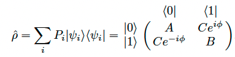
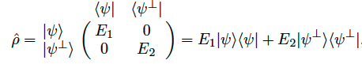

# Mixed state

A mixed state can be represented by a density matrix $\rho$, where

$P_{i}$ 는 고전적 확률 weight ($\sum_i P_i = 1$), A와 B, C는 non negative real number, A+B=1, $C\leq \sqrt{AB}$ 이다.

이때 any physical density matrix can be diagonalized, such that

이때 ${E_1,E_2}$ 는 $\rho$의 eigenvalue 이고 $\ket{\psi}$와 $\ket{\psi^{\perp}}$는 서로 직교하는 $\rho$의 eigenvector 이다.

Thus the representation of any quantum state, no matter how it is constructed, is identical to that of an ensemble of two orthogonal pure states.

# Quantum Tomography

