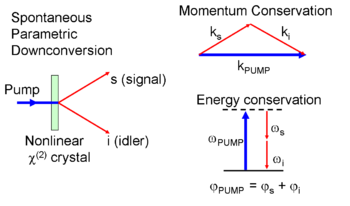

# Spantaneous Parametric Down Conversion (SPDC)

pump photons inside a $\chi^{(2)}$ nonlinear medium interact with quantum vacuum to down-convert into signal-idler photon pairs.

Spontaneous : because there is initially no field at the signal or idler frequencies.

optical parametric processes are equated involing no net excahnge of energy or momentum with the nonlinear medium. Thus, we can treat SPDC as the quantum evolution of a closed system.

## Three assumptions of SPDC

1. Material is non-magnetic, so that $\vec{M}=0$ and $\vec{B}=\mu_0 \vec{H}$

2. Material is approximately lossless. interacting light frequency spectrum is far enough from any absorption bands. 

3. Pump light is weak compared to the electric field of biding electrons to their atoms. The polarization field $\vec{P}$ is expressed as a rapidly decaying power series in applied electric field $\vec{E}$:

$$
P_i = \epsilon_0[\chi_{ij}^{(1)}E_j+\chi_{ijk}^{(2)}E_j E_k+\chi_{ijkl}^{(3)}E_j E_k E_l+...]
$$

$\chi^{(n)}$ is $n$ th order optical suscepibility tensor. Most crystalline materials respond differently to fields polarized along its different principal axes, the induced polarization will not always same direction as the applied electric field. 

## Nonlinear Hamiltonian

energy density of an optical field in a medium is 

$$
U = \frac{1}{2}\int d^3r(\vec{E}\cdot \vec{D}+\vec{B}\cdot\vec{H})
$$

and $\vec{D} = \epsilon\vec{E} = \epsilon_0\vec{E}+\vec{P}$. Thus, 
$$
H^{(2)}_{NL}=\frac{\epsilon_0}{2}\int d^3r \chi^{(2)}_{ijk}E_i E_j E_k
$$

Electric field is written as a linear combination of bosonic ladder operators is inconsistent with the Maxwell equation in the nonlinear regime and leads to incorrect expressions for three or higher-order nonlinear processes.

Thus we convert electric field $\vec{E}$ into a displacement field $\vec{D}$, as

$$
E_i = \zeta^{(1)}_{ij}D_j+\zeta^{(2)}_{ijk}D_j D_k +\zeta^{(3)}_{ijkl}D_j D_k D_l + ...
$$

where $\zeta$ is inverse optical susceptiblity tensor.

Finally, nonlinear Hamiltonian is

$$
H^{(2)}_{NL} = \int d^3r \zeta^{(2)}_{ijl}(r)D_i(r) D_j(r) D_l(r)
$$

### Field quantization

$$
D = D^{(+)}+D^{(-)}
$$
$$
\hat{D}^+ = \sum_{s,\vec{k}} i\sqrt{\frac{\epsilon_0 n^2(\vec{k})\hbar w(\vec{k})}{2V}}\hat{a}_{s,\vec{k}}(t)\hat{\epsilon}_{s,\vec{k}}e^{i\vec{k}\cdot\vec{r}}
$$

And $\hat{D}^-$ is the Hermitian conjugate of $\hat{D}^+$. $\vec{k}$ is the momentum of photon and $\vec{\epsilon}_{s,\vec{k}}$ is the polarization vector with polarization index $s$. V is the quantization volume which we may take to approach infinity in the continuum limit.

Nonlinear Hamiltonian has eight distant terms. Various combinations of these terms correspond to diffrent basic nonlinear optical processes. But for many non-linear medium, $\zeta^{(2)}$(or $\chi^{(2)}$) is only significant for one particular optical process by material design

(Even $\zeta^{(2)}$ is significant for multiple nonlinear optical processes, simultaneously satisfying phase matching for multiple processes is difficult task, but efficient enough that these multi-step optical parametric processes have benn demonstrated experimentally at Andrews et al 1970, Abu-Safe 2005)

Our interest is the process that one photon is annihilated and two photons are created.

$$
H_{NL} = \int d^3r \zeta^{(2)}_{ijl}(r) \hat{D}^+_i(r,t)\hat{D}^-_j(r,t)\hat{D}^-_l(r,t)
$$

We will be working on the paraxial regime so it is valid approximation to simply replace displacement field component indices with polarization indices since the component of the displacement field parallel to the $\vec{\epsilon}$.

## Hermite-Gaussian basis.

It will make calculations much simpler if we express the transverse momentum components of the field in terms of Hermite-Gaussian modes, since Gaussian pump beams and similar collection modes of down-converted light are valid descriptions of the light generated in SPDC experiments.

Let say $\vec{k}=\vec{q}+k_z \hat{z}$, where $\vec{q}$ is the projection of the momentum $\vec{k}$ onto the transverse plane.

we can express plane wave creation operator $\hat{a}^†_{\vec{q},k_z,s}$ as a sum over transverse mode creation operators $\hat{a}^†_{\vec{\mu},k_z,s}$, where $\mu$ is denoting 2D Hermite polynomial mode (n,m), ordered non-negative pair.

Thus,

$$
\hat{a}^†_{\vec{q},k_z,s} = \sum_{\mu}\tilde{C}_{\vec{q},\vec{\mu}}\hat{a}^†_{\vec{\mu},k_z,s}
$$

and 

$$
g_{\vec{\mu}}(x,y)=
\frac{1}{\sqrt{L_x L_y}}\sum_{\vec{q}}\tilde{C}_{\vec{\mu},\vec{q}}e^{-i\vec{q}\cdot\vec{r}}
$$

where we have defined $g_{\mu}(x,y)$ to be normalized Hermite-Gaussian wavefunction given by the index $\vec{\mu}$

$L_x$ and $L_y$ are x,y length of cavity for normalization.

Hermite-Gaussian approximation is well behaved when Hermite-Gaussian modes are encomppased by the crystal.

using an paraxial approximation (so that the frequency $w$ only depends on $k_z$), the displacement operator becomes:

$$
\hat{D}^-(\vec{r},t) = -i\sum_{\vec{\mu},k_z,s}\sqrt{\frac{\epsilon_0 n_{k_z}^2\hbar w_{k_z}}{2L_z}}\hat{\epsilon}_{k_z,s} g_{\mu}(x,y) e^{-i k_z z} \hat{a}^†_{\vec{\mu},k_z,s}e^{iwt}
$$

Here, $ \hat{a}^†_{\vec{\mu},k_z,s}e^{iwt}=\hat{a}^†_{\vec{\mu},k_z,s}(t)$

With $D$ operator and Non-linear Hamiltonian, we can handle SPDC process.

- We assume that pump light is classical light because pump field is bright enough.

- We assume that pump light is not diminished much due to down-conversion events (known as undepleted pump approximation)

## Classical pump light

Classical pump light can be written as 

$$
\vec{D}_p(\vec{r},t)=|D_p^0|\vec{\epsilon}_p f_p(\vec{r})\cos{(w_p t)}
$$

$\vec{\epsilon}_p$ : polarization of pump field, $f_p(\vec{r})$ : spatial function of light.

It can be separated into positive and negative frequency components:
$$
\vec{D}^+_p(\vec{r},t)=|D_p^0|\vec{\epsilon}_p f_p(\vec{r})\frac{e^{-iw_pt}}{2}
\newline
\vec{D}^-_p(\vec{r},t)=|D_p^0|\vec{\epsilon}_p f_p(\vec{r})\frac{e^{iw_pt}}{2}
$$

time averaged pump intensity is then :

$$
I_p = \frac{c}{2\epsilon_0 n^3}|D^0_p|^2|f_p(\vec{r})|^2
$$

## Phase matching

## References

Introduction to the absolute brightness and number statistics in spontaneous parametric down-conversion

Why you should not use the electric field to quantize in nonlinear optics

BBO 크리스탈 같은 곳에 광자 하나가 들어가면 correlated photon 두개가 튀어나오는 현상.

input photon (pumped photon), output photon (signal photon, idler photon)

만약 아웃풋 포톤 두개의 polarization 이 인풋과 같으면 type 0, 아웃풋 포톤 두개는 서로 같지만 인풋과는 orthogonal 하면 type 1, 그리고 아웃풋 포톤 두개가 서로 orthogonal 하면 (Horizontal 과 Vertical 처럼) type 2 SPDC.

$$
E\rightarrow\hat{E}=\hat{E}^+ +\hat{E}^-
$$

$$
H_{SPDC}= \int dr^3 \chi^{(2)}\hat{E}^+_p \hat{E}^-_s \hat{E}^-_i
$$