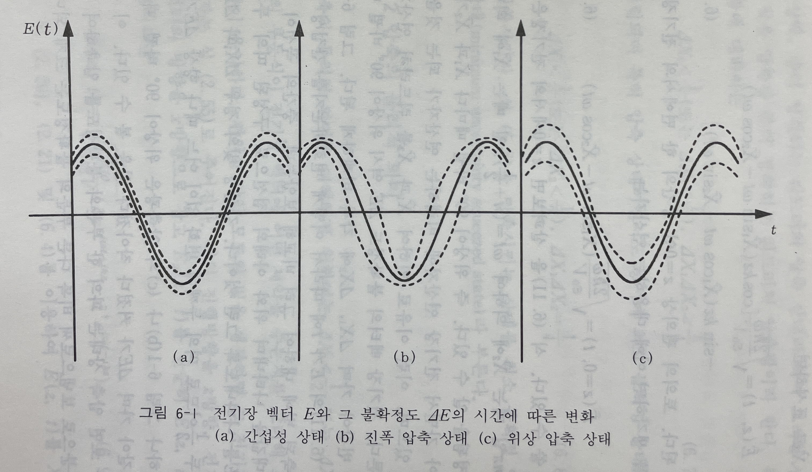

# Squeezing Light

압축광(squeezing light)란 어떤 물리량의 불확정성이 결맞음 빛(coherence light)보다 낮은 빛을 의미한다. 

하이젠베르크 불확정성 원리에 따라 canonical pair 물리량의 불확실성의 곱은 특정 값 이상이어야 하지만, 개별 불확실성은 0보다 커야 된다는 것 외에는 다른 제약이 없다. 따라서 어느 물리량의 불확실성을 키우는 대신 다른 물리량의 불확실성을 줄일 수 있다.

## Quadrature Operator

압축광을 수학적으로 기술하기 위해서 쿼드러쳐 연산자 $\hat{X_1}, \hat{X_2}$를 도입하자(쿼드러쳐가 무슨 뜻인지, 어떤 물리적 의미를 가지는지는 조금 뒤에 설명할 것이다).
$$
\hat{X_{1}} = \sqrt{\frac{w}{2\hbar}}\hat{q} = \frac{1}{2}(\hat{a}+\hat{a}^{\dagger})
$$

$$
\hat{X_{2}} = \sqrt{\frac{1}{2\hbar w}}\hat{p} = \frac{1}{2i}(\hat{a}-\hat{a}^{\dagger})
$$

(일반화 좌표 q 와 모멘텀 p 에 적절한 수를 곱해 dimensionless 하게 만든 연산자라고 생각해도 된다.)

이때 $\Delta q \Delta p \geq \frac{\hbar}{2}$ 에 대응되는 쿼드러쳐 연산자의 불확실성 정리는 $\Delta X_1 \Delta X_2 \geq \frac{1}{4}$ 이다.

이때 결맞음 빛은 $\Delta X_1 = 1/2$, $\Delta X_2 = 1/2$ 인 minimum uncertainty light 이고, $\Delta X_1 \leq 1/2$ 또는 $\Delta X_2 \leq 1/2$ 인 경우를 압축광, 좀 더 정확히는 쿼드러쳐 압축광이라고 한다.

## Meaning of Quadrature Squeezing

압축에 따라 빛의 전기장 연산자가 어떻게 변하는지 살펴보자. 편의상 파의 진행방향을 z, 전기장 벡터의 방향을 x 로 잡는다면 전기장 벡터는 다음과 같이 표현될 수 있다.
$$
\hat{E}(z,t) = i \sqrt{\frac{\hbar w}{2\epsilon_0 V}}(\hat{a}e^{i(kz-wt)} - \hat{a}^{\dagger}e^{-i(kz-wt)})
$$

이때 전기장을 쿼드러쳐 연산자로 표현하면 다음과 같다.
$$
\hat{E}(z,t) = \sqrt{\frac{2\hbar w }{\epsilon_0 V}}[\cos{kz}(\hat{X_1}\sin{wt}-\hat{X_2}cos{wt})-\sin{kw}(\hat{X_1}\cos{wt}-\hat{X_2}\sin{wt})]
$$

여기서 z=0 인 지점에서 시간에 따른 전기장의 변화를 본다면

$$
\hat{E}(z=0,t) = \sqrt{\frac{2\hbar w }{\epsilon_0 V}}(\hat{X_1}\sin{wt}-\hat{X_2}\cos{wt})
$$

위 전기장은 $wt = (n+1/2)\pi$ 일때는 $\hat{X_1}$ 에 의해 결정되고 $wt = n\pi$ 일때는 $\hat{X_2}$ 에 의해 결정된다. 즉 위상이 90도 바뀔때마다 지배적인 연산자가 바뀌는데, 이런 이유때문에 쿼드러쳐 연산자라고 부른다.

> Quadrature 는 구분구적법, 90도 등의 의미를 가지는데, quadra 라는 접두어로 미루어 볼때 사분할에서 의미를 따온게 아닐까 싶다.

(a) 결맞음 빛의 경우 모든 지점에서 전기장의 불확실성이 일정하다. 

(b) 의 경우 진폭 압축 상태인데, sinusoidal wave 의 피크지점에서 전기장의 불확실성은 작지만 위상이 90도 지난 부분에서 전기장의 불확실성은 크다. 피크 지점의 불확실성이 작기에 진폭의 불확실성이 줄어든 것이고, 전기장의 부호가 바뀌는 지점의 불확실성이 커졌으므로 위상의 불확실성은 커졌다.

(c) 의 경우 위상 압축상태인데, 전기장의 피크 지점의 불확실성은 커졌기에 진폭의 불확실성은 크지만 위상이 90도 지난 부분인 전기장의 부호가 바뀌는 지점의 불확실성은 작아졌으므로 위상의 불확실성은 작아졌다. 

전기장의 진폭의 경우 광자 수의 불확실성이랑 관계가 있기에, 광자수-위상에 대한 불확실성도 유추해 낼 수 있다.

$$
\Delta n \Delta \phi \geq something
$$

## Reference and image source

이해웅, 빛의 양자이론