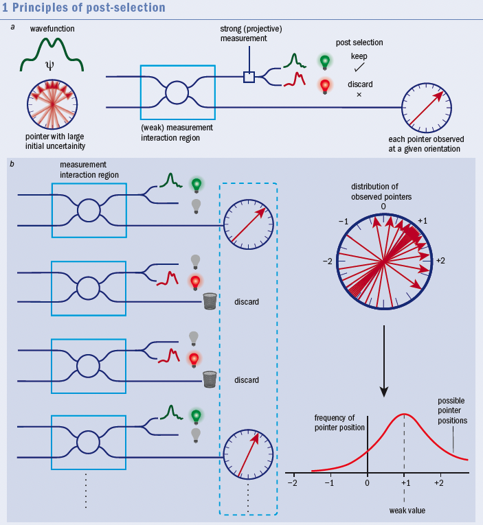

“Observations,” he once wrote, “not only disturb what is to be measured, they produce it.” What Jordan meant is that the wavefunction does not describe reality, but only makes statistical predictions about potential measurements

By simply averaging over enough trials, one can establish
as precise a measure as one has patience for; at least
until systematic errors come to dominate. Aharonov
called this a weak measurement because the coupling
between the system and the pointer is assumed
to be too weak for us to resolve how much the pointer
shifts by on just a single trial.

if you do a weak enough measurement of the
velocity – by using some appropriate device – you
reduce the disturbance that the measurement makes
on the position of the electron to nearly zero. So if you
repeat such a measurement on many particles, some
fraction of them (or “subensemble”, to use the jargon)
will be found at the x = 1 detector a second later. 

instead of averaging the positions
of all the pointers, average only the subset that interacted
with electrons successfully detected at x = 1.

Post-selected weak measurements give physicists a whole new view of the quantum world. (a) They involve a system (the wavefunction)
interacting with a meter (shown here by a pointer) in a “measurement interaction region”. A separate measurement is made of the
wavefunction once it has interacted with the pointer, which collapses the wavefunction either into the desired state (green light) or some
other state (red light). (b) The trick in weak measurement is to repeat this process on many identically prepared systems. Each time a red
light goes off, the corresponding pointer is discarded; each time a green light goes off, the pointer is kept. In this way, a collection of pointers
is obtained, which all correspond to systems that ended up in the desired final state. Since the measurement was weak, there is a great uncertainty in pointer position. But since we have many pointers, we can find their average deflection – a number termed the “weak value”.

If you work this formula out for the case we have
been discussing, you find that the electrons that
reached x = 1 were indeed going at 1 m/s on average.
This in no way contradicts the uncertainty principle
– you cannot say precisely how fast any individual
particle was travelling at any particular time. But it is
striking that we now know that the average result of
such a measurement will yield exactly what common
sense would have suggested.

for kindergarten: 코끼리 본뜨기. 코끼리 한마리 몸 전체를 본을 뜨면 코끼리는 죽는다. 그럼 코끼리를 백마리쯤 준비해서 한마리는 코만 본뜨고, 한마리는 귀만 본뜨고, 한마리는 다리만 본뜨고... 그렇게 본뜬 정보를 모은다. 이때 

### reference

[Physics World March 2013](https://www.physics.utoronto.ca/~aephraim/PWMar13steinberg-final.pdf)