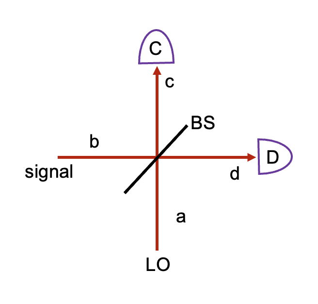

호모다인 측정은 로컬 오실레이터(레이저 빛을 사용)을 이용해서 원하는 빛의 페이즈를 측정하는 테크닉임.

balanced homodyne detection (left) 와 unbalanced homodyne detection (right)

빔 스플리터의 투과율을 T, 반사율을 R, 그리고 대칭형 빔 스플리터를 가정했을때 패스 모드는
$$
c = \sqrt{T}a+i\sqrt{R}b \\
d = i\sqrt{R}a +\sqrt{T}b
$$
이다.

디텍터 C 와 D 에 측정되는 신호는 

$$
c^\dagger c = Ta^\dagger a +Rb^\dagger b + i\sqrt{TR}(a^\dagger b - b^\dagger a)\\
d^\dagger d = TRa^\dagger a +Tb^\dagger b + i\sqrt{TR}(a^\dagger b - b^\dagger a)
$$

가 된다.

로컬 오실레이터의 진동수는 측정하고자 하는 빛의 진동수와 같게 하고, 진폭 $|\alpha|$가 큰 빛을 사용한다. 따라서 로컬 오실레이터의 모드는 고전적으로 다룰 수 있으며, 위상을 $\theta$ 라고 하면

$$
a \simeq |\alpha|e^{i\theta}
$$

라고 쓸 수 있다.

# unbalanced homodyne detection

unbalanced 측정에서는 $T \gg R$ 인 빔 스플리터를 사용하고 한쪽 디텍터 D 만 사용한다.

디텍터 D 에 찍히는 신호에 $a = |\alpha|e^{i\theta}$ 를 대입하면

$$
<d^\dagger d>=<n_D> = TR |\alpha|^2 +T<b^\dagger b> + 2\sqrt{TR}|\alpha|<X_{\theta+\pi/2}>
$$

가 되고, 여기서 $X_{\theta+\pi/2}= \frac{1}{2}( be^{-i(\theta+\pi/2)} + b^\dagger e^{i(\theta + \pi/2)})$ 인, b 모드의 쿼드러처 연산자이다.

빛의 진폭이 커서 $R|\alpha|^2 \gg Tb^\dagger b$ 라면, 디텍터 D 에서 측정되는 빛의 세기는 다음과 같이 쓸 수 있다.

$$
<n_D> \simeq R|\alpha|^2 +2\sqrt{TR}|\alpha|<X_{\theta+\pi/2}>
$$

빛의 진폭과 빔스플리터의 반사율 R은 알고 있는 값이므로 첫번째 항을 빼면 쿼드러처 연산자의 기댓값(진폭)을 알 수 있다.

또한 $(\triangle n_D)^2 = <n_D^2>-<n_D>^2$ 이므로,

