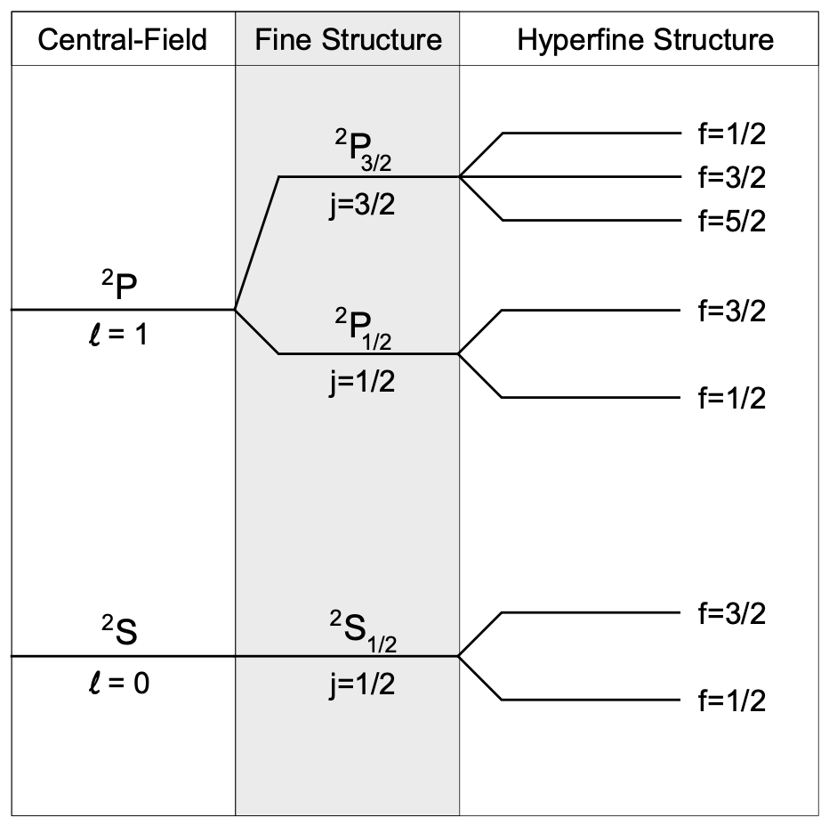

nuclear angular momentum $I$, electron angular momentum $J$, and total angular momentum $F$.

Total angular momentum 
$$
|I-J|\le F \le I+J
$$

(proof: ladder operator)

for 6Li, $I=1$. 

2S의 경우 $S=1/2$, $L=0$, $J=1/2$. $F=3/2,1/2$.

2P의 경우 $S=1/2$, $L=1$, $J=3/2,1/2$. $F=5/2,3/2,1/2$.