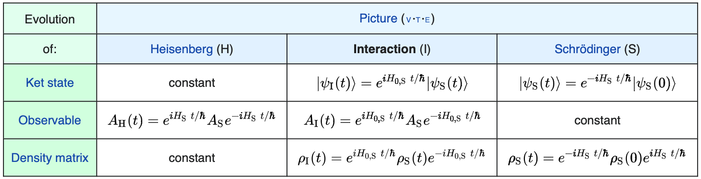

# Schrodinger picture, Heisenberg picture

파동함수 $\ket{\psi(t)}$에 대하여 어떤 연산자 A 의 특정 시간 t 에 대한 기댓값은 다음과 같다.
$$
\braket{A} = \bra{\psi(t)}A\ket{\psi(t)}
$$

위와 같이 상태 함수가 시간에 따라 변한다는 것을 Schrodinger picture 라고 하고, $\ket{\psi(t)} = e^{-iHt/\hbar}\ket{\psi(0)}$ 라고 쓸 수 있다. 

하지만 우리가 관측을 통해 얻어낼 수 있는 것은 파동함수나 연산자가 아니라 기댓값 뿐이므로, 상태 함수는 시간에 따라 변하지 않되 연산자가 시간에 따라 변한다고 봐도 얻어지는 값은 똑같다.

$$
\braket{A} = \bra{\psi(t)}A\ket{\psi(t)} = \bra{\psi(0)}e^{iHt/\hbar}Ae^{-iHt/\hbar}\ket{\psi(0)} =\bra{\psi}A(t)\ket{\psi} 
$$

상태함수는 불변이되 연산자가 시간에 따라 변하는 것을 Heisenberg picture 라고 한다. 

$$
A(t)=e^{iHt/\hbar}Ae^{-iHt/\hbar}
$$

Heisenberg 묘사의 시간 미분을 계산하면 다음과 같다.

$$
\frac{dA_H}{dt} = \frac{1}{i\hbar}[A_H,H] + \frac{\partial A_H}{\partial t}
$$

# Interaction picture

상호작용 묘사는 Schrodinger 묘사와 Heisenberg 묘사의 중간쯤 되는 묘사이다. 시간에 따라 변하는 외부 전기장에 놓인 시스템처럼 explicit time-dependence 가 있는 경우 Interaction picture 가 유용하다.

전체 해밀토니안을 두 부분으로 나눠 생각한다.

$$
H=H_{S,0}+H_{S,1}
$$

보통 $H_{S,0}$는 시간에 따라 변하지 않는 계산하기 쉬운 well-known 부분으로 잡고, $H_{S,1}$는 분석하기 어려운 perturbation 부분으로 나누어 잡는다.

Schrodinger picture $\ket{\psi_S(t)}= e^{-iH_{S,0} t/\hbar}\ket{\psi(0)}$ 에 대하여 상호작용 묘사에서의 상태함수와 연산자는 다음과 같이 정의된다.

$$
\ket{\psi_I(t)}=e^{iH_{S,0} t /\hbar}\ket{\psi_S(t)}
$$

$$
A_I(t)=e^{iH_{S,0} t /\hbar}A_Se^{-iH_{S,0} t /\hbar}
$$

> time evolution 에서 $i$ 의 부호를 주의할 것.

위와 같이 정의하여도 기댓값 $\braket{A} = \bra{\psi_I}A_I\ket{\psi_I}$은 다른 묘사들과 같다는 것을 알 수 있다.

## Time dynamics

상호작용 묘사의 상태함수를 미분하면 다음과 같다.
$$
\frac{\partial }{\partial t}\ket{\psi_I(t)} = \frac{iH_{S,0}}{\hbar} e^{iH_{S,0}t/\hbar}\ket{\psi_S(t)} + e^{iH_{S,0}t/\hbar}\frac{\partial}{\partial t}\ket{\psi_S(t)} \\

\\

=\frac{iH_{S,0}}{\hbar} e^{iH_{S,0}t/\hbar}\ket{\psi_S(t)} - e^{iH_{S,0}t/\hbar} \frac{iH}{\hbar} e^{iHt/\hbar}\ket{\psi_S(0)} \\

=\frac{i}{\hbar}[H_{S,0}-e^{iH_{S,0}t/\hbar}(H_{S,0}+H_{S,1})e^{-iH_{S,0}t/\hbar}]\ket{\psi_I(t)} \\
$$

이때 $H_{S,0}$ 와 $e^{iH_{S,0}t/\hbar}$ 은 서로 commute 하고, 또 $H_{I,1}=e^{iH_{S,0}t/\hbar}H_{S,1}e^{-iH_{S,0}t/ \hbar}$ 라고 정의 한다면 다음과 같다.

$$
i\hbar\frac{\partial }{\partial t}\ket{\psi_I(t)} = H_{I,1}\ket{\psi_I(t)}
$$

상호작용 묘사에서 연산자에 대한 시간 변화는 다음과 같다.

$$
\frac{dA_I}{dt}=\frac{1}{i\hbar}[A_I,H_{S,0}] + \frac{\partial A_I}{\partial t}
$$

연산자의 시간변화는 $H_{S,0}$ 와 관련이 돼 있고, 상태함수의 시간변화는 $H_{S,1}$(또는 $H_{I,1}$) 와 관련이 있음을 알 수 있다.

# Summary

