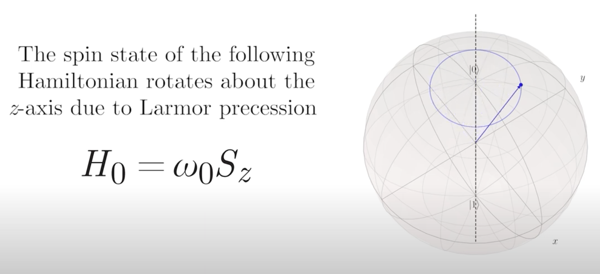
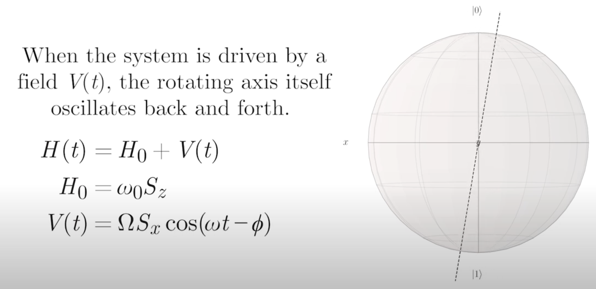
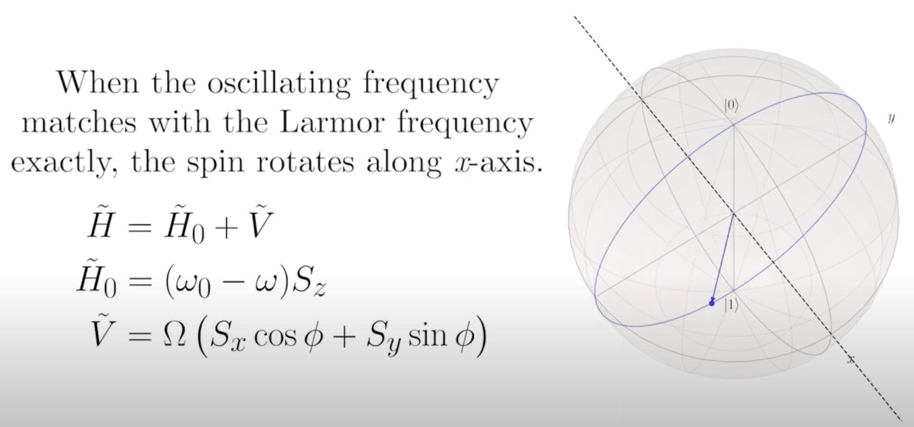
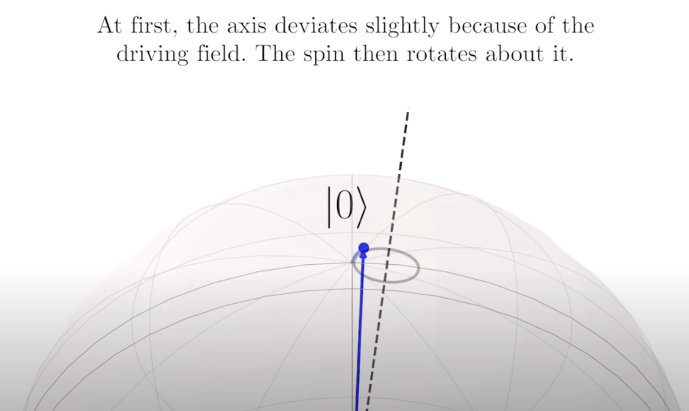
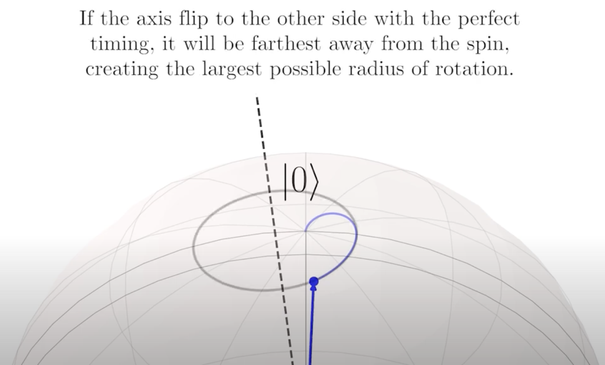
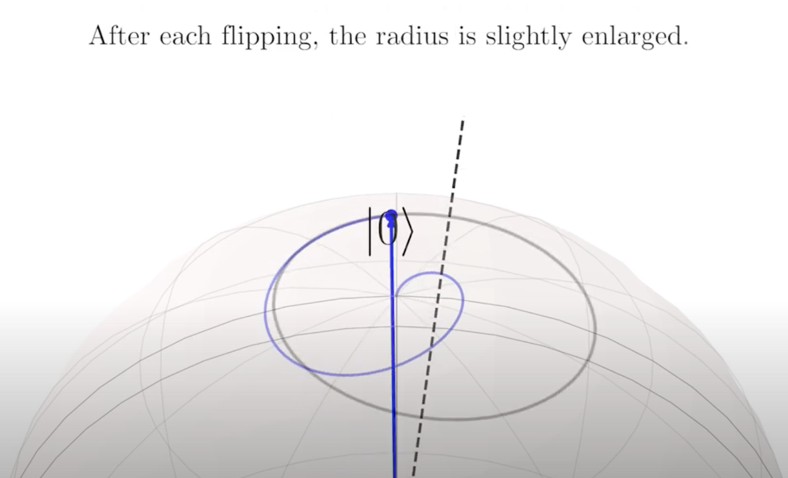
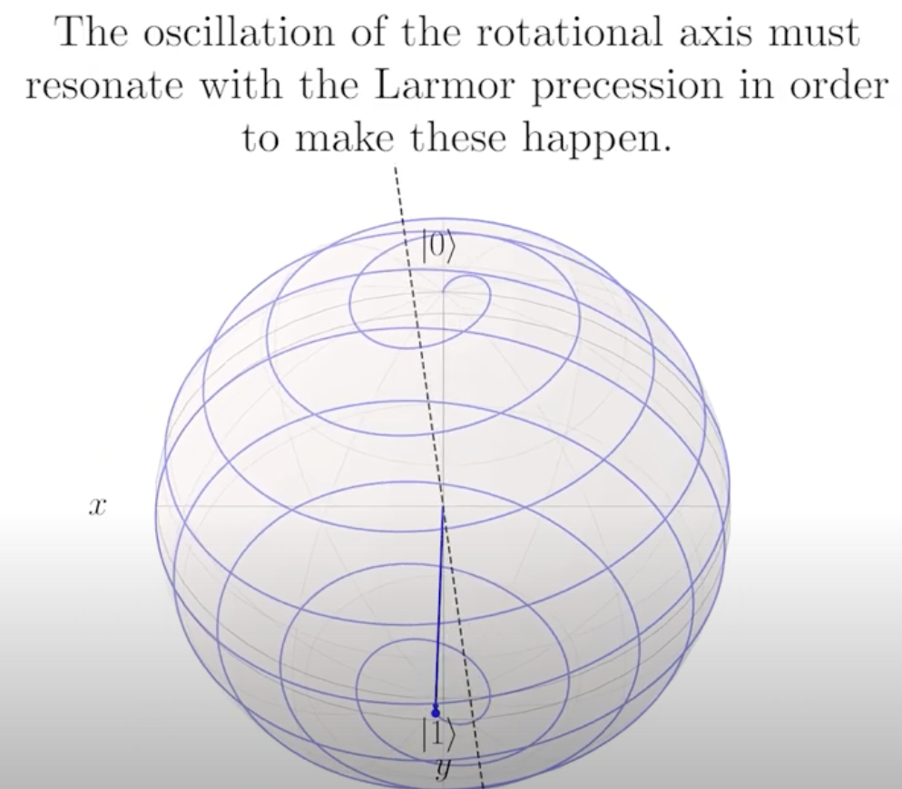
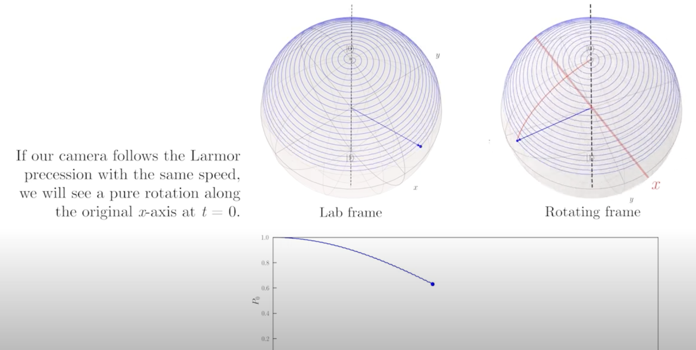

## RWA

2-level system 에서, 특정 주파수로 회전하는 좌표계로 시스템을 바라보면 spin 이 돌아가는 것을 간단한 형태로 나타낼 수 있다. 이를 rotating wave approximation (RWA) 라고 한다.

### Intuition

spin 은 z 축을 기준으로 Larmor precession 을 한다. 

이때 외부의 oscillating field 가 들어오면 스핀의 회전축도 돌아간다.

oscillating frequency 가 스핀의 Larmor frequency 와 같다면, 스핀은 x-axis 를 기준으로 돌아간다. 

스핀 축이 돌아가면 스핀 또한 축을 따라서 돈다.

스핀이 멀리 돌고 있을때 축이 반대방향으로 멀어지면, 스핀이 돌아가는 반경이 점점 커진다.

결국 Larmor frequency 와 resonant 한 외부의 oscillating field 는 스핀을 뒤집는다.

 

이때 Lab frame 에서 보면 스핀은 나선형으로 돌면서 뒤집히지만, 나선형으로 도는 frequency 와 같은 정도로 회전하면서 본다면(Rotating frame 에서 본다면) 스핀은 수평축을 중심으로 깔끔하게 도는걸로 보인다. 

수학적으로는, resonant term 과 off-resonant term 에서 off-resonant term 을 무시하는게 RWA 이다.

## Ref

https://www.youtube.com/watch?v=eNDPyVwZwDI