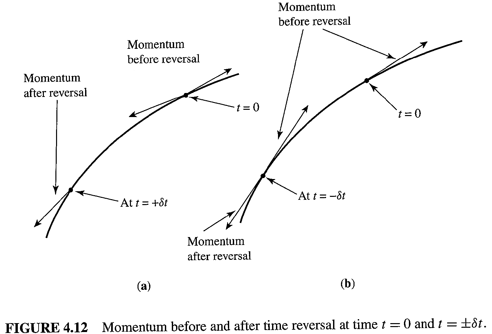

# Time reversal operator (Motion reversal operator)

Time reversal is a misnomer; more appropriate term is motion reversal. Indeed, E. Wigner, who formulated time reversal, used "reversal of motion".

In classical view, time reversal means $x\rightarrow x,p\rightarrow -p.$

In quantum view, time reversal operator is complex conjugation operator. 

$$
\hat{T}\psi(x,t)=\psi^*(x,-t)
$$

Let's consider schrodinger equation

$$
i\hbar \frac{\partial\psi}{\partial t}=(-\frac{\hbar^2}{2m}\nabla^2 +V)\psi
$$

Suppose $\psi(x,t)=e^{-iEt/\hbar}\psi(x,0)$ is a solution. We can verify that $\psi(x,-t)$ is not a solution but $\psi^*(x,-t)$ is a solution.

In position space, momentum operator is represented by $-i\hbar \frac{\partial}{\partial x}$

So defining time inversion operator as a complex conjugate operator is to makes sense.

$$
\hat{T}\psi=\psi^*\\
 \hat{T}\hat{x}\hat{T^{-1}}=\hat{x}\\
 \hat{T}\hat{p}\hat{T^{-1}}=-\hat{p}\\
  \hat{T}\hat{\sigma}\hat{T^{-1}}=-\hat{\sigma}
 $$
 where $\sigma$ is a spin angular momentum.

## Anti Unitary

The transformation $U_A\ket{a} = \ket{a'}$, $U_A\ket{b} = \ket{b'}$ is said to be antiunitary if 

$$
\braket{b'|a'} = \braket{b|a}^*=\braket{a|b} \\
U_A(c_1\ket{a}+c_2\ket{b})=c^*_1U_A\ket{a}+c^*_2U_A\ket{b}
$$

the second line is a property of antilinear operator.

For infinitesimal time evolution $\delta t$, 
$$
(1-\frac{iH\delta t}{\hbar})\hat{T}\ket{\psi} = \hat{T}(1-\frac{iH(-\delta t)}{\hbar})\ket{\psi}
$$

The above relation is to be true for any ket, we must have

$$
-iH\hat{T}\ket{\psi}=\hat{T}iH\ket{\psi}
$$

Suppose that $T$ is a linear operator. Then one could cancel the factors $i$ to obtain $-HT=TH$. Acting on an energy eigenstate $\ket{E_n}$, we would conclude that

$$
HT\ket{E_n} = -TH\ket{E_n} = -E_n T\ket{E_n}
$$

which implies that if eigenvalue of $\ket{E_n}$ is $E_n$, then eigenvalue of $T\ket{E_n}$ is $-E_n$. This result imply that one can generate arbitrary negative energy by choosing a state with arbitrary large positive energy. The absence of a groud state is unphysical. This is why time reversal is to be anti linear and anti unitary.

By anti linear properties, $TiH=-iTH=-iHT$, $THT^{-1}=H$. if H is a Hermitian, then we can say $THT^{-1}=H^{\dagger}$.

$\bra{b}\hat{T}\ket{a}$ is always to be understood as $\bra{b}(\hat{T}\ket{a})$, never as $(\bra{b}\hat{T})\ket{a}$.

In fact, we do not even attempt to define $\bra{b}\hat{T}$. Dirac bra-ket notation was invented to handle linear operators, not antilinear operators. 

Antiunitary operator can be written as $U_A = UK$, where $U$ is an unitary operator and $K$ is a complex conjugate operator.

## Structure of $U$ in $T=UK$

$U$ is a basis dependent.

### 1. Spinless particle

For a spinless particle, only variables are $x$ and $p$. By definition,

$$
TxT^{-1} = UKxK^{-1}U^{-1} = UxU^{-1}=x \\
TpT^{-1} = UKpK^{-1}U^{-1} = U(-p)U^{-1}=-p \\
$$

Thus, $U=I$, $T=K$ in the position representation for a spinkess particle.

### 2. Spin 1/2 particle

For a spin 1/2, $T\overrightarrow{\sigma}T^{-1}=-\overrightarrow{\sigma}$.

$$
K\sigma_x K^{-1}=\sigma_x \\
K\sigma_y K^{-1}=-\sigma_y \\
K\sigma_z K^{-1}=\sigma_z \\
$$

Thus, $T=\lambda\sigma_y K$, where the $\lambda$ is a arbitrary phase. Choosing the $\lambda$ does not changes the physics. For a convinience, $T=-i\sigma_y K$

### 3. pseudo-spin system

In a general two-level system, like a qubit, time reversal is a complex conjugate. Let consider horizontal polarization represents $\ket{\uparrow}$ and vertical polarization represents $\ket{\downarrow}$. Even if motion is reversed, the polarization is unchanged.

## reference

- Modern quantum mechanics, 3rd edition, Chapter 4, J.J. Sakurai

- Embedded Random Matrix Ensembles in Quantum Physics (https://link.springer.com/content/pdf/bbm%3A978-3-319-04567-2%2F1.pdf)

- http://scipp.ucsc.edu/~haber/ph215/TimeReversal.pdf