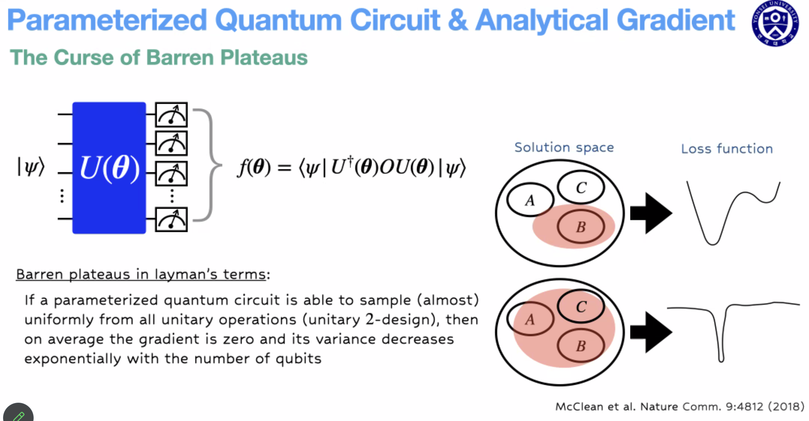

# The Curese of Barren Plateaus

양자회로를 통해 최적화 문제를 푸는 Variational quantum algorithm 에서 parameter 가 커질수록 최적화가 안되는 문제.

솔루션 공간에서 우리의 탐색영역(빨간색 영역)이 커질 수록, loss function 에 평탄한 지점이 많아지고, 평탄한 지점에선 gradient 가 없기때문에 최적화 문제를 풀수가 없게된다. loss function 에 나타나는 *황폐한 고원평지(Barren Plateau)*.

Barren plateau 를 피하기 위한 양자회로 디자인이 제시되지만, 그런 디자인의 양자회로들도 여전히 퀀텀 어드밴티지가 있는가는 다들 쉬쉬하는 문제. 예를 들면 quantum convolution neaural network 는 gradient 평균은 0이지만 0점 근처 variance 가 스케일에 익스포넨셜하게 줄어드는게 아니라 폴리노미얼 하게 줄어들긴 하는데, 투 큐빗 게이트만 써야 되고 로컬 옵저버블만 측정하는 등 제약이 있다. 이런 제약 있는 회로는 클래식하게 시뮬레이션 하기 쉬운거 아닌가? 하는 의문도 남아있음.