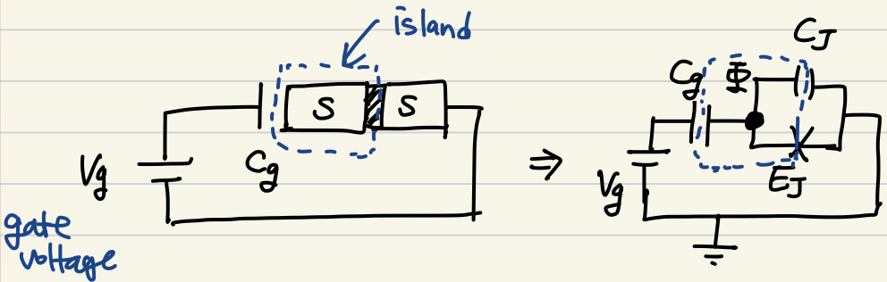
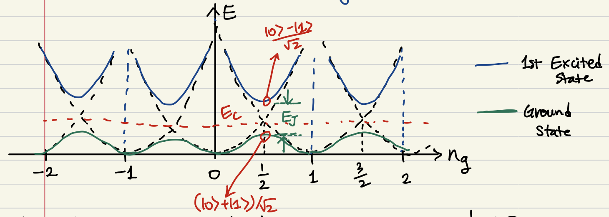

1세대 큐빗이라 불리는 방법. 초전도 박스 안에 있는 쿠퍼페어의 갯수에 따른 에너지 레벨을 큐빗으로 사용한다.

## Cooper pair box

$$
L = \frac{1}{2}C_J\dot{\Phi}^2 +\frac{1}{2}C_g(\dot{\Phi}-V_g)^2 + E_J\cos(\varphi)
$$

Legendre 변환 

$$
H = \dot{\Phi}\frac{\partial L}{\partial \dot{\Phi}} - L = 4E_C(n-n_g)^2 - E_J\cos(\varphi)
$$

where $Q =\partial L/\partial \dot{\Phi} $, $n=Q/2e$ 는 쿠퍼페어의 갯수, $n_g = -C_gV_g/2e$ 는 gate voltage 에 따른 쿠퍼페어의 갯수, $E_c = e^2/2(C_g+C_J)$는 charging energy, $E_J$ 는 Josephson energy 다. $E_C \ll E_J$ 면 쿠퍼 페어 하나를 island 에 추가하는데 에너지가 아주 크다는 것이므로, 쿠퍼페어 갯수가 어느정도 고정되므로 안정된 큐빗으로 쓸 수 있다.

$ E_J\cos(\varphi) $ 부분은 tight-binding 모델로 얻어진 부분으로, $n$ 과 $n+1$ sight 간의 hoping 을 의미한다. number basis 로 해밀토니안을 표시하면,

$$
H= 4E_C\sum_n (n-n_g)^2|n\rangle \langle n|\\ - \frac{E_J}{2}\sum_n |n\rangle \langle n+1|+ |n+1\rangle\langle n|
$$

이때 $n_g = 1/2 + \delta n_g$ 로, 그리고 $n=0$, $n=1$ 부분만 잘라서 보면

$$
H \rightarrow 4E_C(1+4\delta n_g^2)(|0\rangle\langle 0|+|1\rangle\langle 1|)\\
+4E_C \delta n_g (|0\rangle\langle 0|-|1\rangle\langle 1|)\\
-\frac{E_J}{2}(|0\rangle\langle 1| + |1\rangle\langle 0|)
$$

이때 해밀토니안에서 energy offset 에 해당하는 $|0\rangle\langle 0|+|1\rangle\langle 1|=I$ 부분을 제외하면

$$
H\to 4E_C \delta n_g \sigma_z -\frac{E_J}{2}\sigma_x
$$

즉, gate voltage 를 이용해서 $4E_C|\delta n_g| \gg E_J/2$ 인 영역에 두면 해밀토니안이 Pauli Z 가 되므로 relaxation 에 의해 큐빗들이 $|0\rangle$로 초기화 되고, $4E_C|\delta n_g| \ll E_J/2$ 인 영역에 두면 해밀토니안이 Pauli X 가 되므로 time evolution $e^{iHt/\hbar}$ 에 의해 spin flip, 즉 Rabi oscillation 을 일으킬 수 있다. 