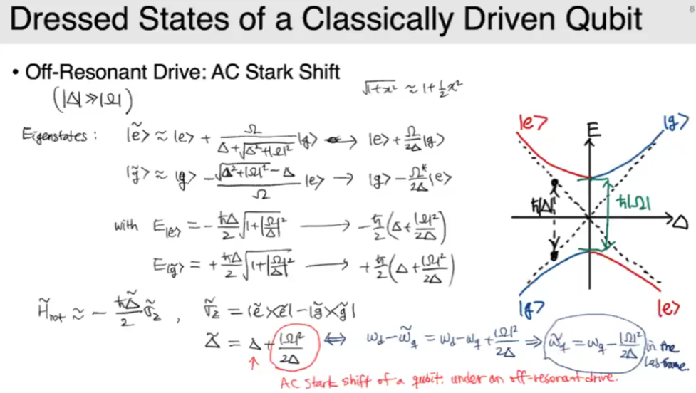
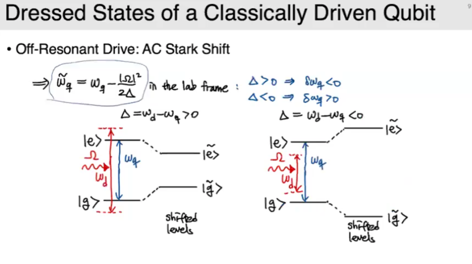

## Hamiltonian in the rotating frame

Rotating frame with $U(t)=\exp[i\omega_d a^\dagger a]=\exp[i\frac{\omega_d t}{2}\sigma_z]$

$$
H_{rot} = UHU^\dagger - i\hbar U\frac{\partial}{\partial t} U^\dagger
$$

with Rotating Wave Approximation (RWA),

$$
H_{rot}/\hbar = -\frac{\triangle}{2}\sigma_z - \frac{\Omega_x}{2}\sigma_x - \frac{\Omega_y}{2}\sigma_y\\
={\triangle}{2}\sigma_z - \frac{\tilde{\Omega}}{2}\sigma_- - \frac{\tilde{\Omega}^*}{2}\sigma_+
$$

where $\triangle \equiv \omega_d - \omega_q$: detuning of the qubit drive frequency.

$$
\Omega_x(t) = \Omega_d (t)\cos{\phi_d(t)} \sim I(t)
$$

$$
\Omega_y(t) = \Omega_d (t)\sin{\phi_d(t)} \sim Q(t)
$$

$$
\tilde{\Omega}(t) = \Omega_d(t)\exp{[i\phi_d(t)]} 
$$

Thus, amplitude of voltage source = amplitude of the drive

phase $\phi_d$ = drive axis

## Dressed states of qubit with AC drive field

$$
H_{rot}/\hbar = -\frac{1}{2}\begin{pmatrix}
\triangle & \Omega^*\\
\Omega & \triangle
\end{pmatrix}
$$

Eigenenergis

$$
E_{\pm} = \pm\frac{\hbar}{2}\sqrt{\triangle^2 + |\Omega|^2}
$$

by the coupling (drive), avoided crossing.

## AC Stark shift

frequency shift by the off-resonant AC field.

