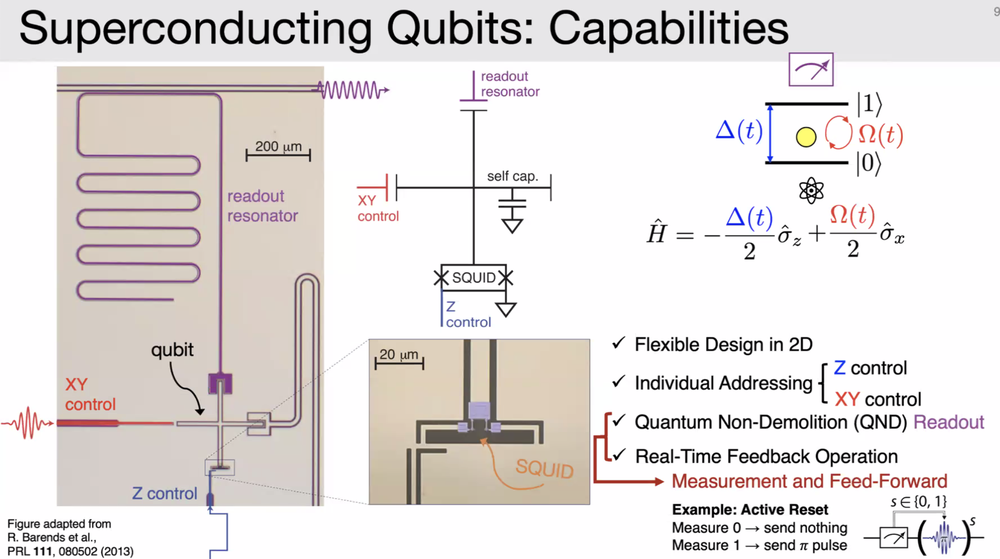
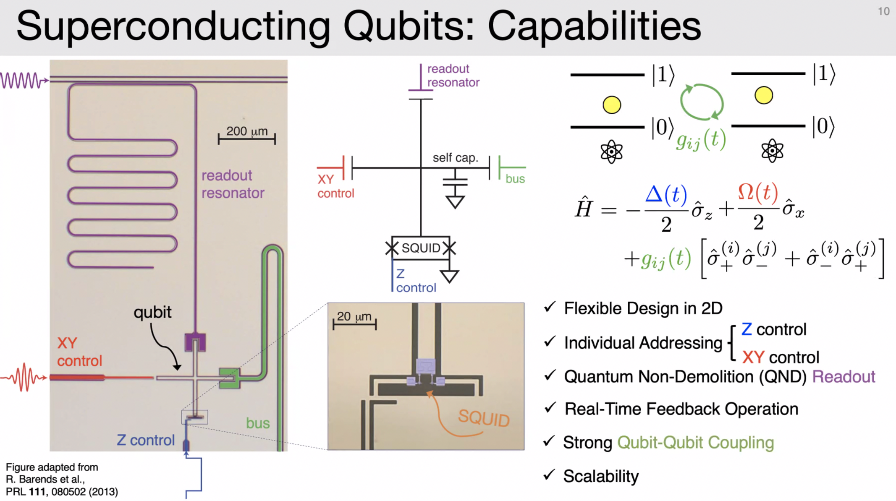
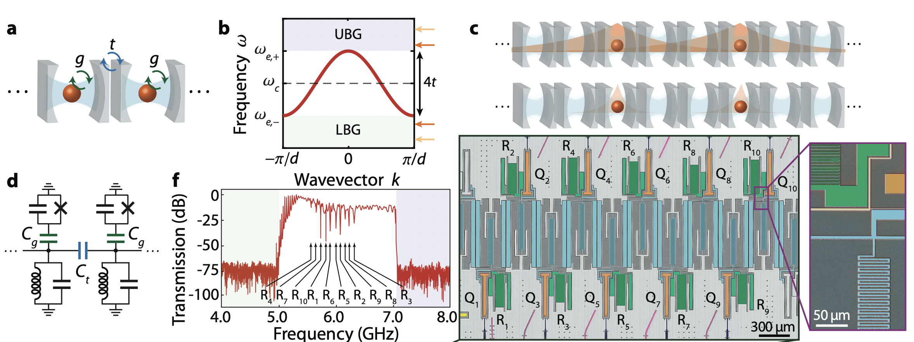

김은종 교수님 발표에서 발췌

LC resonator = harmonic oscillator. 

ground state 를 0, first excited state 를 1로 쓰면 큐빗으로 쓸 수 있음.

energy level 이 등간격이라, 1->0 transition 과 1->2 transition 을 분리할 수가 없음. 그래서 anharmonic 한 포텐셜을 만들어 줘야됨.

Inductor 자리에 Josepson junction 을 집어넣으면 anharmonic 한 포텐셜을 만들 수 있다.

그래서 기본적으로 supercoducting 큐빗은 두개의 슈퍼컨덕터 사이에 J.J. 를 집어넣는 식으로 만들어 진다.

readout resonator 의 공진주파수는 qubit 의 state 에 따라 다름. 그래서 readout resonator 쪽으로 펄스를 쏘면 qubit 은 건드리지 않고 qubit 의 상태를 알 수 있음. 즉, Quantum Non-Demolition (QND) measurement 가 가능함.

qubit 끼리 연결하는 bus 를 통해 two qubit flip flop, 즉 two qubit gate 를 만들 수 있음.

## problems

* 약 10년간 T1, T2 시간이 $100\mu s$ 정도로 정체돼 있음.

* qubit 끼리의 connectivity 문제

## Cavity QED

캐비티 안에 qubit 을 배치해 놓으면 모든 큐빗들끼리 all-to-all connectivity 를 가지는 Hamiltonian 을 갖게 됨. $\sum_{i,j}\hat{\sigma}_i \hat{\sigma}_j$

하지만 큐빗끼리 너무 가까워지면 서로간의 interaction 때문에 문제가 생김. 그래서 스케일 업이 어려움. 그리고 bragg 공명조건때문에 각 큐빗별로 microwave 파의 파장 정도길이로 서로 떨어져있어야 됨. cm 단위라서, 집적화 하는게 불가능.

## Metasurface 

Metasurface 물질과 time-dependent system engeering (시간에 따라 물질 refractive index 가 바뀌게끔) 를 이용함.
 
 

공명조건을 만족하는 조그만 metasurface 여러개를 붙여놓은 것 같은 상황. 큐빗의 에너지 레벨이 bandgap 의 아래나 위에 있으면 decoherence 가 억제된다.

그리고 파라미터를 조절하면 qubit 의 spatial 한 wave function 이 퍼지는 정도를 조절할 수 있고, 그래서 two qubit interaction 을 구현할 수 있게됨.

all-to-all connection 은 아니게 되지만, trade-off 가 있는 듯.

