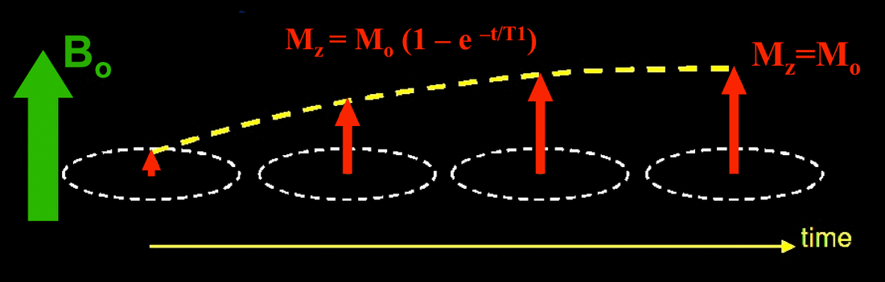
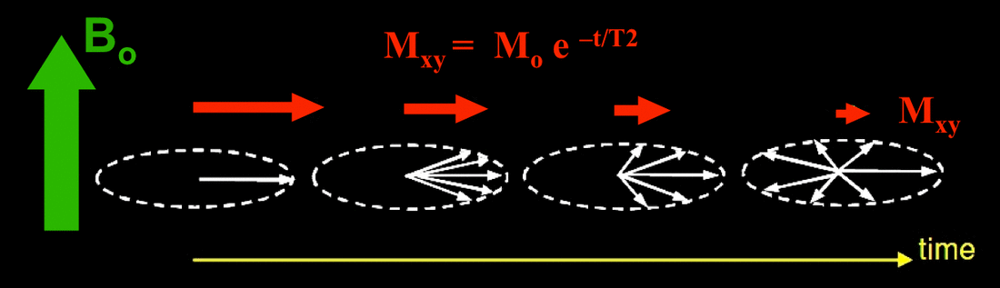

MRI 같은데서 얘기하는 spin relaxation time 과 비슷한 개념. 

## T1 time

MRI 물리에서는 T1 time은 자기장 걸어줬을때 spin 이 Z 축으로 정렬되는데 걸리는 시간.

슈퍼컨덕터 큐빗에서는 excited state $|1\rangle$ 이 $|0\rangle$ 으로 떨어지는 시간 스케일을 의미한다. 즉 스핀 플립 에러가 발생할때 까지의 시간.

## T2 time

MRI 물리에서는 Z 축 방향으로 자기장이 있을때 X-Y 평면의 스핀들이 랜덤해지는데 걸리는 시간.

슈퍼컨덕터 큐빗에서는 Z basis 기준으로, X-Y 평면의 성분들은 relative phase 인데, 얘네가 랜덤하게 섞이는것, 즉 dephasing 에러가 발생할때 까지의 시간을 T2 time 이라고 한다.

## Ref

https://mriquestions.com/what-is-t1.html

https://mriquestions.com/what-is-t2.html