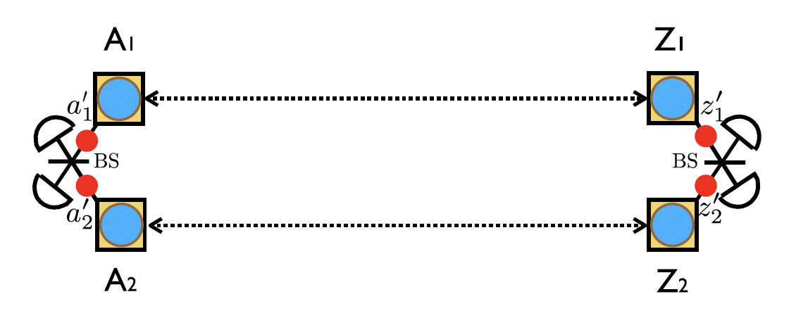

# Entanglement Swap

assume entangled state
$$
\ket{\Psi^+}_{AB}\ket{\Psi^+}_{CD} \newline
= \frac{1}{2}(\ket{0}_{A}\ket{10}_{BC}\ket{1}_{D}  \newline
+ \ket{0}_{A}\ket{11}_{BC}\ket{0}_{D}
\newline
 + \ket{1}_{A}\ket{00}_{BC}\ket{1}_{D} 
 \newline
 + \ket{1}_{A}\ket{01}_{BC}\ket{0}_{D})
$$

Bell State Measurement (BSM) for $\ket{\Psi^+}_{BC}$ is, $$I\otimes \bra{\Psi^+}_{BC}\otimes I$$

then,

$$
I\otimes \bra{\Psi^+}_{BC}\otimes I\ket{\Psi^+}_{AB}\ket{\Psi^+}_{CD}
\newline
= \frac{1}{2\sqrt{2}}[
    \ket{0}(\braket{01|10}+\braket{10|10})\ket{1}
    \newline
    +\ket{0}(\braket{01|11}+\braket{10|11})\ket{0}
    \newline
    +\ket{1}(\braket{01|00}+\braket{10|00})\ket{1}
    \newline
    +\ket{1}(\braket{01|01}+\braket{10|01})\ket{0}
    \newline
    = \frac{1}{2\sqrt{2}}[\ket{01}_{AD}+\ket{10}_{AD}] = \frac{1}{2}\ket{\Psi^+}_{AD}    
 ] 
$$

By Meaeusring BC, we can get entangled state AD. It is called Entanglement Swap.

# Quantum Memory

We need memory to store quantum state. We store quantum state using atomic state and send quantum state using photon state. So, we need atom-photon coupling. 

# Two-Photon entanglement

$$
(\ket{0_{A_1}1_{Z_1}}+e^{i\phi_1}\ket{1_{A_1}0_{Z_1}})\otimes (\ket{0_{A_2}1_{Z_2}}+e^{i\phi_2}\ket{1_{A_2}0_{Z_2}})
\newline

=\ket{0_{A_1}1_{Z_1}0_{A_2}1_{Z_2}}

+e^{i\phi_1}\ket{1_{A_1}0_{Z_1}0_{A_2}1_{Z_2}}
\newline
+e^{i\phi_2}\ket{0_{A_1}1_{Z_1}1_{A_2}0_{Z_2}}

+e^{i(\phi_1+\phi_2)}\ket{1_{A_1}0_{Z_1}1_{A_2}0_{Z_2}}
$$