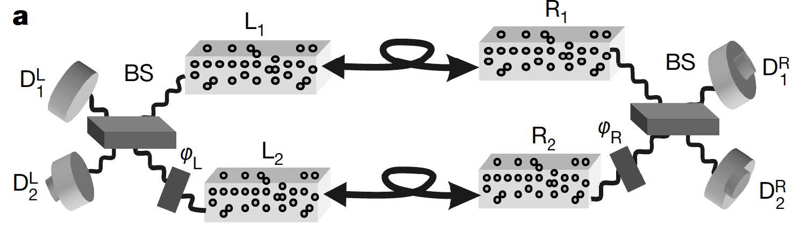

# Quantum repeater and DLCZ protocol

## key idea

- Goal : To overcome signal loss (in optical fiber, -3db/1km. 95% remains for 1km, $10^{-20}$ remains for 1000km)

- Create entanglement independently for each link

- Entanglement extend by entanglement swapping

- Requires heralded signal creation and storage of entanglement

- Atomic ensemble quantum memory & Photon communication

## Entanglement swap

Entangled state 
$$
\ket{\Psi^+}=\frac{1}{\sqrt{2}}(\ket{0_L1_R}+\ket{1_L0_R})
$$

Assume composite system AB and CD
$$
\ket{\Psi^+}_{AB}\ket{\Psi^+}_{CD} \\
= \frac{1}{2}(\ket{0}_{A}\ket{10}_{BC}\ket{1}_{D}  \\
+ \ket{0}_{A}\ket{11}_{BC}\ket{0}_{D}
\\
 + \ket{1}_{A}\ket{00}_{BC}\ket{1}_{D} 
 \\
 + \ket{1}_{A}\ket{01}_{BC}\ket{0}_{D})
$$

We want to generate entangled between A and D.

Bell State Measurement (BSM) for $\ket{\Psi^+}_{BC}$ is, $$I\otimes \bra{\Psi^+}_{BC}\otimes I$$

then,

$$
I\otimes \bra{\Psi^+}_{BC}\otimes I\ket{\Psi^+}_{AB}\ket{\Psi^+}_{CD}
\\
= \frac{1}{2\sqrt{2}}[
    \ket{0}(\braket{01|10}+\braket{10|10})\ket{1}
    \\
    +\ket{0}(\braket{01|11}+\braket{10|11})\ket{0}
    \\
    +\ket{1}(\braket{01|00}+\braket{10|00})\ket{1}
    \\
    +\ket{1}(\braket{01|01}+\braket{10|01})\ket{0}
    \\
    = \frac{1}{2\sqrt{2}}[\ket{01}_{AD}+\ket{10}_{AD}] = \frac{1}{2}\ket{\Psi^+}_{AD}    
 ] 
$$

By Meaeusring BC, we can get entangled state AD. It is called Entanglement Swap.

## Atomic ensemble quantum memory

- 모든 entanglement 를 동시에 생성할 수는 없으니, 각각의 entanglement 를 어딘가에 저장해 둬야한다.

- Atomic ensemble 의 에너지레벨을 사용해서 양자 상태를 저장.

- 모든 원자들이 ground state 에 있으면 write pulse 를 쏘아서 원자 하나가 excitation 된 뒤에 metastable state 로 떨어지면서 photon 을 내놓는다.

- 반대로 read 과정은 excitation 과 metastable 사이 에너지레벨에 해당하는 pulse 를 쏴줘서 photon 을 내놓게함.

> why off-resonant detune $\triangle$ ? write 과정에서 나온 stokes photon 을 다른 원자가 흡수하지 않게끔 detuning 을 하는 것. 

> 그럼 왜 read process 에선 detuning 을 안하나 ? [Electromagnetically Induced Transparency](https://en.wikipedia.org/wiki/Electromagnetically_induced_transparency) 현상으로 재흡수를 안하게 할 수 있음.

- 모든 원자가 ground 에 있는걸 $\ket{0}$ state, 원자 하나만 metastable 에 있는 것을 $\ket{1}$ state 로 취급.

- write / read 과정에서 나오는 photon 을 herald signal 로 사용한다. 

> Single atom quantum memory ? single atom 은 light-matter coupling 확률이 작음. 확률을 올리려면 cavity 를 만들어서 light-matter 가 상호작용할 확률을 높여야 되는데, hard to implement. Atomic ensemble 은 $\sqrt{N_{atom}}$에 비례하는 light-matter interaction.

## Write process (Generate entanglement)

- 두개의 Atomic ensemble L, R에 동시에 write pulse 를 쏘면 확률적으로 stokes photon 이 나옴. 
- stokes photon 이 나오는 경우를 1, 나오지 않는 경우를 0이라 한다면 총 4가지 경우의 수 00, 11, 01, 10
- 만약 00, 11 인 경우 entanglement 생성 실패.
- 만약 01, 10 인 경우 하나의 photon 이 50:50 beam splitter 를 지난 후 D1 또는 D2 디텍터 둘중 하나를 click.
- 빔 스플리터가 광자의 origin 에 대한 정보를 지워버렸으므로, 01과 10 의 상태가 중첩된 Bell state $\Psi^+ = \ket{01}+\ket{10}$ 을 생성(omit normalize factor)

## Read process (Entanglement swap)

- Write process 와 마찬가지로 확률과정
- 만약 00, 11 이면 Bell state measurement 실패
- 만약 01, 10 이면 D1 또는 D2 디텍터 둘중 하나를 click
- BS 가 photon 의 origination 정보를 지워버렸기 때문에 Bell state measurement 가 됨

# Two-Photon entanglement

$$
(\ket{0_{L_1}1_{R_1}}+e^{i\phi_1}\ket{1_{L_1}0_{R_1}})\otimes (\ket{0_{L_2}1_{R_2}}+e^{i\phi_2}\ket{1_{L_2}0_{R_2}})
\\
=\ket{0_{L_1}1_{R_1}0_{L_2}1_{R_2}}
+e^{i\phi_1}\ket{1_{L_1}0_{R_1}0_{L_2}1_{R_2}}
\\
+e^{i\phi_2}\ket{0_{L_1}1_{R_1}1_{L_2}0_{R_2}}
+e^{i(\phi_1+\phi_2)}\ket{1_{L_1}0_{R_1}1_{L_2}0_{R_2}}
$$

- Fock state $\ket{0}$과 $\ket{1}$은 측정하기 어려움
- 대신 Bell state measurement 을 통해 $\ket{1001} + \ket{0110}$ 로 측정
- phase $\phi_L$과 $\phi_R$ 을 조정하면 임의의 basis 로 측정이 가능

## Quantum teleportation via parrael channel

- I 의 State 는 a|01> + b|10> (a, b are unknown coefficient)
- Do BSM : D1 디텍터 둘중 하나가 click + D2 디텍터 둘중 하나가 click = Teleportation Success
- 디텍터에 도착한 Heralding signal 에 대한 정보를 R에게 전송(Local Operation and Classical
Communication, LOCC)
- 최종적으로 R 의 State 는 a|01> + b|10>

## Drawbacks of atomic ensemble repeater

- Probabilistic light-matter entanglement
- Detector efficiency
- Multi particle excitation
- Communication time due to heralded signal
- Probabilistic Bell state measurement